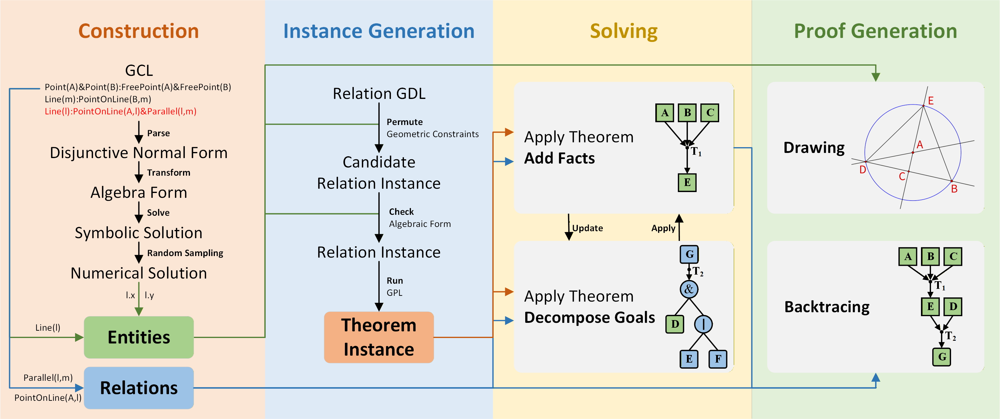
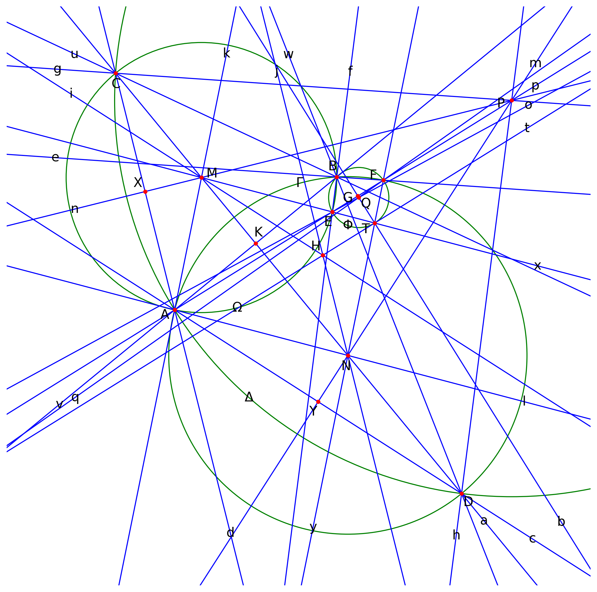

# FormalGeo

**FormalGeo** is a framework for formal representation and solving of plane geometry, encompassing the entire workflow
including **theory**, **formal systems**, **reasoning-computation engines**, **datasets**, **evaluation metrics**, and
**neural-symbolic solvers**. FormalGeo is currently maintained by the **FormalGeo Development Team**, an open-source
research organization dedicated to advancing the frontiers of artificial intelligence through formal mathematical
reasoning. We primarily focus on automatically Geometry Problem-Solving at or beyond the difficulty of the
**International Mathematical Olympiad** (IMO) to explore the boundaries of machine abstraction and reasoning.

Plane geometry, characterized by its multimodal knowledge representation, rigorous axiomatic structure, and reliance on
spatial intuition, serves as a natural benchmark for evaluating an AI system’s capabilities in perception,
comprehension, and logical deduction. We aim to empower machines with mathematical reasoning abilities that match or
surpass those of humans, thereby establishing a new paradigm for **General Artificial Intelligence** that integrates
**Symbolism**, **Connectionism**, and **Behaviorism**. Our goal is to construct a verifiable, interpretable, and
scalable system for automated **Geometric Knowledge Discovery** (GKD) and **Geometric Problem-Solving** (GPS), laying
the foundation for AI-driven mathematical discovery, formal verification, and intelligent education. More information
about FormalGeo will be found in [homepage](https://formalgeo.github.io/).

Older versions before 2.0.1, which we refer to as **alpha** version, have been unmaintained since December 2025. If
you still wish to access the alpha version code, you can check out the alpha branch. On April 2026, we released
**beta** version, a new solver version that unifies **geometric configuration construction**, **problem-solving**, and
**solution generation**. By integrating modern neuro-symbolic architectures, the vision of building a geometric
problem-solving system that surpasses human performance is becoming a reality.

The released open-source datasets can be found in the `datasets.json` file. If you use these datasets, please cite them
appropriately according to the citation information provided in the JSON file.

For Chinese researchers and developers, we have created a community. Scan the left QR code to join the WeChat group. If
the QR code has expired, scan the QR code on the right to add the WeChat contact, and you will be invited to the group.

## Installation

**For users:**  
We recommend using Conda to manage Python development environments. FormalGeo has been deployed to PyPi, allowing for
easy installation via the `pip` command.

    $ conda create -n <your_env_name> python=3.12.13
    $ conda activate <your_env_name>
    $ pip install formalgeo

**For developers:**  
This project uses [pyproject.toml](https://packaging.python.org/en/latest/specifications/declaring-project-metadata) to
store project metadata. The command `pip install -e .` reads file `pyproject.toml`, automatically installs project
dependencies, and installs the current project in an editable mode into the environment's library. It is convenient for
project development and testing.

    $ git clone --depth 1 https://github.com/FormalGeo/FormalGeo.git
    $ cd FormalGeo
    $ conda create -n <your_env_name> python=3.12.13
    $ conda activate <your_env_name>
    $ pip install -e .

## Example

We hereby present the formal representation and the interactive solving process for **IMO 2025 Problem 2**. All example
code can be found in `tests/test.py`.The original problem statement is as follows:

> Let Ω and Γ be circles with centres M and N, respectively, such that the radius of Ω is less than the radius of Γ.
> Suppose circles Ω and Γ intersect at two distinct points A and B. Line MN intersects Ω at C and Γ at D, such that
> points
> C, M, N and D lie on the line in that order. Let P be the circumcentre of triangle ACD. Line AP intersects Ω again at
> E ≠ A. Line AP intersects Γ again at F ≠ A. Let H be the orthocentre of triangle PMN.
>
> Prove that the line through H parallel to AP is tangent to the circumcircle of triangle BEF.
>
> (The orthocentre of a triangle is the point of intersection of its altitudes.)

First, start Python and import the necessary classes and methods:

    >>> from formalgeo import GeometricConfiguration, load_json, parse_gdl, debug_execute

First, we need to configure the geometry formal system using Geometry Definition Language (GDL). We provide an example
of a formal system in `tests/gdl.json`. After that, we parse the GDL and initialize a geometry configuration instance:

    >>> parsed_gdl = parse_gdl(load_json('gdl.json'))
    >>> gc = GeometricConfiguration(parsed_gdl=parsed_gdl)

Subsequently, we can use the Geometric Construction Language (GCL) to construct the geometric figure step by step. The
description of the geometric problem can be translated into the following GCL:

    >>> debug_execute(gc.construct, ['Circle(Γ)&Circle(Ω):IntersectBetweenCircle(Ω,Γ)&G(Sub(Γ.rc,Ω.rc))', 19])
    >>> debug_execute(gc.construct, ['Point(M):CenterOfCircle(M,Ω)'])
    >>> debug_execute(gc.construct, ['Point(N):CenterOfCircle(N,Γ)'])
    >>> debug_execute(gc.construct, ['Point(A):PointOnCircle(A,Ω)&PointOnCircle(A,Γ)&PointLeftSegment(A,N,M)'])
    >>> debug_execute(gc.construct, ['Point(B):PointOnCircle(B,Ω)&PointOnCircle(B,Γ)&PointLeftSegment(B,M,N)'])
    >>> debug_execute(gc.construct, ['Line(a):PointOnLine(M,a)&PointOnLine(N,a)'])
    >>> debug_execute(gc.construct, ['Point(C):PointOnLine(C,a)&PointOnCircle(C,Ω)&PointLeftSegment(C,A,B)'])
    >>> debug_execute(gc.construct, ['Point(D):PointOnLine(D,a)&PointOnCircle(D,Γ)&PointLeftSegment(D,B,A)'])
    >>> debug_execute(gc.construct, ['Line(c):PointOnLine(A,c)&PointOnLine(D,c)'])
    >>> debug_execute(gc.construct, ['Line(d):PointOnLine(A,d)&PointOnLine(C,d)'])
    >>> debug_execute(gc.construct, ['Point(P):CircumcenterOfTriangle(P,C,d,A,c,D,a)'])
    >>> debug_execute(gc.construct, ['Line(p):PointOnLine(A,p)&PointOnLine(P,p)'])
    >>> debug_execute(gc.construct, ['Point(E):PointOnLine(E,p)&PointOnCircle(E,Ω)&~SamePoint(E,A)'])
    >>> debug_execute(gc.construct, ['Point(F):PointOnLine(F,p)&PointOnCircle(F,Γ)&~SamePoint(F,A)'])
    >>> debug_execute(gc.construct, ['Line(n):PointOnLine(P,n)&PointOnLine(M,n)'])
    >>> debug_execute(gc.construct, ['Line(m):PointOnLine(P,m)&PointOnLine(N,m)'])
    >>> debug_execute(gc.construct, ['Point(H):OrthocenterOfTriangle(H,P,n,M,a,N,m)'])
    >>> debug_execute(gc.construct, ['Line(f):PointOnLine(B,f)&PointOnLine(E,f)'])
    >>> debug_execute(gc.construct, ['Line(e):PointOnLine(B,e)&PointOnLine(F,e)'])
    >>> debug_execute(gc.construct, ['Circle(Φ):CircumcircleOfTriangle(Φ,B,f,E,p,F,e)'])

When calling the functions of `gc`, we use `debug_execute(func, args)` to obtain debugging information. Alternatively,
we can directly execute the functions of `gc`, such as `gc.construct('Point(M): CenterOfCircle(M,Ω)')`. The original
geometry problem description uses 20 GCLs. To solve the current problem, an additional 22 auxiliary GCLs are required:

    >>> debug_execute(gc.construct, ['Line(x):PointOnLine(M,x)&PointOnLine(E,x)'])
    >>> debug_execute(gc.construct, ['Line(y):PointOnLine(N,y)&PointOnLine(F,y)'])
    >>> debug_execute(gc.construct, ['Point(T):PointOnLine(T,x)&PointOnLine(T,y)'])
    >>> debug_execute(gc.construct, ['Line(t):PointOnLine(H,t)&PointOnLine(T,t)'])
    >>> debug_execute(gc.construct, ['Circle(Δ):CircumcircleOfTriangle(Δ,C,d,A,c,D,a)'])
    >>> debug_execute(gc.construct, ['Line(g):PointOnLine(P,g)&PointOnLine(C,g)'])
    >>> debug_execute(gc.construct, ['Line(h):PointOnLine(P,h)&PointOnLine(D,h)'])
    >>> debug_execute(gc.construct, ['Line(i):PointOnLine(M,i)&PointOnLine(H,i)'])
    >>> debug_execute(gc.construct, ['Line(j):PointOnLine(N,j)&PointOnLine(H,j)'])
    >>> debug_execute(gc.construct, ['Line(k):PointOnLine(A,k)&PointOnLine(M,k)'])
    >>> debug_execute(gc.construct, ['Line(l):PointOnLine(A,l)&PointOnLine(N,l)'])
    >>> debug_execute(gc.construct, ['Line(u):PointOnLine(B,u)&PointOnLine(C,u)'])
    >>> debug_execute(gc.construct, ['Line(v):PointOnLine(A,v)&PointOnLine(B,v)'])
    >>> debug_execute(gc.construct, ['Line(w):PointOnLine(B,w)&PointOnLine(D,w)'])
    >>> debug_execute(gc.construct, ['Point(X):PointOnLine(X,n)&PointOnLine(X,d)'])
    >>> debug_execute(gc.construct, ['Point(Y):PointOnLine(Y,m)&PointOnLine(Y,c)'])
    >>> debug_execute(gc.construct, ['Point(G):CenterOfCircle(G,Φ)'])
    >>> debug_execute(gc.construct, ['Line(b):PointOnLine(T,b)&PointOnLine(G,b)'])
    >>> debug_execute(gc.construct, ['Point(Q):PointOnLine(Q,p)&PointOnLine(Q,b)'])
    >>> debug_execute(gc.construct, ['Line(q):PointOnLine(F,q)&PointOnLine(G,q)'])
    >>> debug_execute(gc.construct, ['Line(o):PointOnLine(E,o)&PointOnLine(G,o)'])
    >>> debug_execute(gc.construct, ['Point(K):PointOnLine(K,v)&PointOnLine(K,a)'])

At this point, the construction of the geometry problem is complete, and we can proceed to plot the geometric figure:

    >>> gc.draw_sg(save_path='../outputs/', file_format='png')

You will obtain an image like this:

Then, set the problem goal:

    >>> debug_execute(gc.set_goal, ['ParallelBetweenLine(p,t)&TangentBetweenLineAndCircle(t,Φ)'])

After the construction is complete and goal is set, we can apply theorems. These theorems are pre-defined in the GDL,
and the solver
will perform rigorous reasoning and calculations based on their definitions to derive new facts:

    >>> # common sense
    >>> debug_execute(gc.apply, ['circumcenter_of_triangle_property_center_of_circle(P,Δ,C,d,A,c,D,a)'])
    >>> debug_execute(gc.apply, ['circumcircle_of_triangle_property_multiple_forms(Δ,C,d,A,c,D,a)'])
    >>> debug_execute(gc.apply, ['circumcircle_of_triangle_property_multiple_forms(Δ,A,c,D,a,C,d)'])
    >>> debug_execute(gc.apply, ['circumcircle_of_triangle_property_point_on_circle(Δ,A,c,D,a,C,d)'])
    >>> debug_execute(gc.apply, ['circumcircle_of_triangle_property_point_on_circle(Δ,D,a,C,d,A,c)'])
    >>> debug_execute(gc.apply, ['circumcircle_of_triangle_property_point_on_circle(Δ,C,d,A,c,D,a)'])
    >>> debug_execute(gc.apply, ['circle_property_radius_equal(Δ,P,C)'])
    >>> debug_execute(gc.apply, ['circle_property_radius_equal(Δ,P,A)'])
    >>> debug_execute(gc.apply, ['circle_property_radius_equal(Δ,P,D)'])
    >>> 
    >>> # prove ∠gd = ∠dp
    >>> debug_execute(gc.apply, ['equal_distance_point_to_point_determination_algebraic(P,C,P,A)'])
    >>> debug_execute(gc.apply, ['triangle_determination(P,g,C,d,A,p)'])
    >>> debug_execute(gc.apply, ['isosceles_triangle_determination_distance_equal(P,g,C,d,A,p)'])
    >>> debug_execute(gc.apply, ['isosceles_triangle_property_angle_equal(P,g,C,d,A,p)'])
    >>> debug_execute(gc.apply, ['equal_angle_property_algebraic(g,d,d,p)'])
    >>> 
    >>> # prove ∠pc = ∠ch
    >>> debug_execute(gc.apply, ['equal_distance_point_to_point_determination_algebraic(P,A,P,D)'])
    >>> debug_execute(gc.apply, ['triangle_determination(P,p,A,c,D,h)'])
    >>> debug_execute(gc.apply, ['isosceles_triangle_determination_distance_equal(P,p,A,c,D,h)'])
    >>> debug_execute(gc.apply, ['isosceles_triangle_property_angle_equal(P,p,A,c,D,h)'])
    >>> debug_execute(gc.apply, ['equal_angle_property_algebraic(p,c,c,h)'])
    >>> 
    >>> # prove ∠ga = ∠ah
    >>> debug_execute(gc.apply, ['equal_distance_point_to_point_determination_algebraic(P,C,P,D)'])
    >>> debug_execute(gc.apply, ['triangle_determination(P,g,C,a,D,h)'])
    >>> debug_execute(gc.apply, ['isosceles_triangle_determination_distance_equal(P,g,C,a,D,h)'])
    >>> debug_execute(gc.apply, ['isosceles_triangle_property_angle_equal(P,g,C,a,D,h)'])
    >>> debug_execute(gc.apply, ['equal_angle_property_algebraic(g,a,a,h)'])
    >>> debug_execute(gc.apply, ['circle_property_radius_equal(Ω,M,C)'])
    >>> debug_execute(gc.apply, ['circle_property_radius_equal(Ω,M,A)'])
    >>> debug_execute(gc.apply, ['circle_property_radius_equal(Ω,M,E)'])
    >>> 
    >>> # prove ∠ad = ∠dk
    >>> debug_execute(gc.apply, ['equal_distance_point_to_point_determination_algebraic(M,C,M,A)'])
    >>> debug_execute(gc.apply, ['triangle_determination(M,a,C,d,A,k)'])
    >>> debug_execute(gc.apply, ['isosceles_triangle_determination_distance_equal(M,a,C,d,A,k)'])
    >>> debug_execute(gc.apply, ['isosceles_triangle_property_angle_equal(M,a,C,d,A,k)'])
    >>> debug_execute(gc.apply, ['equal_angle_property_algebraic(a,d,d,k)'])
    >>> 
    >>> # prove ∠kp = ∠px
    >>> debug_execute(gc.apply, ['equal_distance_point_to_point_determination_algebraic(M,A,M,E)'])
    >>> debug_execute(gc.apply, ['triangle_determination(M,k,A,p,E,x)'])
    >>> debug_execute(gc.apply, ['isosceles_triangle_determination_distance_equal(M,k,A,p,E,x)'])
    >>> debug_execute(gc.apply, ['isosceles_triangle_property_angle_equal(M,k,A,p,E,x)'])
    >>> debug_execute(gc.apply, ['equal_angle_property_algebraic(k,p,p,x)'])
    >>> debug_execute(gc.apply, ['circle_property_radius_equal(Γ,N,A)'])
    >>> debug_execute(gc.apply, ['circle_property_radius_equal(Γ,N,D)'])
    >>> debug_execute(gc.apply, ['circle_property_radius_equal(Γ,N,F)'])
    >>> 
    >>> # prove ∠lc = ∠ca
    >>> debug_execute(gc.apply, ['equal_distance_point_to_point_determination_algebraic(N,A,N,D)'])
    >>> debug_execute(gc.apply, ['triangle_determination(N,l,A,c,D,a)'])
    >>> debug_execute(gc.apply, ['isosceles_triangle_determination_distance_equal(N,l,A,c,D,a)'])
    >>> debug_execute(gc.apply, ['isosceles_triangle_property_angle_equal(N,l,A,c,D,a)'])
    >>> debug_execute(gc.apply, ['equal_angle_property_algebraic(l,c,c,a)'])
    >>> 
    >>> # prove ∠yp = ∠pl
    >>> debug_execute(gc.apply, ['equal_distance_point_to_point_determination_algebraic(N,F,N,A)'])
    >>> debug_execute(gc.apply, ['triangle_determination(N,y,F,p,A,l)'])
    >>> debug_execute(gc.apply, ['isosceles_triangle_determination_distance_equal(N,y,F,p,A,l)'])
    >>> debug_execute(gc.apply, ['isosceles_triangle_property_angle_equal(N,y,F,p,A,l)'])
    >>> debug_execute(gc.apply, ['equal_angle_property_algebraic(y,p,p,l)'])
    >>> debug_execute(gc.apply, ['line_property_angle_addition(C,g,a,d)'])
    >>> debug_execute(gc.apply, ['line_property_angle_addition(A,d,k,p)'])
    >>> debug_execute(gc.apply, ['line_property_angle_addition(A,p,l,c)'])
    >>> debug_execute(gc.apply, ['line_property_angle_addition(D,c,a,h)'])
    >>> 
    >>> # prove y // k
    >>> debug_execute(gc.apply, ['equal_angle_determination_algebraic(y,p,k,p)'])
    >>> debug_execute(gc.apply, ['parallel_determination_angle_equal(y,k,p)'])
    >>> 
    >>> # prove x // l
    >>> debug_execute(gc.apply, ['line_property_adjacent_complementary_angle(p,x)'])
    >>> debug_execute(gc.apply, ['line_property_adjacent_complementary_angle(p,l)'])
    >>> debug_execute(gc.apply, ['equal_angle_determination_algebraic(x,p,l,p)'])
    >>> debug_execute(gc.apply, ['parallel_determination_angle_equal(x,l,p)'])
    >>> debug_execute(gc.apply, ['perpendicular_bisector_determination_center_line_and_common_chord(Ω,Γ,M,N,a,A,B,v)'])
    >>> debug_execute(gc.apply, ['perpendicular_bisector_property_perpendicular_between_line(a,v,A,B)'])
    >>> 
    >>> # prove ∠fp = 2∠ad
    >>> debug_execute(gc.apply, ['perpendicular_between_line_property_multiple_forms(a,v)'])
    >>> debug_execute(gc.apply, ['perpendicular_between_line_property_angle(a,v)'])
    >>> debug_execute(gc.apply, ['perpendicular_between_line_property_angle(v,a)'])
    >>> debug_execute(gc.apply, ['perpendicular_bisector_property_distance_equal(a,v,A,B,C)'])
    >>> debug_execute(gc.apply, ['triangle_determination(C,d,A,v,B,u)'])
    >>> debug_execute(gc.apply, ['isosceles_triangle_determination_distance_equal(C,d,A,v,B,u)'])
    >>> debug_execute(gc.apply, ['isosceles_triangle_property_angle_equal(C,d,A,v,B,u)'])
    >>> debug_execute(gc.apply, ['equal_angle_property_algebraic(d,v,v,u)'])
    >>> debug_execute(gc.apply, ['triangle_determination(A,v,K,a,C,d)'])
    >>> debug_execute(gc.apply, ['triangle_determination(B,u,C,a,K,v)'])
    >>> debug_execute(gc.apply, ['triangle_property_angle_sum(A,v,K,a,C,d)'])
    >>> debug_execute(gc.apply, ['triangle_property_angle_sum(B,u,C,a,K,v)'])
    >>> debug_execute(gc.apply, ['line_property_angle_addition(C,u,a,d)'])
    >>> debug_execute(gc.apply, ['concyclic_between_points_determination_same_circle(Ω,B,C,A,E)'])
    >>> debug_execute(gc.apply, ['concyclic_between_points_property_inscribed_angle_sum(B,u,C,d,A,p,E,f)'])
    >>> debug_execute(gc.apply, ['line_property_adjacent_complementary_angle(p,f)'])
    >>> 
    >>> # prove ∠pe = 2∠ca
    >>> debug_execute(gc.apply, ['perpendicular_bisector_property_multiple_forms(a,v,A,B)'])
    >>> debug_execute(gc.apply, ['perpendicular_bisector_property_distance_equal(a,v,B,A,D)'])
    >>> debug_execute(gc.apply, ['triangle_determination(D,w,B,v,A,c)'])
    >>> debug_execute(gc.apply, ['isosceles_triangle_determination_distance_equal(D,w,B,v,A,c)'])
    >>> debug_execute(gc.apply, ['isosceles_triangle_property_angle_equal(D,w,B,v,A,c)'])
    >>> debug_execute(gc.apply, ['equal_angle_property_algebraic(w,v,v,c)'])
    >>> debug_execute(gc.apply, ['triangle_determination(D,w,B,v,K,a)'])
    >>> debug_execute(gc.apply, ['triangle_determination(D,a,K,v,A,c)'])
    >>> debug_execute(gc.apply, ['triangle_property_angle_sum(D,w,B,v,K,a)'])
    >>> debug_execute(gc.apply, ['triangle_property_angle_sum(D,a,K,v,A,c)'])
    >>> debug_execute(gc.apply, ['line_property_angle_addition(D,c,a,w)'])
    >>> debug_execute(gc.apply, ['concyclic_between_points_determination_same_circle(Γ,B,A,D,F)'])
    >>> debug_execute(gc.apply, ['concyclic_between_points_property_inscribed_angle_equal(B,w,A,c,D,e,F,p)'])
    >>> 
    >>> # prove ∠ay = 2∠ad
    >>> debug_execute(gc.apply, ['triangle_property_angle_sum(M,a,C,d,A,k)'])
    >>> debug_execute(gc.apply, ['line_property_adjacent_complementary_angle(a,k)'])
    >>> debug_execute(gc.apply, ['parallel_property_angle_equal(y,k,a)'])
    >>> debug_execute(gc.apply, ['equal_angle_property_algebraic(y,a,k,a)'])
    >>> debug_execute(gc.apply, ['line_property_adjacent_complementary_angle(a,y)'])
    >>> 
    >>> # prove ∠la = 2∠ca
    >>> debug_execute(gc.apply, ['triangle_property_angle_sum(N,l,A,c,D,a)'])
    >>> debug_execute(gc.apply, ['line_property_adjacent_complementary_angle(a,l)'])
    >>> 
    >>> # prove ∠xy = 2∠ad + 2∠ca
    >>> debug_execute(gc.apply, ['line_property_angle_addition(N,l,a,y)'])
    >>> debug_execute(gc.apply, ['parallel_property_multiple_forms(x,l)'])
    >>> debug_execute(gc.apply, ['parallel_property_angle_equal(l,x,y)'])
    >>> debug_execute(gc.apply, ['equal_angle_property_algebraic(l,y,x,y)'])
    >>> 
    >>> # prove ∠ef + ∠xy = 180° (T on Φ)
    >>> debug_execute(gc.apply, ['triangle_determination(F,e,B,f,E,p)'])
    >>> debug_execute(gc.apply, ['triangle_property_angle_sum(F,e,B,f,E,p)'])
    >>> debug_execute(gc.apply, ['circumcircle_of_triangle_property_multiple_forms(Φ,B,f,E,p,F,e)'])
    >>> debug_execute(gc.apply, ['circumcircle_of_triangle_property_multiple_forms(Φ,E,p,F,e,B,f)'])
    >>> debug_execute(gc.apply, ['circumcircle_of_triangle_property_point_on_circle(Φ,B,f,E,p,F,e)'])
    >>> debug_execute(gc.apply, ['circumcircle_of_triangle_property_point_on_circle(Φ,E,p,F,e,B,f)'])
    >>> debug_execute(gc.apply, ['circumcircle_of_triangle_property_point_on_circle(Φ,F,e,B,f,E,p)'])
    >>> debug_execute(gc.apply, ['concyclic_between_points_determination_inscribed_angle_sum(F,e,B,f,E,x,T,y)'])
    >>> debug_execute(gc.apply, ['point_on_circle_determination_concyclic(Φ,F,B,E,T)'])
    >>> 
    >>> # prove m ⊥ c
    >>> debug_execute(gc.apply, ['equal_distance_point_to_point_determination_algebraic(N,P,N,P)'])
    >>> debug_execute(gc.apply, ['equal_distance_point_to_point_determination_algebraic(A,N,D,N)'])
    >>> debug_execute(gc.apply, ['triangle_determination(A,l,N,m,P,p)'])
    >>> debug_execute(gc.apply, ['triangle_determination(D,h,P,m,N,a)'])
    >>> debug_execute(gc.apply, ['mirror_congruent_triangle_determination_sss(A,l,N,m,P,p,D,a,N,m,P,h)'])
    >>> debug_execute(gc.apply, ['mirror_congruent_triangle_property_angle_equal(A,l,N,m,P,p,D,a,N,m,P,h)'])
    >>> debug_execute(gc.apply, ['equal_angle_property_algebraic(l,m,m,a)'])
    >>> debug_execute(gc.apply, ['line_property_adjacent_complementary_angle(l,m)'])
    >>> debug_execute(gc.apply, ['line_property_adjacent_complementary_angle(m,a)'])
    >>> debug_execute(gc.apply, ['triangle_determination(Y,m,N,l,A,c)'])
    >>> debug_execute(gc.apply, ['triangle_determination(Y,c,D,a,N,m)'])
    >>> debug_execute(gc.apply, ['equal_angle_determination_algebraic(m,l,a,m)'])
    >>> debug_execute(gc.apply, ['mirror_congruent_triangle_determination_asa(Y,m,N,l,A,c,Y,m,N,a,D,c)'])
    >>> debug_execute(gc.apply, ['mirror_congruent_triangle_property_multiple_forms(Y,m,N,l,A,c,Y,m,N,a,D,c)'])
    >>> debug_execute(gc.apply, ['mirror_congruent_triangle_property_multiple_forms(N,l,A,c,Y,m,N,a,D,c,Y,m)'])
    >>> debug_execute(gc.apply, ['mirror_congruent_triangle_property_angle_equal(A,c,Y,m,N,l,D,c,Y,m,N,a)'])
    >>> debug_execute(gc.apply, ['equal_angle_property_algebraic(c,m,m,c)'])
    >>> debug_execute(gc.apply, ['line_property_adjacent_complementary_angle(m,c)'])
    >>> 
    >>> # prove n ⊥ d
    >>> debug_execute(gc.apply, ['equal_distance_point_to_point_determination_algebraic(C,M,A,M)'])
    >>> debug_execute(gc.apply, ['equal_distance_point_to_point_determination_algebraic(M,P,M,P)'])
    >>> debug_execute(gc.apply, ['triangle_determination(C,a,M,n,P,g)'])
    >>> debug_execute(gc.apply, ['triangle_determination(A,p,P,n,M,k)'])
    >>> debug_execute(gc.apply, ['mirror_congruent_triangle_determination_sss(C,a,M,n,P,g,A,k,M,n,P,p)'])
    >>> debug_execute(gc.apply, ['mirror_congruent_triangle_property_angle_equal(C,a,M,n,P,g,A,k,M,n,P,p)'])
    >>> debug_execute(gc.apply, ['equal_angle_property_algebraic(a,n,n,k)'])
    >>> debug_execute(gc.apply, ['line_property_adjacent_complementary_angle(a,n)'])
    >>> debug_execute(gc.apply, ['line_property_adjacent_complementary_angle(n,k)'])
    >>> debug_execute(gc.apply, ['triangle_determination(X,n,M,a,C,d)'])
    >>> debug_execute(gc.apply, ['triangle_determination(X,d,A,k,M,n)'])
    >>> debug_execute(gc.apply, ['equal_angle_determination_algebraic(n,a,k,n)'])
    >>> debug_execute(gc.apply, ['mirror_congruent_triangle_determination_asa(X,n,M,a,C,d,X,n,M,k,A,d)'])
    >>> debug_execute(gc.apply, ['mirror_congruent_triangle_property_multiple_forms(X,n,M,a,C,d,X,n,M,k,A,d)'])
    >>> debug_execute(gc.apply, ['mirror_congruent_triangle_property_multiple_forms(M,a,C,d,X,n,M,k,A,d,X,n)'])
    >>> debug_execute(gc.apply, ['mirror_congruent_triangle_property_angle_equal(C,d,X,n,M,a,A,d,X,n,M,k)'])
    >>> debug_execute(gc.apply, ['equal_angle_property_algebraic(d,n,n,d)'])
    >>> debug_execute(gc.apply, ['line_property_adjacent_complementary_angle(n,d)'])
    >>> 
    >>> # prove i // c
    >>> debug_execute(gc.apply, ['orthocenter_of_triangle_property_multiple_forms(H,P,n,M,a,N,m)'])
    >>> debug_execute(gc.apply, ['orthocenter_of_triangle_property_perpendicular(H,i,M,a,N,m,P,n)'])
    >>> debug_execute(gc.apply, ['perpendicular_between_line_property_angle(i,m)'])
    >>> debug_execute(gc.apply, ['equal_angle_determination_algebraic(i,m,c,m)'])
    >>> debug_execute(gc.apply, ['parallel_determination_angle_equal(i,c,m)'])
    >>> 
    >>> # prove ∠xi = ∠ia
    >>> debug_execute(gc.apply, ['parallel_property_angle_equal(i,c,a)'])
    >>> debug_execute(gc.apply, ['equal_angle_property_algebraic(i,a,c,a)'])
    >>> debug_execute(gc.apply, ['line_property_angle_addition(M,x,i,a)'])
    >>> debug_execute(gc.apply, ['parallel_property_angle_equal(x,l,a)'])
    >>> debug_execute(gc.apply, ['equal_angle_property_algebraic(x,a,l,a)'])
    >>> debug_execute(gc.apply, ['equal_angle_determination_algebraic(x,i,i,a)'])
    >>> debug_execute(gc.apply, ['angle_bisector_determination_angle_equal(M,i,x,a)'])
    >>> 
    >>> # prove j // d
    >>> debug_execute(gc.apply, ['orthocenter_of_triangle_property_multiple_forms(H,M,a,N,m,P,n)'])
    >>> debug_execute(gc.apply, ['orthocenter_of_triangle_property_perpendicular(H,j,N,m,P,n,M,a)'])
    >>> debug_execute(gc.apply, ['perpendicular_between_line_property_angle(j,n)'])
    >>> debug_execute(gc.apply, ['equal_angle_determination_algebraic(d,n,j,n)'])
    >>> debug_execute(gc.apply, ['parallel_determination_angle_equal(d,j,n)'])
    >>> 
    >>> # prove ∠aj = ∠jy
    >>> debug_execute(gc.apply, ['parallel_property_angle_equal(d,j,a)'])
    >>> debug_execute(gc.apply, ['equal_angle_property_algebraic(d,a,j,a)'])
    >>> debug_execute(gc.apply, ['line_property_adjacent_complementary_angle(a,d)'])
    >>> debug_execute(gc.apply, ['line_property_adjacent_complementary_angle(a,j)'])
    >>> debug_execute(gc.apply, ['line_property_angle_addition(N,a,j,y)'])
    >>> debug_execute(gc.apply, ['equal_angle_determination_algebraic(a,j,j,y)'])
    >>> debug_execute(gc.apply, ['angle_bisector_determination_angle_equal(N,j,a,y)'])
    >>> 
    >>> # prove ∠yt = ∠tx
    >>> debug_execute(gc.apply, ['triangle_determination(T,x,M,a,N,y)'])
    >>> debug_execute(gc.apply, ['incenter_of_triangle_determination_angle_bisector(H,i,j,T,x,M,a,N,y)'])
    >>> debug_execute(gc.apply, ['incenter_of_triangle_property_angle_bisector(H,t,T,x,M,a,N,y)'])
    >>> debug_execute(gc.apply, ['angle_bisector_property_equal_angle(T,t,y,x)'])
    >>> debug_execute(gc.apply, ['equal_angle_property_algebraic(y,t,t,x)'])
    >>> 
    >>> # prove t // p
    >>> debug_execute(gc.apply, ['line_property_angle_addition(T,y,t,x)'])
    >>> debug_execute(gc.apply, ['triangle_determination(F,p,E,x,T,y)'])
    >>> debug_execute(gc.apply, ['triangle_property_angle_sum(F,p,E,x,T,y)'])
    >>> debug_execute(gc.apply, ['line_property_adjacent_complementary_angle(y,x)'])
    >>> debug_execute(gc.apply, ['equal_angle_determination_algebraic(t,x,p,x)'])
    >>> debug_execute(gc.apply, ['parallel_determination_angle_equal(t,p,x)'])
    >>> debug_execute(gc.apply, ['parallel_property_multiple_forms(t,p)'])
    >>> 
    >>> # prove b ⊥ p
    >>> debug_execute(gc.apply, ['triangle_determination(G,q,F,p,Q,b)'])
    >>> debug_execute(gc.apply, ['triangle_determination(G,b,Q,p,E,o)'])
    >>> debug_execute(gc.apply, ['triangle_determination(G,q,F,p,E,o)'])
    >>> debug_execute(gc.apply, ['circle_property_radius_equal(Φ,G,F)'])
    >>> debug_execute(gc.apply, ['circle_property_radius_equal(Φ,G,E)'])
    >>> debug_execute(gc.apply, ['equal_distance_point_to_point_determination_algebraic(G,F,G,E)'])
    >>> debug_execute(gc.apply, ['isosceles_triangle_determination_distance_equal(G,q,F,p,E,o)'])
    >>> debug_execute(gc.apply, ['isosceles_triangle_property_angle_equal(G,q,F,p,E,o)'])
    >>> debug_execute(gc.apply, ['equal_angle_property_algebraic(q,p,p,o)'])
    >>> debug_execute(gc.apply, ['arc_property_central_angle_and_inscribed_angle(Φ,G,T,F,E,b,q,x,p)'])
    >>> debug_execute(gc.apply, ['arc_property_central_angle_and_inscribed_angle(Φ,G,E,T,F,o,b,p,y)'])
    >>> debug_execute(gc.apply, ['line_property_adjacent_complementary_angle(b,o)'])
    >>> debug_execute(gc.apply, ['line_property_adjacent_complementary_angle(q,b)'])
    >>> debug_execute(gc.apply, ['triangle_property_angle_sum(G,q,F,p,Q,b)'])
    >>> debug_execute(gc.apply, ['triangle_property_angle_sum(G,b,Q,p,E,o)'])
    >>> debug_execute(gc.apply, ['line_property_adjacent_complementary_angle(p,b)'])
    >>> debug_execute(gc.apply, ['parallel_property_angle_equal(t,p,b)'])
    >>> debug_execute(gc.apply, ['equal_angle_property_algebraic(t,b,p,b)'])
    >>> 
    >>> # prove t ⊥ p
    >>> debug_execute(gc.apply, ['perpendicular_between_line_determination_angle(t,b)'])
    >>> debug_execute(gc.apply, ['perpendicular_between_line_property_multiple_forms(t,b)'])
    >>> debug_execute(gc.apply, ['tangent_between_line_and_circle_determination_perpendicular(Φ,G,b,T,t)'])

Additionally, at any stage of the construction or reasoning process, we can inspect the current state of the problem.
The `show_gc` function can be used to print detailed information about the current problem, including constructions,
facts, goals, etc.:

    >>> gc.show_gc()

You will see output similar to the following:

    Constructions:
    0  Circle(Γ)&Circle(Ω):IntersectBetweenCircle(Ω,Γ)&G(Sub(Γ.rc,Ω.rc))
       branch: 1
       target_entities: ['Circle(Γ)', 'Circle(Ω)']
       dependent_entities: []
       added_facts: ['IntersectBetweenCircle(Ω,Γ)', 'G(Γ.rc-Ω.rc)']
       equations: 
       inequalities: G((Γ.r+Ω.r)**2-(Γ.u-Ω.u)**2-(Γ.v-Ω.v)**2), G(Γ.r-Ω.r), L((-Γ.r+Ω.r)**2-(Γ.u-Ω.u)**2-(Γ.v-Ω.v)**2)
       solved_value: [(Γ.u, Γ.v, Γ.r, Ω.u, Ω.v, Ω.r), (0.6838, 0.0491, 1.1491, -0.2555, 1.1924, 0.868)]
    
    ...
    
    Entity - Point:
    fact_id     instance       values                         premise_ids              entity_ids               operation_id   operation                                                                                           
    4           (M)            (-0.2555, 1.1924)              {1}                      {1}                      1              Construct: Point(M):CenterOfCircle(M,Ω)                                                             
    6           (N)            (0.6838, 0.0491)               {0}                      {0}                      2              Construct: Point(N):CenterOfCircle(N,Γ)                                                             
    8           (A)            (-0.4275, 0.3415)              {0,1,4,6}                {0,1,4,6}                3              Construct: Point(A):PointOnCircle(A,Ω)&PointOnCircle(A,Γ)&PointLeftSegment(A,N,M)                   
    
    ...
    
    Goals:
    goal_id    sub_goal_id_tree                                       root  status    premise_ids               operation_id   operation                                                                                           
    0          (0,&,1)                                                None  1         {313,334}                 42             Auto: set_initial_goal                                                                              
    1          (2,&,(3,&,(4,&,(5,&,(6,&,7)))))                        1     1         {71,108,110,111,303,...}  43             Decompose: tangent_between_line_and_circle_determination_perpendicular(Φ,G,b,T,t)                   
    2          8                                                      7     1         {332}                     44             Decompose: perpendicular_between_line_property_multiple_forms(t,b)                                  
    
    ...
    
    Sub Goals:
    sub_goal_id predicate                     instance                                goal_id   leaf_goal_ids                 status         premise_ids                                       
    0           ParallelBetweenLine           (p,t)                                   0         {6}                           1              {313}                                             
    1           TangentBetweenLineAndCircle   (t,Φ)                                   0         {1}                           1              {334}                                             
    
    ...

You can also obtain the serialized representation of the current problem. All vocabulary tokens are available in
`src/formalgeo/tools.py` under the `letters` list. This is specifically prepared for integration with modern deep neural
networks and deep learning approaches:

    >>> print(gc.get_gc())

You will see output similar to the following:

    ['<init_fact>', 'Circle', 'Γ', '&', 'Circle', 'Ω', '&', 'IntersectBetweenCircle', 'Ω', 'Γ', '&', 'G', 'Γ', '.', 'r', 'c', '-', 'Ω', '.', 'r', 'c', '<premises>', 'Circle', 'Ω', '<operation>', 'Point', 'M', ':', 'CenterOfCircle', 'M', 'Ω', '<conclusion>', 'Point', 'M', '|', 'CenterOfCircle', 'M', 'Ω', ..., '<premises>', 'Line', 'm', '&', 'Line', 'l', '<operation>', 'line_property_adjacent_complementary_angle', 'l', 'm', '<conclusion>', 'Eq', 'l', 'm', '.', 'm', 'a', '+', 'm', 'l', '.', 'm', 'a', '-', 'nums', ..., '<goal>', 'Triangle', 'G', 'q', 'F', 'p', 'E', 'o', '<sub_goals>', 'PointOnLine', 'G', 'q', '&', 'PointOnLine', 'F', 'q', '&', 'PointOnLine', 'F', 'p', '&', 'PointOnLine', 'E', 'p', '&', 'PointOnLine', 'E', 'o', '&', 'PointOnLine', 'G', 'o']

In addition to forward solving, FormalGeo also supports backward solving. Forward solving starts from known `facts`,
continuously applying theorems to derive new `facts` until the `goal` is included in the `facts`. Backward solving
starts from the `goal`, applying theorems to decompose the `goal` into `sub-goals` until all `sub-goals` in a certain
branch are initial `facts`. The usage of backward solving is similar to forward solving: first, initialize the geometry
configuration, then apply 42 GCL statements, set the solving goal, and subsequently execute backward reasoning:

    >>> debug_execute(gc.decompose, ['tangent_between_line_and_circle_determination_perpendicular(Φ,G,b,T,t)'])
    >>> debug_execute(gc.decompose, ['perpendicular_between_line_property_multiple_forms(t,b)'])
    >>> debug_execute(gc.decompose, ['perpendicular_between_line_determination_angle(t,b)'])
    >>> debug_execute(gc.decompose, ['equal_angle_property_algebraic(t,b,p,b)'])
    >>> debug_execute(gc.decompose, ['parallel_property_angle_equal(t,p,b)'])
    >>> debug_execute(gc.decompose, ['parallel_property_multiple_forms(t,p)'])
    >>> debug_execute(gc.decompose, ['parallel_determination_angle_equal(t,p,x)'])
    >>> debug_execute(gc.decompose, ['equal_angle_determination_algebraic(t,x,p,x)'])
    >>> debug_execute(gc.decompose, ['triangle_property_angle_sum(F,p,E,x,T,y)'])
    >>> debug_execute(gc.decompose, ['triangle_determination(F,p,E,x,T,y)'])
    >>> debug_execute(gc.decompose, ['line_property_angle_addition(T,y,t,x)'])
    >>> debug_execute(gc.decompose, ['equal_angle_property_algebraic(y,t,t,x)'])
    >>> debug_execute(gc.decompose, ['angle_bisector_property_equal_angle(T,t,y,x)'])
    >>> debug_execute(gc.decompose, ['incenter_of_triangle_property_angle_bisector(H,t,T,x,M,a,N,y)'])
    >>> debug_execute(gc.decompose, ['incenter_of_triangle_determination_angle_bisector(H,i,j,T,x,M,a,N,y)'])
    >>> debug_execute(gc.decompose, ['triangle_determination(T,x,M,a,N,y)'])
    >>> debug_execute(gc.decompose, ['angle_bisector_determination_angle_equal(N,j,a,y)'])
    >>> debug_execute(gc.decompose, ['equal_angle_determination_algebraic(a,j,j,y)'])
    >>> debug_execute(gc.decompose, ['line_property_angle_addition(N,a,j,y)'])
    >>> debug_execute(gc.decompose, ['line_property_adjacent_complementary_angle(a,j)'])
    >>> debug_execute(gc.decompose, ['equal_angle_property_algebraic(d,a,j,a)'])
    >>> debug_execute(gc.decompose, ['parallel_property_angle_equal(d,j,a)'])
    >>> debug_execute(gc.decompose, ['parallel_determination_angle_equal(d,j,n)'])
    >>> debug_execute(gc.decompose, ['equal_angle_determination_algebraic(d,n,j,n)'])
    >>> debug_execute(gc.decompose, ['perpendicular_between_line_property_angle(j,n)'])
    >>> debug_execute(gc.decompose, ['orthocenter_of_triangle_property_perpendicular(H,j,N,m,P,n,M,a)'])
    >>> debug_execute(gc.decompose, ['orthocenter_of_triangle_property_multiple_forms(H,M,a,N,m,P,n)'])
    >>> debug_execute(gc.decompose, ['angle_bisector_determination_angle_equal(M,i,x,a)'])
    >>> debug_execute(gc.decompose, ['equal_angle_determination_algebraic(x,i,i,a)'])
    >>> debug_execute(gc.decompose, ['line_property_angle_addition(M,x,i,a)'])
    >>> debug_execute(gc.decompose, ['equal_angle_property_algebraic(i,a,c,a)'])
    >>> debug_execute(gc.decompose, ['parallel_property_angle_equal(i,c,a)'])
    >>> debug_execute(gc.decompose, ['parallel_determination_angle_equal(i,c,m)'])
    >>> debug_execute(gc.decompose, ['equal_angle_determination_algebraic(i,m,c,m)'])
    >>> debug_execute(gc.decompose, ['perpendicular_between_line_property_angle(i,m)'])
    >>> debug_execute(gc.decompose, ['orthocenter_of_triangle_property_perpendicular(H,i,M,a,N,m,P,n)'])
    >>> debug_execute(gc.decompose, ['orthocenter_of_triangle_property_multiple_forms(H,P,n,M,a,N,m)'])
    >>> debug_execute(gc.decompose, ['line_property_adjacent_complementary_angle(n,d)'])
    >>> debug_execute(gc.decompose, ['equal_angle_property_algebraic(d,n,n,d)'])
    >>> debug_execute(gc.decompose, ['mirror_congruent_triangle_property_angle_equal(C,d,X,n,M,a,A,d,X,n,M,k)'])
    >>> debug_execute(gc.decompose, ['mirror_congruent_triangle_property_multiple_forms(M,a,C,d,X,n,M,k,A,d,X,n)'])
    >>> debug_execute(gc.decompose, ['mirror_congruent_triangle_property_multiple_forms(X,n,M,a,C,d,X,n,M,k,A,d)'])
    >>> debug_execute(gc.decompose, ['mirror_congruent_triangle_determination_asa(X,n,M,a,C,d,X,n,M,k,A,d)'])
    >>> debug_execute(gc.decompose, ['equal_angle_determination_algebraic(n,a,k,n)'])
    >>> debug_execute(gc.decompose, ['triangle_determination(X,d,A,k,M,n)'])
    >>> debug_execute(gc.decompose, ['triangle_determination(X,n,M,a,C,d)'])
    >>> debug_execute(gc.decompose, ['line_property_adjacent_complementary_angle(n,k)'])
    >>> debug_execute(gc.decompose, ['line_property_adjacent_complementary_angle(a,n)'])
    >>> debug_execute(gc.decompose, ['equal_angle_property_algebraic(a,n,n,k)'])
    >>> debug_execute(gc.decompose, ['mirror_congruent_triangle_property_angle_equal(C,a,M,n,P,g,A,k,M,n,P,p)'])
    >>> debug_execute(gc.decompose, ['mirror_congruent_triangle_determination_sss(C,a,M,n,P,g,A,k,M,n,P,p)'])
    >>> debug_execute(gc.decompose, ['triangle_determination(A,p,P,n,M,k)'])
    >>> debug_execute(gc.decompose, ['triangle_determination(C,a,M,n,P,g)'])
    >>> debug_execute(gc.decompose, ['equal_distance_point_to_point_determination_algebraic(M,P,M,P)'])
    >>> debug_execute(gc.decompose, ['equal_distance_point_to_point_determination_algebraic(C,M,A,M)'])
    >>> debug_execute(gc.decompose, ['line_property_adjacent_complementary_angle(m,c)'])
    >>> debug_execute(gc.decompose, ['equal_angle_property_algebraic(c,m,m,c)'])
    >>> debug_execute(gc.decompose, ['mirror_congruent_triangle_property_angle_equal(A,c,Y,m,N,l,D,c,Y,m,N,a)'])
    >>> debug_execute(gc.decompose, ['mirror_congruent_triangle_property_multiple_forms(N,l,A,c,Y,m,N,a,D,c,Y,m)'])
    >>> debug_execute(gc.decompose, ['mirror_congruent_triangle_property_multiple_forms(Y,m,N,l,A,c,Y,m,N,a,D,c)'])
    >>> debug_execute(gc.decompose, ['mirror_congruent_triangle_determination_asa(Y,m,N,l,A,c,Y,m,N,a,D,c)'])
    >>> debug_execute(gc.decompose, ['equal_angle_determination_algebraic(m,l,a,m)'])
    >>> debug_execute(gc.decompose, ['triangle_determination(Y,c,D,a,N,m)'])
    >>> debug_execute(gc.decompose, ['triangle_determination(Y,m,N,l,A,c)'])
    >>> debug_execute(gc.decompose, ['line_property_adjacent_complementary_angle(m,a)'])
    >>> debug_execute(gc.decompose, ['line_property_adjacent_complementary_angle(l,m)'])
    >>> debug_execute(gc.decompose, ['equal_angle_property_algebraic(l,m,m,a)'])
    >>> debug_execute(gc.decompose, ['mirror_congruent_triangle_property_angle_equal(A,l,N,m,P,p,D,a,N,m,P,h)'])
    >>> debug_execute(gc.decompose, ['mirror_congruent_triangle_determination_sss(A,l,N,m,P,p,D,a,N,m,P,h)'])
    >>> debug_execute(gc.decompose, ['triangle_determination(D,h,P,m,N,a)'])
    >>> debug_execute(gc.decompose, ['triangle_determination(A,l,N,m,P,p)'])
    >>> debug_execute(gc.decompose, ['equal_distance_point_to_point_determination_algebraic(A,N,D,N)'])
    >>> debug_execute(gc.decompose, ['equal_distance_point_to_point_determination_algebraic(N,P,N,P)'])
    >>> debug_execute(gc.decompose, ['point_on_circle_determination_concyclic(Φ,F,B,E,T)'])
    >>> debug_execute(gc.decompose, ['concyclic_between_points_determination_inscribed_angle_sum(F,e,B,f,E,x,T,y)'])
    >>> debug_execute(gc.decompose, ['circumcircle_of_triangle_property_point_on_circle(Φ,F,e,B,f,E,p)'])
    >>> debug_execute(gc.decompose, ['circumcircle_of_triangle_property_point_on_circle(Φ,E,p,F,e,B,f)'])
    >>> debug_execute(gc.decompose, ['circumcircle_of_triangle_property_point_on_circle(Φ,B,f,E,p,F,e)'])
    >>> debug_execute(gc.decompose, ['circumcircle_of_triangle_property_multiple_forms(Φ,E,p,F,e,B,f)'])
    >>> debug_execute(gc.decompose, ['circumcircle_of_triangle_property_multiple_forms(Φ,B,f,E,p,F,e)'])
    >>> debug_execute(gc.decompose, ['triangle_property_angle_sum(F,e,B,f,E,p)'])
    >>> debug_execute(gc.decompose, ['triangle_determination(F,e,B,f,E,p)'])
    >>> debug_execute(gc.decompose, ['equal_angle_property_algebraic(l,y,x,y)'])
    >>> debug_execute(gc.decompose, ['parallel_property_angle_equal(l,x,y)'])
    >>> debug_execute(gc.decompose, ['parallel_property_multiple_forms(x,l)'])
    >>> debug_execute(gc.decompose, ['line_property_angle_addition(N,l,a,y)'])
    >>> debug_execute(gc.decompose, ['line_property_adjacent_complementary_angle(a,l)'])
    >>> debug_execute(gc.decompose, ['triangle_property_angle_sum(N,l,A,c,D,a)'])
    >>> debug_execute(gc.decompose, ['line_property_adjacent_complementary_angle(a,y)'])
    >>> debug_execute(gc.decompose, ['equal_angle_property_algebraic(y,a,k,a)'])
    >>> debug_execute(gc.decompose, ['parallel_property_angle_equal(y,k,a)'])
    >>> debug_execute(gc.decompose, ['concyclic_between_points_property_inscribed_angle_equal(B,w,A,c,D,e,F,p)'])
    >>> debug_execute(gc.decompose, ['concyclic_between_points_determination_same_circle(Γ,B,A,D,F)'])
    >>> debug_execute(gc.decompose, ['line_property_angle_addition(D,c,a,w)'])
    >>> debug_execute(gc.decompose, ['triangle_property_angle_sum(D,a,K,v,A,c)'])
    >>> debug_execute(gc.decompose, ['triangle_property_angle_sum(D,w,B,v,K,a)'])
    >>> debug_execute(gc.decompose, ['triangle_determination(D,a,K,v,A,c)'])
    >>> debug_execute(gc.decompose, ['triangle_determination(D,w,B,v,K,a)'])
    >>> debug_execute(gc.decompose, ['equal_angle_property_algebraic(w,v,v,c)'])
    >>> debug_execute(gc.decompose, ['isosceles_triangle_property_angle_equal(D,w,B,v,A,c)'])
    >>> debug_execute(gc.decompose, ['isosceles_triangle_determination_distance_equal(D,w,B,v,A,c)'])
    >>> debug_execute(gc.decompose, ['triangle_determination(D,w,B,v,A,c)'])
    >>> debug_execute(gc.decompose, ['perpendicular_bisector_property_distance_equal(a,v,B,A,D)'])
    >>> debug_execute(gc.decompose, ['perpendicular_bisector_property_multiple_forms(a,v,A,B)'])
    >>> debug_execute(gc.decompose, ['line_property_adjacent_complementary_angle(p,f)'])
    >>> debug_execute(gc.decompose, ['concyclic_between_points_property_inscribed_angle_sum(B,u,C,d,A,p,E,f)'])
    >>> debug_execute(gc.decompose, ['concyclic_between_points_determination_same_circle(Ω,B,C,A,E)'])
    >>> debug_execute(gc.decompose, ['line_property_angle_addition(C,u,a,d)'])
    >>> debug_execute(gc.decompose, ['triangle_property_angle_sum(B,u,C,a,K,v)'])
    >>> debug_execute(gc.decompose, ['triangle_property_angle_sum(A,v,K,a,C,d)'])
    >>> debug_execute(gc.decompose, ['triangle_determination(B,u,C,a,K,v)'])
    >>> debug_execute(gc.decompose, ['triangle_determination(A,v,K,a,C,d)'])
    >>> debug_execute(gc.decompose, ['equal_angle_property_algebraic(d,v,v,u)'])
    >>> debug_execute(gc.decompose, ['isosceles_triangle_property_angle_equal(C,d,A,v,B,u)'])
    >>> debug_execute(gc.decompose, ['isosceles_triangle_determination_distance_equal(C,d,A,v,B,u)'])
    >>> debug_execute(gc.decompose, ['triangle_determination(C,d,A,v,B,u)'])
    >>> debug_execute(gc.decompose, ['perpendicular_bisector_property_distance_equal(a,v,A,B,C)'])
    >>> debug_execute(gc.decompose, ['perpendicular_between_line_property_angle(v,a)'])
    >>> debug_execute(gc.decompose, ['perpendicular_between_line_property_angle(a,v)'])
    >>> debug_execute(gc.decompose, ['perpendicular_between_line_property_multiple_forms(a,v)'])
    >>> debug_execute(gc.decompose, ['perpendicular_bisector_property_perpendicular_between_line(a,v,A,B)'])
    >>> debug_execute(gc.decompose, ['perpendicular_bisector_determination_center_line_and_common_chord(Ω,Γ,M,N,a,A,B,v)'])
    >>> debug_execute(gc.decompose, ['parallel_determination_angle_equal(x,l,p)'])
    >>> debug_execute(gc.decompose, ['equal_angle_determination_algebraic(x,p,l,p)'])
    >>> debug_execute(gc.decompose, ['line_property_adjacent_complementary_angle(p,l)'])
    >>> debug_execute(gc.decompose, ['line_property_adjacent_complementary_angle(p,x)'])
    >>> debug_execute(gc.decompose, ['parallel_determination_angle_equal(y,k,p)'])
    >>> debug_execute(gc.decompose, ['equal_angle_determination_algebraic(y,p,k,p)'])
    >>> debug_execute(gc.decompose, ['line_property_angle_addition(D,c,a,h)'])
    >>> debug_execute(gc.decompose, ['line_property_angle_addition(A,p,l,c)'])
    >>> debug_execute(gc.decompose, ['line_property_angle_addition(A,d,k,p)'])
    >>> debug_execute(gc.decompose, ['line_property_angle_addition(C,g,a,d)'])
    >>> debug_execute(gc.decompose, ['equal_angle_property_algebraic(y,p,p,l)'])
    >>> debug_execute(gc.decompose, ['isosceles_triangle_property_angle_equal(N,y,F,p,A,l)'])
    >>> debug_execute(gc.decompose, ['isosceles_triangle_determination_distance_equal(N,y,F,p,A,l)'])
    >>> debug_execute(gc.decompose, ['triangle_determination(N,y,F,p,A,l)'])
    >>> debug_execute(gc.decompose, ['equal_distance_point_to_point_determination_algebraic(N,F,N,A)'])
    >>> debug_execute(gc.decompose, ['equal_angle_property_algebraic(l,c,c,a)'])
    >>> debug_execute(gc.decompose, ['isosceles_triangle_property_angle_equal(N,l,A,c,D,a)'])
    >>> debug_execute(gc.decompose, ['isosceles_triangle_determination_distance_equal(N,l,A,c,D,a)'])
    >>> debug_execute(gc.decompose, ['triangle_determination(N,l,A,c,D,a)'])
    >>> debug_execute(gc.decompose, ['equal_distance_point_to_point_determination_algebraic(N,A,N,D)'])
    >>> debug_execute(gc.decompose, ['circle_property_radius_equal(Γ,N,F)'])
    >>> debug_execute(gc.decompose, ['circle_property_radius_equal(Γ,N,D)'])
    >>> debug_execute(gc.decompose, ['circle_property_radius_equal(Γ,N,A)'])
    >>> debug_execute(gc.decompose, ['equal_angle_property_algebraic(k,p,p,x)'])
    >>> debug_execute(gc.decompose, ['isosceles_triangle_property_angle_equal(M,k,A,p,E,x)'])
    >>> debug_execute(gc.decompose, ['isosceles_triangle_determination_distance_equal(M,k,A,p,E,x)'])
    >>> debug_execute(gc.decompose, ['triangle_determination(M,k,A,p,E,x)'])
    >>> debug_execute(gc.decompose, ['equal_distance_point_to_point_determination_algebraic(M,A,M,E)'])
    >>> debug_execute(gc.decompose, ['equal_angle_property_algebraic(a,d,d,k)'])
    >>> debug_execute(gc.decompose, ['isosceles_triangle_property_angle_equal(M,a,C,d,A,k)'])
    >>> debug_execute(gc.decompose, ['isosceles_triangle_determination_distance_equal(M,a,C,d,A,k)'])
    >>> debug_execute(gc.decompose, ['triangle_determination(M,a,C,d,A,k)'])
    >>> debug_execute(gc.decompose, ['equal_distance_point_to_point_determination_algebraic(M,C,M,A)'])
    >>> debug_execute(gc.decompose, ['circle_property_radius_equal(Ω,M,E)'])
    >>> debug_execute(gc.decompose, ['circle_property_radius_equal(Ω,M,A)'])
    >>> debug_execute(gc.decompose, ['circle_property_radius_equal(Ω,M,C)'])
    >>> debug_execute(gc.decompose, ['equal_angle_property_algebraic(g,a,a,h)'])
    >>> debug_execute(gc.decompose, ['isosceles_triangle_property_angle_equal(P,g,C,a,D,h)'])
    >>> debug_execute(gc.decompose, ['isosceles_triangle_determination_distance_equal(P,g,C,a,D,h)'])
    >>> debug_execute(gc.decompose, ['triangle_determination(P,g,C,a,D,h)'])
    >>> debug_execute(gc.decompose, ['equal_distance_point_to_point_determination_algebraic(P,C,P,D)'])
    >>> debug_execute(gc.decompose, ['equal_angle_property_algebraic(p,c,c,h)'])
    >>> debug_execute(gc.decompose, ['isosceles_triangle_property_angle_equal(P,p,A,c,D,h)'])
    >>> debug_execute(gc.decompose, ['isosceles_triangle_determination_distance_equal(P,p,A,c,D,h)'])
    >>> debug_execute(gc.decompose, ['triangle_determination(P,p,A,c,D,h)'])
    >>> debug_execute(gc.decompose, ['equal_distance_point_to_point_determination_algebraic(P,A,P,D)'])
    >>> debug_execute(gc.decompose, ['equal_angle_property_algebraic(g,d,d,p)'])
    >>> debug_execute(gc.decompose, ['isosceles_triangle_property_angle_equal(P,g,C,d,A,p)'])
    >>> debug_execute(gc.decompose, ['isosceles_triangle_determination_distance_equal(P,g,C,d,A,p)'])
    >>> debug_execute(gc.decompose, ['triangle_determination(P,g,C,d,A,p)'])
    >>> debug_execute(gc.decompose, ['equal_distance_point_to_point_determination_algebraic(P,C,P,A)'])
    >>> debug_execute(gc.decompose, ['circle_property_radius_equal(Δ,P,D)'])
    >>> debug_execute(gc.decompose, ['circle_property_radius_equal(Δ,P,A)'])
    >>> debug_execute(gc.decompose, ['circle_property_radius_equal(Δ,P,C)'])
    >>> debug_execute(gc.decompose, ['circumcircle_of_triangle_property_point_on_circle(Δ,C,d,A,c,D,a)'])
    >>> debug_execute(gc.decompose, ['circumcircle_of_triangle_property_point_on_circle(Δ,D,a,C,d,A,c)'])
    >>> debug_execute(gc.decompose, ['circumcircle_of_triangle_property_point_on_circle(Δ,A,c,D,a,C,d)'])
    >>> debug_execute(gc.decompose, ['circumcircle_of_triangle_property_multiple_forms(Δ,A,c,D,a,C,d)'])
    >>> debug_execute(gc.decompose, ['circumcircle_of_triangle_property_multiple_forms(Δ,C,d,A,c,D,a)'])
    >>> debug_execute(gc.decompose, ['circumcenter_of_triangle_property_center_of_circle(P,Δ,C,d,A,c,D,a)'])
    >>> debug_execute(gc.decompose, ['arc_property_central_angle_and_inscribed_angle(Φ,G,E,T,F,o,b,p,y)'])
    >>> debug_execute(gc.decompose, ['arc_property_central_angle_and_inscribed_angle(Φ,G,T,F,E,b,q,x,p)'])
    >>> debug_execute(gc.decompose, ['line_property_adjacent_complementary_angle(y,x)'])
    >>> debug_execute(gc.decompose, ['line_property_adjacent_complementary_angle(a,d)'])
    >>> debug_execute(gc.decompose, ['equal_angle_property_algebraic(x,a,l,a)'])
    >>> debug_execute(gc.decompose, ['parallel_property_angle_equal(x,l,a)'])
    >>> debug_execute(gc.decompose, ['line_property_adjacent_complementary_angle(a,k)'])
    >>> debug_execute(gc.decompose, ['triangle_property_angle_sum(M,a,C,d,A,k)'])
    >>> debug_execute(gc.decompose, ['line_property_adjacent_complementary_angle(p,b)'])
    >>> debug_execute(gc.decompose, ['triangle_property_angle_sum(G,b,Q,p,E,o)'])
    >>> debug_execute(gc.decompose, ['triangle_property_angle_sum(G,q,F,p,Q,b)'])
    >>> debug_execute(gc.decompose, ['triangle_determination(G,b,Q,p,E,o)'])
    >>> debug_execute(gc.decompose, ['triangle_determination(G,q,F,p,Q,b)'])
    >>> debug_execute(gc.decompose, ['line_property_adjacent_complementary_angle(q,b)'])
    >>> debug_execute(gc.decompose, ['line_property_adjacent_complementary_angle(b,o)'])
    >>> debug_execute(gc.decompose, ['equal_angle_property_algebraic(q,p,p,o)'])
    >>> debug_execute(gc.decompose, ['isosceles_triangle_property_angle_equal(G,q,F,p,E,o)'])
    >>> debug_execute(gc.decompose, ['isosceles_triangle_determination_distance_equal(G,q,F,p,E,o)'])
    >>> debug_execute(gc.decompose, ['equal_distance_point_to_point_determination_algebraic(G,F,G,E)'])
    >>> debug_execute(gc.decompose, ['circle_property_radius_equal(Φ,G,E)'])
    >>> debug_execute(gc.decompose, ['circle_property_radius_equal(Φ,G,F)'])
    >>> debug_execute(gc.decompose, ['triangle_determination(G,q,F,p,E,o)'])

At any stage of the reasoning process, you can also call `show_gc()` and `get_gc()` to obtain the current state of the
problem. Additionally, you can generate reasoning graphs of the solving process. The forward-solving process is stored
internally in the solver as a hypergraph, where facts serve as hyper-nodes and the applied theorems as hyper-edges. The
backward-solving process is stored internally as a composite graph: a standard graph with goals as nodes and applied
theorems as edges, where each goal consists of a logical tree composed of sub-goals and logical expressions. You can
plot the reasoning graphs for both forward and backward processes using the following methods:

    >>> gc.draw_sg(save_path='../outputs/', file_format='png')

You will get a similar forward process reasoning graph:

And backward process reasoning graph:

## Contributing

We are committed to open-source and welcome contributions from the community. Fork our repository on GitHub and submit a
pull request. We appreciate contributions of all sizes and are happy to assist newcomers to git with their pull
requests. We look forward to having more people become part of this incredible journey.

Our bug reporting platform is available at [here](https://github.com/FormalGeo/FormalGeo/issues). We encourage you to
report any issues you encounter.

## Updates

Here is the main changelog. We have provided the runtime of the **IMO 2025 Problem 2** to serve as a benchmark reference
for code optimization. All tests were conducted on an **AMD Ryzen 9 7950X**.

| Version | Release Date   | Construction | Forward (Interactive) | Backward (Interactive) | Forward (Automatic) | Backward (Automatic) |
|---------|----------------|--------------|-----------------------|------------------------|---------------------|----------------------|
| 2.2.2   | April 08, 2026 | 2.323s       | 31.736s               | 54.258s                | \> 5400s            | \> 5400s             |

**[2.2.2]** Official Release of the Stable Version of FormalGeo-beta.

## License Change Notice

Effective May 1, 2026, the license for the FormalGeo project will change from the MIT License to the GNU General Public
License (GPL). Any code and data released before May 1, 2026 will remain under the MIT License. If you use any code or
data released on or after May 1, 2026, you must ensure that your project is licensed under the GPL, which means your
project must be open source. You must also retain and properly attribute the copyright notice of the FormalGeo project
in your work. Additionally, any use of the new code or data for commercial purposes is strictly prohibited. If you find
that the GPL imposes restrictions on your project development and you require an alternative arrangement, please do not
hesitate to contact us.

## Citation

To cite FormalGeo in publications use:
> Zhang, X., Zhu, N., He, Y., Zou, J., Huang, Q., Jin, X., ... & Leng, T. (2024). FormalGeo: An Extensible Formalized
> Framework for Olympiad Geometric Problem Solving

A BibTeX entry for LaTeX users is:
> @misc{arxiv2024formalgeo,  
> title={FormalGeo: An Extensible Formalized Framework for Olympiad Geometric Problem Solving},  
> author={Xiaokai Zhang and Na Zhu and Yiming He and Jia Zou and Qike Huang and Xiaoxiao Jin and Yanjun Guo and Chenyang
> Mao and Zhe Zhu and Dengfeng Yue and Fangzhen Zhu and Yang Li and Yifan Wang and Yiwen Huang and Runan Wang and Cheng
> Qin and Zhenbing Zeng and Shaorong Xie and Xiangfeng Luo and Tuo Leng},  
> year={2024},  
> eprint={2310.18021},  
> archivePrefix={arXiv},  
> primaryClass={cs.AI},  
> url={https://arxiv.org/abs/2310.18021}  
> }