# GFS-Basic

GFS-Basic是基于[几何形式化理论](https://arxiv.org/abs/2310.18021)设计的几何形式化系统，适用求解器
[FormalGeo](https://github.com/FormalGeo/FormalGeo)的版本为0.0.1。FormalGeo-0.0.1包含25个内置的谓词，GFS-Basic在此基础之上，
详细总结了平面几何领域常见的名词和定理，新定义了63个谓词和196个定理。

## 内置谓词

内置谓词包括:  
3个构图谓词：Shape、Collinear、Cocircular；6个基本实体谓词：Point、Line、Arc、Angle、Polygon、Circle；2个代数关系谓词：
Equal、Equation；1个属性谓词：Free；10个运算谓词：Add、Sub、Mul、Div、Pow、Mod、Sqrt、Sin、Cos、Tan；3个解题目标谓词：
Value、Equal、Relation。

### 构图谓词

#### Shape(*)

Shape是最基本的构图谓词，它使用若干个边或弧来声明一个封闭几何图形，这个几何图形可以是一个角，也可以是边和弧围成的图形。对于封闭几何图形，按照
逆时针方向依次列出图形的边；对于不封闭的几何图形，先连接图形缺口使其转化为封闭的几何图形。

    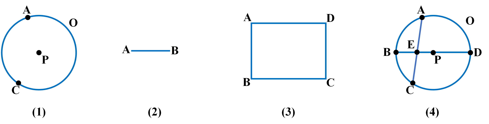

**1.声明一个点**  
如图1所示，P是圆O的圆心，我们可以这样声明一个点：

    Shape(P)

**2.声明一条线段**  
如图2所示，AB是线段的两点，我们可以这样声明线段：

    Shape(AB)

当使用Shape声明线段时，默认线段是无向的，所以这样声明也是合法的：

    Shape(BA)

**3.声明一个角**  
如图3所示，角B由两条线段构成。需要注意，在声明角时，线段是有向的，两条线出现的顺序按照逆时针的方向，首尾相接。因此角B可以表示为：

    Shape(AB,BC)

**4.声明一个封闭图形**  
如果一个边一个边或一个角一个角来声明图形，未免也太麻烦了。我们可以直接声明一个由若干线段和弧构成的图形，在构图阶段，推理器会自动扩展出图形中的
角、线和弧。因此我们在标注图形的构图语句时，先使用Shape声明所有的最小封闭图形，然后在把那些不封闭的最小图形如角、线段、点等声明，就可以声明整个图形。  
对于图3中的四边形，我们可以这样声明：

    Shape(AB,BC,CD,DA)
    Shape(BC,CD,DA,AB)
    Shape(CD,DA,AB,BC)
    Shape(DA,AB,BC,CD)

一个四边形有上述四种表示，我们选择一种就可以。  
更复杂的图形，如图4，可以声明为：

    Shape(OAB,BE,EA)
    Shape(OBC,CE,EB)
    Shape(EC,OCD,DP,PE)
    Shape(AE,EP,PD,ODA)

需注意，虽然EP和PD是共线的，但在声明封闭图形时，不能直接声明ED，需要把最小的边都声明出来。  
封闭图形可以由线和弧构成，线有两个方向，弧只有一个方向。在声明线时，需要按照逆时针的方向，各点首尾相接；声明弧时，需注意弧只有一种表示方法。  
当弧单独出现时，不需要使用Shape来声明，因为弧的出现必然伴随着Cocircular谓词，所有弧将会由Cocircular谓词自动扩展得到。

#### Collinear(*)

Collinear用来声明3个及3个以上的共线点，2点一定是共线的，所以不用声明2点。

    

共线声明是及其简单的，只要按顺序列出一条线上所有的点即可，如图1中的共线可声明为：

    Collinear(AMB)

共线没有方向之分，从另一个方向声明也是合法的：

    Collinear(BMA)

图2中的共线可声明为：

    Collinear(BCDEF)

图3中的共线可声明为：

    Collinear(ADB)
    Collinear(AEC)

共线会在推理器中自动扩展出所有的线和平角，如Collinear(AMB)会扩展得到Line(AM),Line(MB),Line(AM),Angle(AMB),Angle(BMA)。

#### Cocircular(O,*)

Cocircular用来声明共圆的若干个点，与Collinear相同，按照顺序列出若干点即可；但也与Collinear不同，一是即使1个点在圆上也要声明，二是共圆的
声明按照逆时针方向，且从任何点开始都可。

    

在图1中，共圆的几点可声明为：

    Cocircular(O,ABCD)
    Cocircular(O,BCDA)
    Cocircular(O,CDAB)
    Cocircular(O,DABC)

图1的共圆声明可以有上述4种形式，任选其1即可。图2到图4是几种比较特殊的共圆声明。
图2的圆上只有1个点，也要声明：

    Cocircular(O,A)

图3圆上没有点，也要声明：

    Cocircular(O)

图4两圆有公共点，要分别声明：

    Cocircular(O,AB)
    Cocircular(P,BA)

共圆声明后，会自动扩展出所有的弧和圆。

### 基本实体谓词

基本实体是由基本构图扩展来的实体，在构图结束后不会再改变。我们无需声明基本实体，下述内容是为了让我们理解形式化系统的内在逻辑。
基本构图谓词声明一个图形的结构信息，也就是点的相对位置信息。基本实体相当于是基本构图的unzip版本，在推理过程中更方便使用。

#### Point(A)

就是点，没什么好说的。

    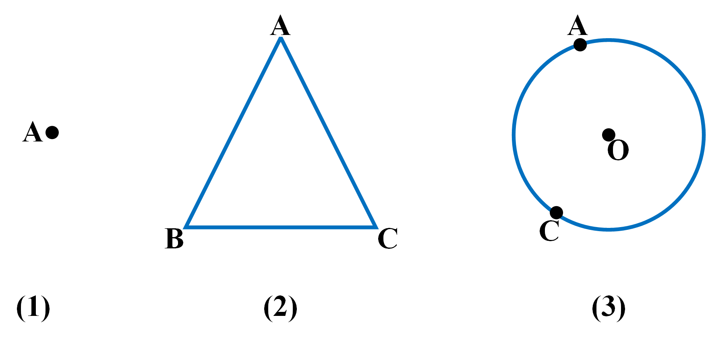

图1-3的点的声明：

    Point(A)
    Point(A),Point(B),Point(C)
    Point(A),Point(C),Point(O)

#### Line(AB)

Line声明一个无向线段。

    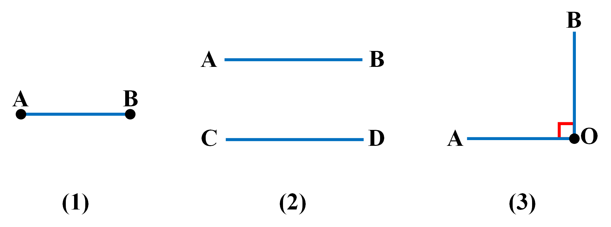

因为是无向的，所以图1的线段有两种声明方法，选其一即可：

    Line(AB)
    Line(BA)

图2和图3的线段声明：

    Line(AB),Line(CD)  
    Line(AO),Line(BO) 

#### Arc(OAB)

Arc声明一段弧，由3个点组成，第1个点是弧所在的圆，其余2点是构成弧的点，按照逆时针的方向有序列出。

    

图1-3中弧的声明：

    Arc(OAB)
    Arc(OAC),Arc(OCA)
    Arc(OAB),Arc(OBC),Arc(OCD),Arc(ODA)

#### Angle(ABC)

角由3个点构成，在声明角时，需要按照逆时针原则。

    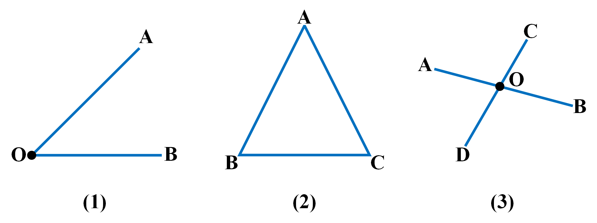

图1-3的角的声明：

    Angle(AOB)
    Angle(ABC),Angle(BCA),Angle(CAB)
    Angle(AOC),Angle(COB),Angle(BOD),Angle(DOA)

#### Polygon(*)

多边形由若干个直线构成，按照逆时针的方向列出所有的点，一个n边形有n种表示方式。

    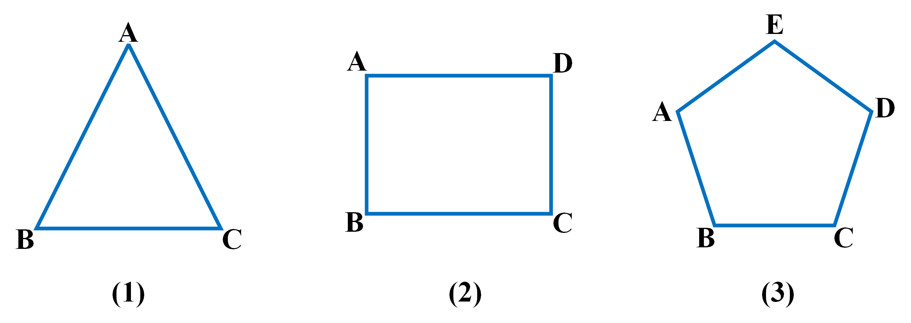

    Polygon(ABC),Polygon(BCA),Polygon(CAB)
    Polygon(ABCD),Polygon(BCDA),Polygon(CDAB),Polygon(DABC)
    Polygon(ABCDE),Polygon(BCDEA),Polygon(CDEAB),Polygon(DEABC),Polygon(EABCD)

#### Circle(O)

Circle用于声明一个圆，注意区别圆和圆心。

    

图1-3中圆的声明：

    Cirlce(O)
    Cirlce(B),Cirlce(A)
    Cirlce(O)

### 代数关系谓词

代数关系由代数式表达，记为expr。expr是由符号、运算符、属性嵌套构成的式子。凡是符合sympy语法的表达式都可以被正确的解析。

#### Equal(expr1,expr2)

Equal接受两个expr，表示代数的等价关系。

    Equal(a,5)  
    Equal(MeasureOfAngle(ABC),30)  
    Equal(Add(LengthOfLine(AB),a+5,x),y^2)

#### Equation(expr)

Equation接受一个expr，表示方程。

    Equation(a-5)  
    Equation(Sub(MeasureOfAngle(ABC),30))  
    Equation(Sub(Add(LengthOfLine(AB),a+5,x),y^2))

### 属性谓词

#### Free(y)

声明一个自由符号，可以表示未知数或代指某个几何属性。

### 运算符谓词

|  名称  |         格式         |   表达式符号   | 运算符优先级 |
|:----:|:------------------:|:---------:|:------:|
|  加   | Add(expr1,expr2,…) |     +     |   1    |
|  减   |  Sub(expr1,expr2)  |     -     |   1    |
|  乘   | Mul(expr1,expr2,…) |     *     |   2    |
|  除   |  Div(expr1,expr2)  |     /     |   2    |
|  幂   |  Pow(expr1,expr2)  |    **     |   3    |
|  模   |  Mod(expr1,expr2)  |    mod    |   3    |
|  根号  |    Sqrt(expr1)     |   sqrt    |   4    |
|  正弦  |     Sin(expr)      |    sin    |   4    |
|  余弦  |     Cos(expr)      |    cos    |   4    |
|  正切  |     Tan(expr)      |    tan    |   4    |
|  实数  |         R          | 1,2,3,... |   /    |
| 自由变量 |         f          | a,b,c,... |   /    |
| 左括号  |         /          |     (     |   5    |
| 右括号  |         /          |     )     |   0    |  

### 解题目标谓词

#### Value(expr)

expr可以是表达式，也可以是实体属性，并且可以嵌套表示。  
代数型解题目标，求某个表达式或属性的值。

    Value(LengthOfLine(AB))
    Value(Add(MeasureOfAngle(ABC),MeasureOfAngle(DEF)))
    Value(x+y)

#### Equal(expr1,expr2)

expr可以是表达式，也可以是实体属性，并且可以嵌套表示。
代数型解题目标，证明左右俩个部分相等。

    Equal(LengthOfLine(AB),x+y)
    Equal(Add(MeasureOfAngle(ABC),MeasureOfAngle(DEF)),Pow(x,2))

#### Relation(*)

逻辑型解题目标，求某个实体或属性。  
Relation表示任意实体、实体关系。

    Relation(Parallel(AB,CD))
    Relation(RightTriangle(ABC))  

## 自定义谓词
### 实体
#### RightTriangle(ABC)

    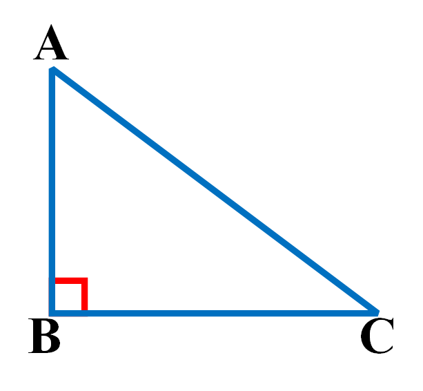

    ee_check: Polygon(ABC)
    multi: 
    extend: PerpendicularBetweenLine(AB,CB)

**Description**:  
有一个角是直角的三角形称为直角三角形。
在直角△ABC中，∠ABC为直角，AB和BC是两个直角边。

#### IsoscelesTriangle(ABC)

    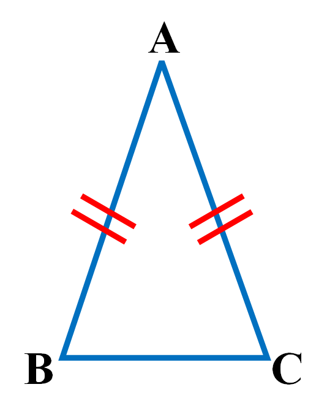

    ee_check: Polygon(ABC)
    multi: 
    extend: Equal(LengthOfLine(AB),LengthOfLine(AC))

**Description**:  
两腰相等的三角形称为等腰三角形。
AB和AC是等腰三角形ABC的两腰。

#### IsoscelesRightTriangle(ABC)

    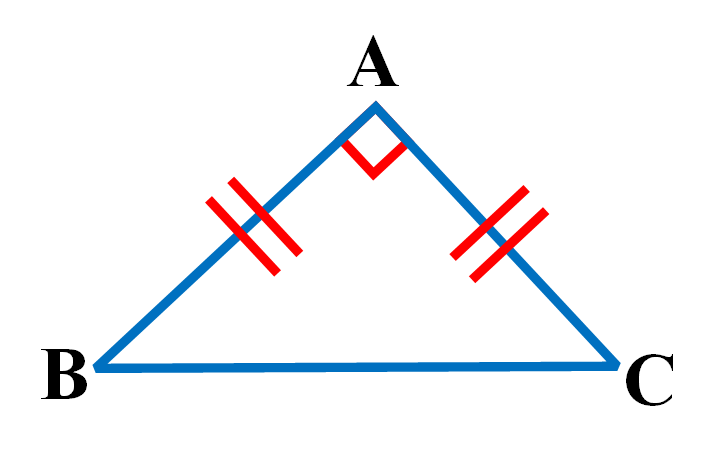

    ee_check: Polygon(ABC)
    multi: 
    extend: RightTriangle(CAB)
            IsoscelesTriangle(ABC)

**Description**:  
同时满足直角三角形和等腰三角形的三角形，是等腰直角三角形。

#### EquilateralTriangle(ABC)

    

    ee_check: Polygon(ABC)
    multi: BCA
           CAB
    extend: IsoscelesTriangle(ABC)
            IsoscelesTriangle(BCA)
            IsoscelesTriangle(CAB)

**Description**:  
三条边相等的三角形称为等边三角形。

#### Kite(ABCD)

    

    ee_check: Polygon(ABCD)
    multi: CDAB
    extend: Equal(LengthOfLine(AB),LengthOfLine(AD))
            Equal(LengthOfLine(CB),LengthOfLine(CD))

**Description**:  
两组临边相等的四边形称为风筝形。在风筝形ABCD中，AB和AD是一组临边，CB和CD是另一组临边。

#### Parallelogram(ABCD)

    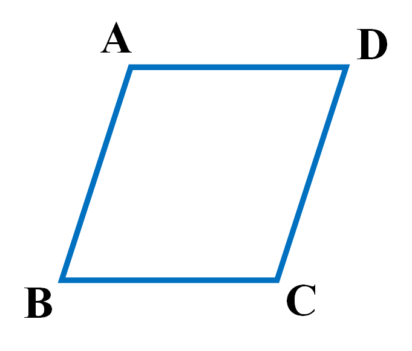

    ee_check: Polygon(ABCD)
    multi: BCDA
           CDAB
           DABC
    extend: ParallelBetweenLine(AD,BC)
            ParallelBetweenLine(BA,CD)

**Description**:  
两组对边分别平行的四边形称为平行四边形。在平行四边形ABCD中，AD和BC是一组对边，BA和CD是另一组对边。

#### Rhombus(ABCD)

    

    ee_check: Polygon(ABCD)
    multi: BCDA
           CDAB
           DABC
    extend: Parallelogram(ABCD)
            Kite(ABCD)
            Kite(BCDA)

**Description**:  
四条边相等的四边形称为菱形。

#### Rectangle(ABCD)

    

    ee_check: Polygon(ABCD)
    multi: BCDA
           CDAB
           DABC
    extend: Parallelogram(ABCD)
            PerpendicularBetweenLine(AB,CB)
            PerpendicularBetweenLine(BC,DC)
            PerpendicularBetweenLine(CD,AD)
            PerpendicularBetweenLine(DA,BA)

**Description**:  
四个角都是直角的四边形称为矩形。

#### Square(ABCD)

    

    ee_check: Polygon(ABCD)
    multi: BCDA
           CDAB
           DABC
    extend: Rhombus(ABCD)
            Rectangle(ABCD)

**Description**:  
四个角都是直角且四条边相等的四边形称为正方形。

#### Trapezoid(ABCD)

    

    ee_check: Polygon(ABCD)
    multi: CDAB
    extend: ParallelBetweenLine(AD,BC)

**Description**:  
一组对边平行且另一组对边延长后相交的四边形称为梯形。
在梯形ABCD中，AD和BC是平行边，AB和CD是梯形的腰。

#### IsoscelesTrapezoid(ABCD)

    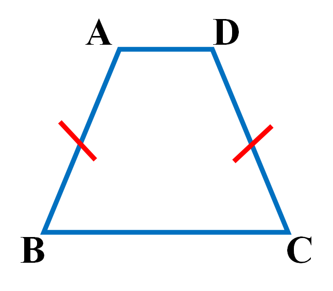

    ee_check: Polygon(ABCD)
    multi: CDAB
    extend: Trapezoid(ABCD)
            Equal(LengthOfLine(AB),LengthOfLine(CD))

**Description**:  
两腰相等的梯形称为等腰梯形。

#### RightTrapezoid(ABCD)

    

    ee_check: Polygon(ABCD)
    multi: 
    extend: Trapezoid(ABCD)
            PerpendicularBetweenLine(DA,BA)
            PerpendicularBetweenLine(AB,CB)

**Description**:  
一侧角是直角的梯形称为直角梯形。
在直角梯形ABCD中，∠A和∠B为直角。

### 实体关系
#### IsMidpointOfLine(M,AB)

    

    ee_check: Point(M)
              Line(AB)
              Collinear(AMB)
    fv_check: M,AB
    multi: M,BA
    extend: Equal(LengthOfLine(AM),LengthOfLine(MB))

**Description**:  
线段上到线段两端距离相等的点，称为线段的中点。

#### IsMidpointOfArc(M,OAB)

    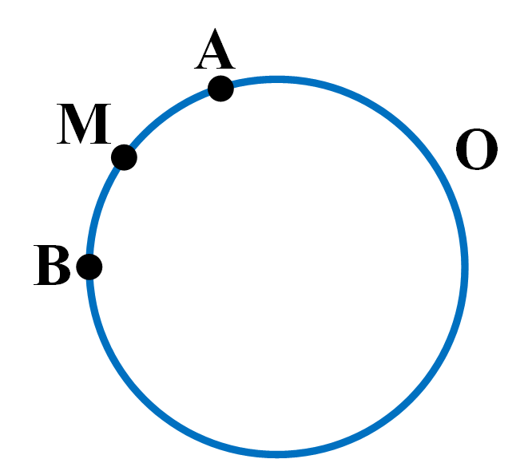

    ee_check: Point(M)
              Arc(OAB)
              Cocircular(O,AMB)
    fv_check: M,OAB
    multi: 
    extend: Equal(LengthOfArc(OAM),LengthOfArc(OMB))

**Description**:  
弧上到弧两端距离相等的点，称为弧的中点。

#### ParallelBetweenLine(AB,CD)

    

    ee_check: Line(AB)
              Line(CD)
    fv_check: AB,CD
    multi: DC,BA
    extend: 

**Description**:  
线AB和线CD相互平行。
AB与CD是同方向的线段。

#### PerpendicularBetweenLine(AO,CO)

    

    ee_check: Line(AO)
              Line(CO)
    fv_check: AO,CO
    multi: 
    extend: Equal(MeasureOfAngle(AOC),90)

**Description**:  
线AO和线CO相互垂直。
∠AOC是直角。

#### IsPerpendicularBisectorOfLine(CO,AB)

    

    ee_check: Line(CO)
              Line(AB)
              Collinear(AOB)
    fv_check: CO,AB
    multi: 
    extend: PerpendicularBetweenLine(AO,CO)
            PerpendicularBetweenLine(CO,BO)
            IsMidpointOfLine(O,AB)

**Description**:  
若CO垂直于AB，与AB交于点O，且O是AB的重点，则线CO是线AB的垂直平分线。

#### IsBisectorOfAngle(BD,ABC)

    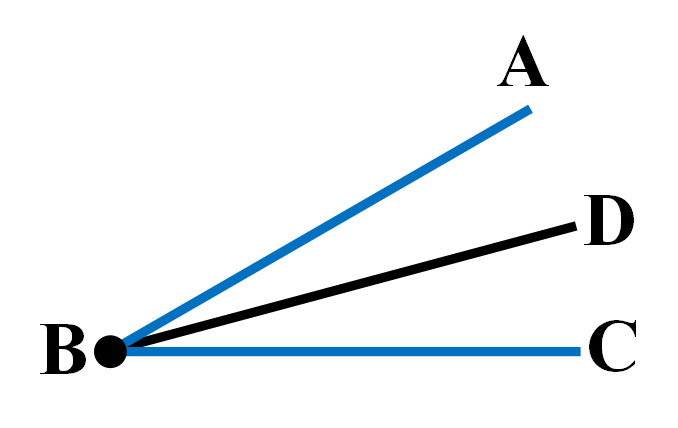

    ee_check: Line(BD)
              Angle(ABC)
    fv_check: BD,ABC
    multi: 
    extend: Equal(MeasureOfAngle(ABD),MeasureOfAngle(DBC))

**Description**:  
若BD在角ABC中间，且分割后的两个角相等，则线BD是角ABC的角平分线。

#### IsMedianOfTriangle(AD,ABC)

    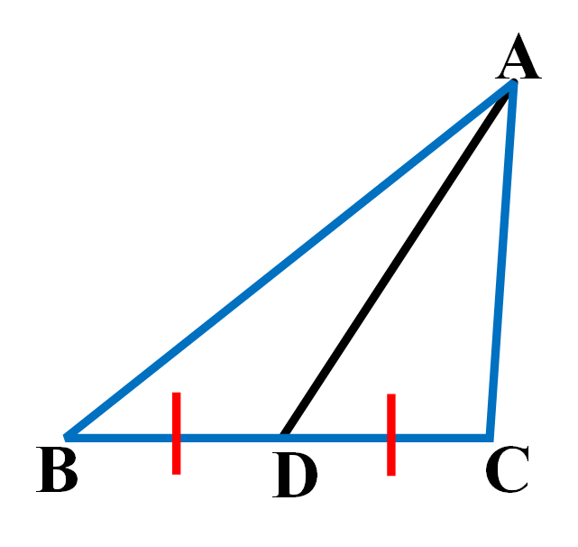

    ee_check: Line(AD)
              Polygon(ABC)
              Collinear(BDC)
    fv_check: AD,ABC
    multi: 
    extend: IsMidpointOfLine(D,BC)

**Description**:  
三角形ABC顶点A与底边BC的中点D的连线，称为三角形的中线。

#### IsAltitudeOfTriangle(AD,ABC)

    

    ee_check: Line(AD)
              Polygon(ABC)
    fv_check: AD,ABC
    multi: 
    extend: Equal(LengthOfLine(AD),HeightOfTriangle(ABC))
            PerpendicularBetweenLine(BD,AD)
            PerpendicularBetweenLine(AD,CD)

**Description**:  
垂直于底边的线段是三角形的高。

#### IsMidsegmentOfTriangle(DE,ABC)

    

    ee_check: Line(DE)
              Polygon(ABC)
              Collinear(ADB)
              Collinear(AEC)
    fv_check: DE,ABC
    multi: 
    extend: IsMidpointOfLine(D,AB)
            IsMidpointOfLine(E,AC)

**Description**:  
三角形两腰中点的连线是三角形的中位线。

#### IsCircumcenterOfTriangle(O,ABC)

    

    ee_check: Point(O)
              Polygon(ABC)
    fv_check: O,ABC
    multi: O,BCA
           O,CAB
    extend: 

**Description**:  
三角形三边垂直平分线的交点、外接圆的圆心，是三角形的外心。

#### IsIncenterOfTriangle(O,ABC)

    

    ee_check: Point(O)
              Polygon(ABC)
    fv_check: O,ABC
    multi: O,BCA
           O,CAB
    extend: IsBisectorOfAngle(AO,CAB)
            IsBisectorOfAngle(BO,ABC)
            IsBisectorOfAngle(CO,BCA)

**Description**:  
三角形三边角平分线的交点、内切圆的圆心，是三角形的内心。

#### IsCentroidOfTriangle(O,ABC)

    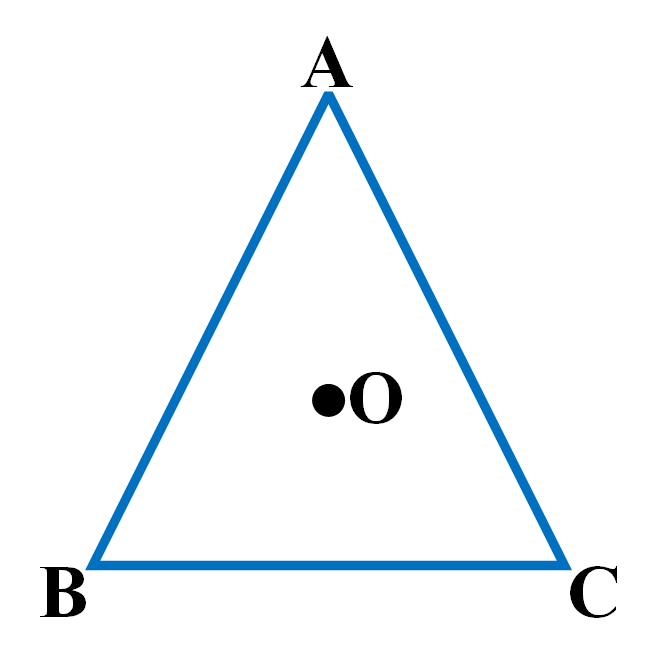

    ee_check: Point(O)
              Polygon(ABC)
    fv_check: O,ABC
    multi: O,BCA
           O,CAB
    extend: 

**Description**:  
三角形三边的中线的交点是三角形的重心。

#### IsOrthocenterOfTriangle(O,ABC)

    

    ee_check: Point(O)
              Polygon(ABC)
    fv_check: O,ABC
              A,ABC
              B,ABC
              C,ABC
    multi: O,BCA
           O,CAB
    extend: 

**Description**:  
三角形三边的高的交点是三角形的垂心。

#### CongruentBetweenTriangle(ABC,DEF)

    

    ee_check: Polygon(ABC)
              Polygon(DEF)
    multi: BCA,EFD
           CAB,FDE
    extend: 

**Description**:  
完全一致的两个三角形，称为全等三角形。

#### MirrorCongruentBetweenTriangle(ABC,DEF)

    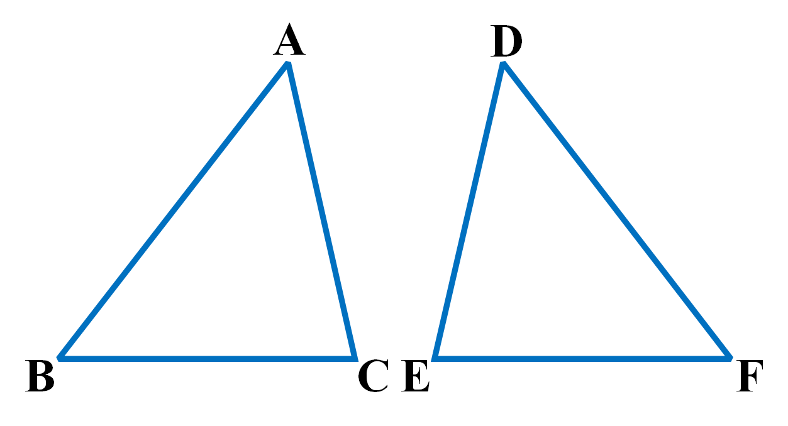

    ee_check: Polygon(ABC)
              Polygon(DEF)
    multi: BCA,FDE
           CAB,EFD
    extend: 

**Description**:  
镜像完全一致的两个三角形，称为镜像全等三角形。
点一一对应得(ABC,DFE)，不存在三角形DFE，第一个点D不动，将其他点逆序，得(ABC,DEF)。

#### SimilarBetweenTriangle(ABC,DEF)

    

    ee_check: Polygon(ABC)
              Polygon(DEF)
    multi: BCA,EFD
           CAB,FDE
    extend: 

**Description**:  
成比例的两个三角形，称为相似三角形。

#### MirrorSimilarBetweenTriangle(ABC,DEF)

    

    ee_check: Polygon(ABC)
              Polygon(DEF)
    multi: BCA,FDE
           CAB,EFD
    extend: 

**Description**:  
镜像成比例的两个三角形，称为镜像相似三角形。

#### IsAltitudeOfQuadrilateral(EF,ABCD)

    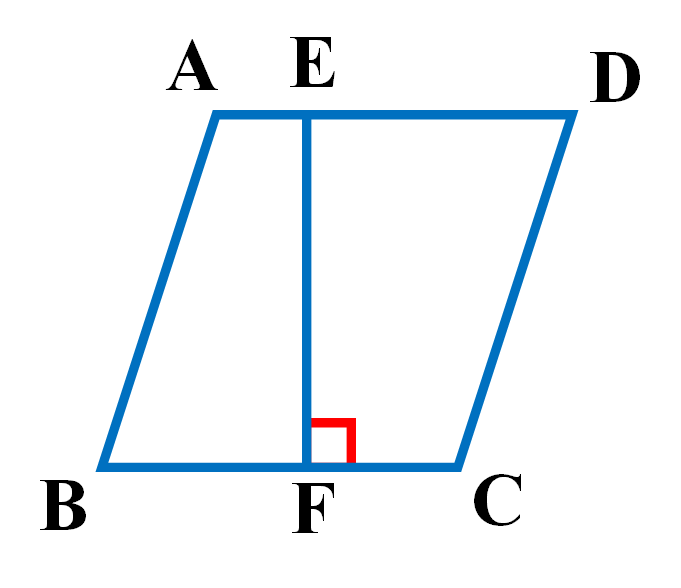

    ee_check: Line(EF)
              Polygon(ABCD)
    fv_check: EF,ABCD
              AF,ABCD
              DF,ABCD
              AC,ABCD
              DB,ABCD
    multi: 
    extend: Equal(LengthOfLine(EF),HeightOfQuadrilateral(ABCD))
            PerpendicularBetweenLine(BF,EF)
            PerpendicularBetweenLine(EF,CF)
            PerpendicularBetweenLine(DE,FE)
            PerpendicularBetweenLine(FE,AE)

**Description**:  
垂直于底边的线EF是四边形ABCD的高。

#### IsMidsegmentOfQuadrilateral(EF,ABCD)

    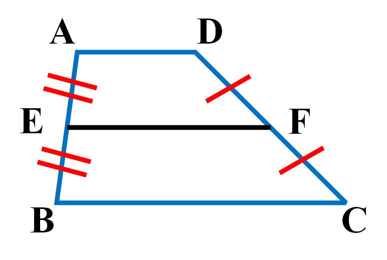

    ee_check: Line(EF)
              Polygon(ABCD)
              Collinear(AEB)
              Collinear(DFC)
    fv_check: FE,CDAB
    multi: FE,CDAB
    extend: IsMidpointOfLine(E,AB)
            IsMidpointOfLine(F,CD)

**Description**:  
四边形两腰中点的连线，称为四边形的中位线。

#### IsCircumcenterOfQuadrilateral(O,ABCD)

    

    ee_check: Point(O)
              Polygon(ABCD)
    fv_check: O,ABCD
    multi: O,BCDA
           O,CDAB
           O,DABC
    extend: 

**Description**:  
四边形外接圆的圆心，称为四边形的外心。

#### IsIncenterOfQuadrilateral(O,ABCD)

    

    ee_check: Point(O)
              Polygon(ABCD)
    fv_check: O,ABCD
    multi: O,BCDA
           O,CDAB
           O,DABC
    extend: IsBisectorOfAngle(AO,DAB)
            IsBisectorOfAngle(BO,ABC)
            IsBisectorOfAngle(CO,BCD)
            IsBisectorOfAngle(DO,CDA)

**Description**:  
四边形内切圆的圆心，称为四边形的内心。

#### CongruentBetweenQuadrilateral(ABCD,EFGH)

    

    ee_check: Polygon(ABCD)
              Polygon(EFGH)
    multi: BCDA,FGHE
           CDAB,GHEF
           DABC,HEFG
    extend: 

**Description**:  
完全一致的两个四边形，称为全等四边形。

#### MirrorCongruentBetweenQuadrilateral(ABCD,EFGH)

    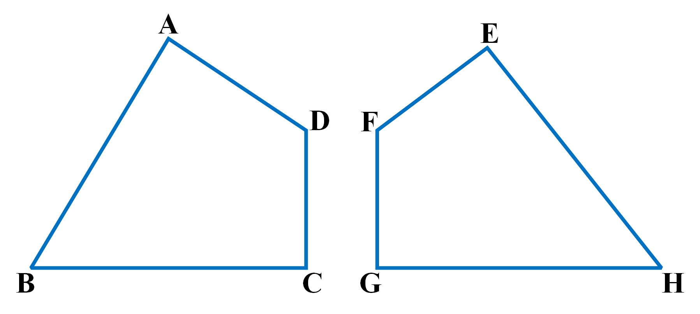

    ee_check: Polygon(ABCD)
              Polygon(EFGH)
    multi: BCDA,HEFG
           CDAB,GHEF
           DABC,FGHE
    extend: 

**Description**:  
镜像完全一致的两个四边形，称为镜像全等四边形。

#### SimilarBetweenQuadrilateral(ABCD,EFGH)

    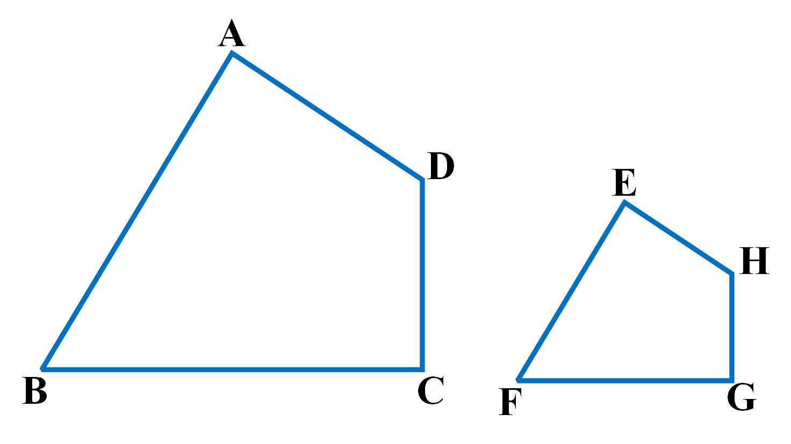

    ee_check: Polygon(ABCD)
              Polygon(EFGH)
    multi: BCDA,FGHE
           CDAB,GHEF
           DABC,HEFG
    extend: 

**Description**:  
成比例的两个四边形，称为相似四边形。

#### MirrorSimilarBetweenQuadrilateral(ABCD,EFGH)

    

    ee_check: Polygon(ABCD)
              Polygon(EFGH)
    multi: BCDA,HEFG
           CDAB,GHEF
           DABC,FGHE
    extend: 

**Description**:  
镜像成比例的两个四边形，称为镜像相似四边形。

#### CongruentBetweenArc(OAB,OCD)

    

    ee_check: Arc(OAB)
              Arc(OCD)
    multi: 
    extend: 

**Description**:  
完全一致的两个弧，称为全等弧。

#### SimilarBetweenArc(OAB,OCD)

    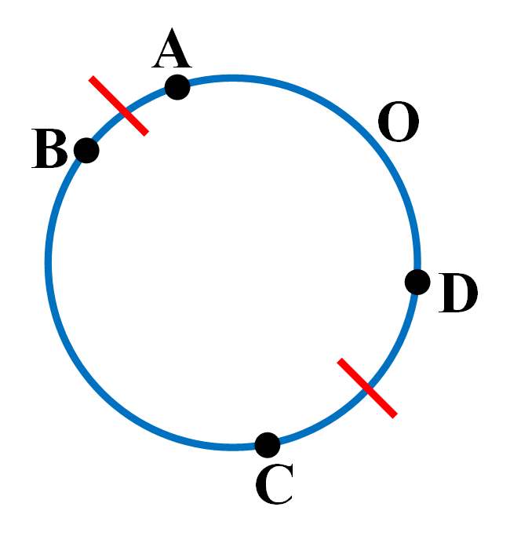

    ee_check: Arc(OAB)
              Arc(OCD)
    multi: 
    extend: 

**Description**:  
成比例的两个弧，称为相似弧。

#### IsDiameterOfCircle(AB,O)

    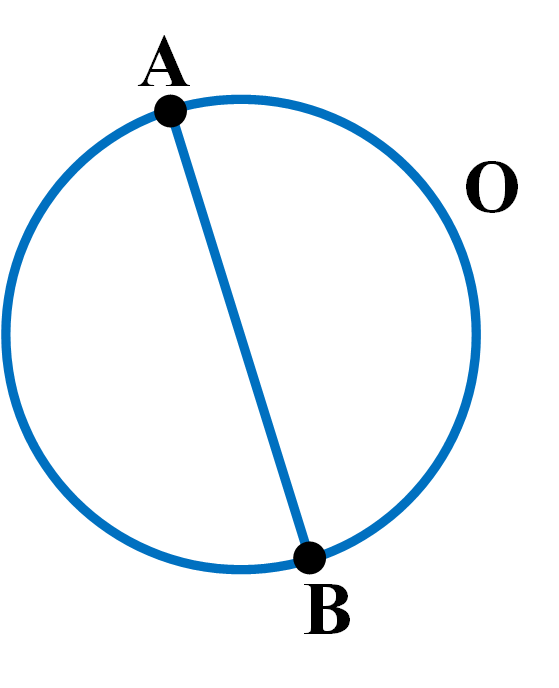

    ee_check: Line(AB)
              Cocircular(O,AB)
    fv_check: AB,O
    multi: BA,O
    extend: 

**Description**:  
圆的直径。

#### IsTangentOfCircle(PA,O)

    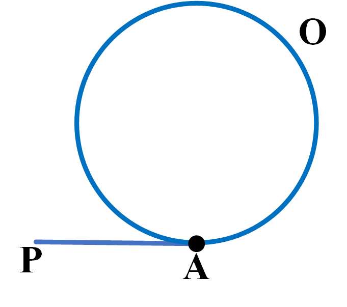

    ee_check: Line(PA)
              Cocircular(O,A)
    fv_check: PA,O
    multi: 
    extend: 

**Description**:  
过P点做一条直线，若直线与圆只有一个交点，称这个直线是圆的切线。

#### IsCentreOfCircle(P,O)

    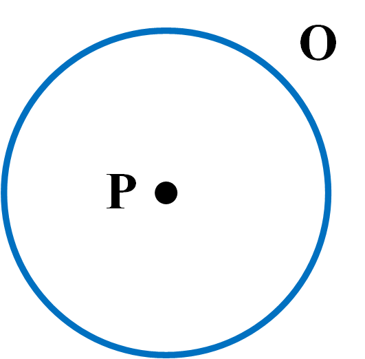

    ee_check: Point(P)
              Circle(O)
    fv_check: P,O
              O,O
    multi: 
    extend: 

**Description**:  
圆的中心称为圆的圆心。

### 实体属性
#### LengthOfLine(AB)

    

    ee_check: Line(AB)
    multi: BA
    sym: ll

**Description**:  
直线AB的长度。

#### MeasureOfAngle(ABC)

    

    ee_check: Angle(ABC)
    multi: 
    sym: ma

**Description**:  
∠ABC的角度。

#### PerimeterOfTriangle(ABC)

    

    ee_check: Polygon(ABC)
    multi: BCA
           CAB
    sym: pt

**Description**:  
三角形ABC的周长。

#### AreaOfTriangle(ABC)

    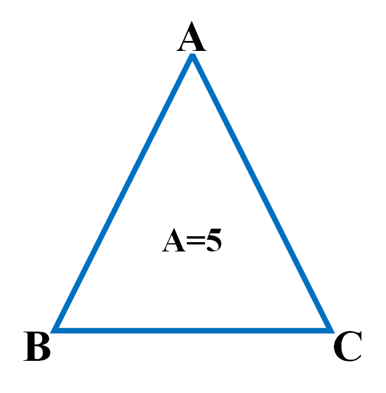

    ee_check: Polygon(ABC)
    multi: BCA
           CAB
    sym: at

**Description**:  
三角形ABC的面积。

#### HeightOfTriangle(ABC)

    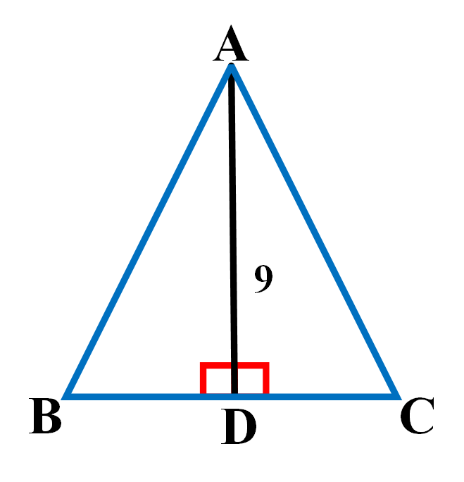

    ee_check: Polygon(ABC)
    multi: 
    sym: ht

**Description**:  
三角形ABC底边BC上的高的长度。

#### RatioOfSimilarTriangle(ABC,DEF)

    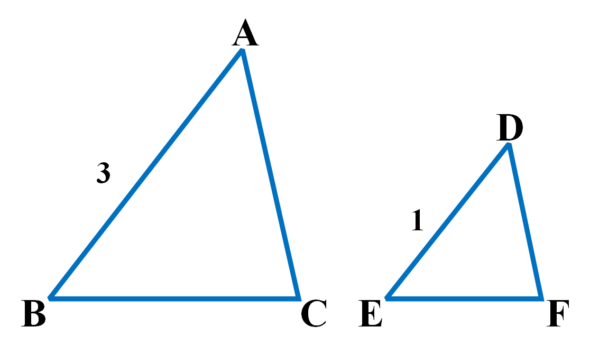

    ee_check: Polygon(ABC)
              Polygon(DEF)
    multi: BCA,EFD
           CAB,FDE
    sym: rst

**Description**:  
相似三角形的相似比。

#### RatioOfMirrorSimilarTriangle(ABC,DEF)

    

    ee_check: Polygon(ABC)
              Polygon(DEF)
    multi: BCA,FDE
           CAB,EFD
    sym: rmt

**Description**:  
镜像相似三角形的相似比。

#### PerimeterOfQuadrilateral(ABCD)

    

    ee_check: Polygon(ABCD)
    multi: BCDA
           CDAB
           DABC
    sym: pq

**Description**:  
四边形ABCD的周长。

#### AreaOfQuadrilateral(ABCD)

    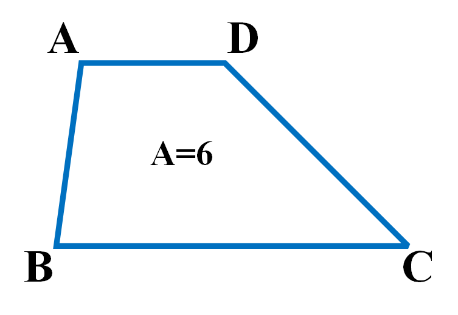

    ee_check: Polygon(ABCD)
    multi: BCDA
           CDAB
           DABC
    sym: aq

**Description**:  
四边形ABCD的面积。

#### HeightOfQuadrilateral(ABCD)

    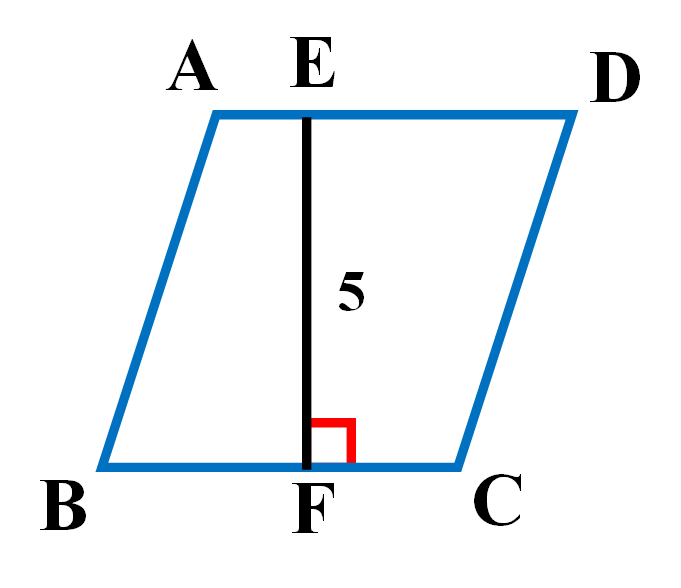

    ee_check: Polygon(ABCD)
    multi: 
    sym: hq

**Description**:  
四边形ABCD底边BC上的高的长度。

#### RatioOfSimilarQuadrilateral(ABCD,EFGH)

    

    ee_check: Polygon(ABCD)
              Polygon(EFGH)
    multi: BCDA,FGHE
           CDAB,GHEF
           DABC,HEFG
    sym: rsq

**Description**:  
相似四边形的相似比。

#### RatioOfMirrorSimilarQuadrilateral(ABCD,EFGH)

    

    ee_check: Polygon(ABCD)
              Polygon(EFGH)
    multi: BCDA,HEFG
           CDAB,GHEF
           DABC,FGHE
    sym: rmq

**Description**:  
镜像相似四边形的相似比。

#### LengthOfArc(OAB)

    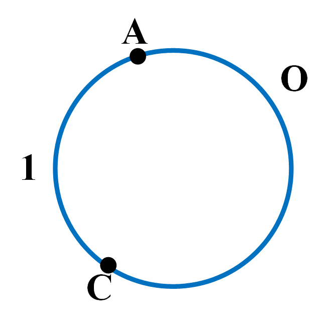

    ee_check: Arc(OAB)
    multi: 
    sym: la

**Description**:  
弧OAB的长度。

#### MeasureOfArc(OAB)

    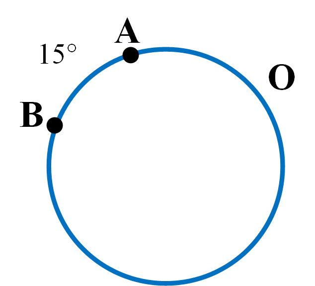

    ee_check: Arc(OAB)
    multi: 
    sym: mar

**Description**:  
弧OAB的角度。
与弧OAB所对圆心角的大小相等。

#### RatioOfSimilarArc(OAB,OCD)

    

    ee_check: Arc(OAB)
              Arc(OCD)
    multi: 
    sym: rsa

**Description**:  
相似弧的相似比。

#### RadiusOfCircle(O)

    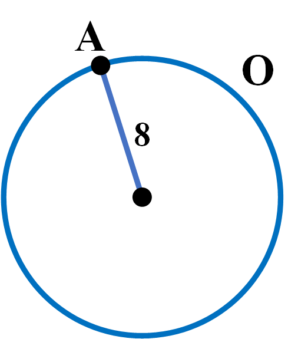

    ee_check: Circle(O)
    multi: 
    sym: rc

**Description**:  
圆半径的长度。

#### DiameterOfCircle(O)

    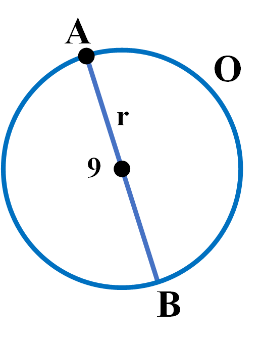

    ee_check: Circle(O)
    multi: 
    sym: dc

**Description**:  
圆直径的长度。

#### PerimeterOfCircle(O)

    

    ee_check: Circle(O)
    multi: 
    sym: pc

**Description**:  
The circumference of the circle.

#### AreaOfCircle(O)

    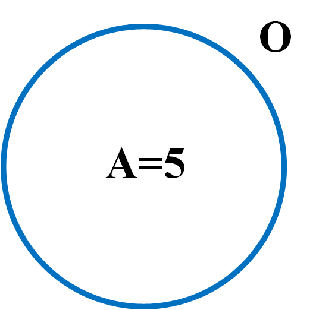

    ee_check: Circle(O)
    multi: 
    sym: ac

**Description**:  
The area of the circle.

#### PerimeterOfSector(OAB)

    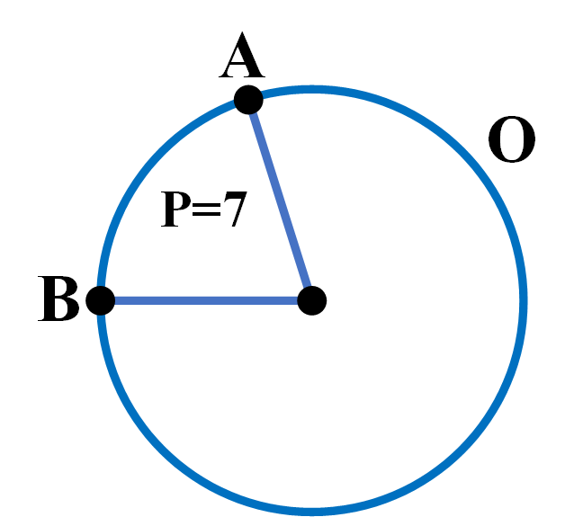

    ee_check: Arc(OAB)
    multi: 
    sym: ps

**Description**:  
The circumference of the sector.

#### AreaOfSector(OAB)

    

    ee_check: Arc(OAB)
    multi: 
    sym: as

**Description**:  
The area of the sector.

## 自定义定理
#### line_addition(AB,BC)

    

    premise: Collinear(ABC)
    conclusion: Equal(LengthOfLine(AC),Add(LengthOfLine(AB),LengthOfLine(BC)))

**Description**:  
1.常识：若ABC三点共线，则AB+BC=AC

#### midpoint_of_line_judgment(M,AB)

    

    premise: Collinear(AMB)&Equal(LengthOfLine(AM),LengthOfLine(MB))
    conclusion: IsMidpointOfLine(M,AB)

**Description**:  
1.中点的判定：点到线段两端的距离相等

#### parallel_judgment_corresponding_angle(AB,CD,E)

    

    # branch 1
    premise: Angle(EAB)&Angle(ACD)&Collinear(EAC)&Equal(MeasureOfAngle(EAB),MeasureOfAngle(ACD))
    conclusion: ParallelBetweenLine(AB,CD)
    # branch 2
    premise: Angle(BAC)&Angle(DCE)&Collinear(ACE)&Equal(MeasureOfAngle(BAC),MeasureOfAngle(DCE))
    conclusion: ParallelBetweenLine(AB,CD)

**Description**:  
1.平行的判定，同位角相等  
2.注意标注的参数：只判断左侧的同位角，点E是构成同位角的另外一点

#### parallel_judgment_alternate_interior_angle(AB,CD)

    

    # branch 1
    premise: Angle(BAD)&Angle(CDA)&Equal(MeasureOfAngle(BAD),MeasureOfAngle(CDA))
    conclusion: ParallelBetweenLine(AB,CD)
    # branch 2
    premise: Angle(CBA)&Angle(BCD)&Equal(MeasureOfAngle(CBA),MeasureOfAngle(BCD))
    conclusion: ParallelBetweenLine(AB,CD)

**Description**:  
1.平行的判定：内错角相等

#### parallel_judgment_ipsilateral_internal_angle(AB,CD)

    

    premise: Angle(BAC)&Angle(ACD)&Equal(Add(MeasureOfAngle(BAC),MeasureOfAngle(ACD)),180)
    conclusion: ParallelBetweenLine(AB,CD)

**Description**:  
1.平行的判定，同旁内角互补  
2.注意标注的参数：只判断左侧的同旁内角

#### parallel_judgment_par_par(AB,CD,EF)

    

    premise: ParallelBetweenLine(AB,CD)&ParallelBetweenLine(CD,EF)
    conclusion: ParallelBetweenLine(AB,EF)

**Description**:  
1.平行的传递性

#### parallel_judgment_per_per(AB,CD)

    

    # branch 1
    premise: PerpendicularBetweenLine(BA,CA)&PerpendicularBetweenLine(AC,DC)
    conclusion: ParallelBetweenLine(AB,CD)
    # branch 2
    premise: PerpendicularBetweenLine(CD,AD)&PerpendicularBetweenLine(BA,DA)
    conclusion: ParallelBetweenLine(AB,CD)

**Description**:  
1.由垂直推出平行

#### parallel_property_collinear_extend(AB,CD,M)

    

    # branch 1
    premise: ParallelBetweenLine(AB,CD)&Collinear(MAB)
    conclusion: ParallelBetweenLine(MA,CD)
                ParallelBetweenLine(MB,CD)
    # branch 2
    premise: ParallelBetweenLine(AB,CD)&Collinear(ABM)
    conclusion: ParallelBetweenLine(AM,CD)
                ParallelBetweenLine(BM,CD)
    # branch 3
    premise: ParallelBetweenLine(AB,CD)&Collinear(AMB)
    conclusion: ParallelBetweenLine(AM,CD)
                ParallelBetweenLine(MB,CD)

**Description**:  
1.平行的共线扩展：由一个平行关系和一条平行线（上方那条）的共线点推出其他平行关系

#### parallel_property_corresponding_angle(AB,CD,E)

    

    # branch 1
    premise: ParallelBetweenLine(AB,CD)&Collinear(EAC)
    conclusion: Equal(MeasureOfAngle(EAB),MeasureOfAngle(ACD))
    # branch 2
    premise: ParallelBetweenLine(AB,CD)&Collinear(ACE)
    conclusion: Equal(MeasureOfAngle(BAC),MeasureOfAngle(DCE))

**Description**:  
1.平行的性质：同位角相等

#### parallel_property_alternate_interior_angle(AB,CD)

    

    # branch 1
    premise: ParallelBetweenLine(AB,CD)&Line(AD)
    conclusion: Equal(MeasureOfAngle(BAD),MeasureOfAngle(CDA))
    # branch 2
    premise: ParallelBetweenLine(AB,CD)&Line(BC)
    conclusion: Equal(MeasureOfAngle(CBA),MeasureOfAngle(BCD))

**Description**:  
1.平行的性质：内错角相等

#### parallel_property_ipsilateral_internal_angle(AB,CD)

    

    premise: ParallelBetweenLine(AB,CD)&Line(AC)
    conclusion: Equal(Add(MeasureOfAngle(BAC),MeasureOfAngle(ACD)),180)

**Description**:  
1.平行的性质：同旁内角互补  
2.左侧的同旁内角

#### parallel_property_par_per(AB,CD)

    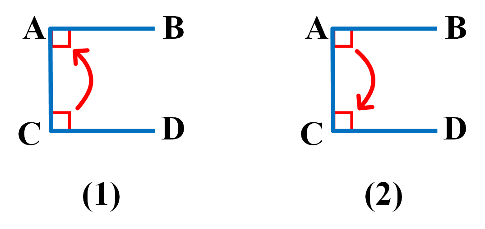

    # branch 1
    premise: ParallelBetweenLine(AB,CD)&PerpendicularBetweenLine(AC,DC)
    conclusion: PerpendicularBetweenLine(BA,CA)
    # branch 2
    premise: ParallelBetweenLine(AB,CD)&PerpendicularBetweenLine(BA,CA)
    conclusion: PerpendicularBetweenLine(AC,DC)

**Description**:  
1.平行线的性质：垂直+平行-->垂直

#### perpendicular_judgment_angle(AO,CO)

    

    premise: Angle(AOC)&Equal(MeasureOfAngle(AOC),90)
    conclusion: PerpendicularBetweenLine(AO,CO)

**Description**:  
1.垂直的判定：角为90°

#### perpendicular_bisector_judgment_per_and_mid(CO,AB)

    

    premise: Collinear(AOB)&Angle(AOC)&Equal(MeasureOfAngle(AOC),90)&Equal(LengthOfLine(AO),LengthOfLine(BO))
    conclusion: IsPerpendicularBisectorOfLine(CO,AB)

**Description**:  
1.垂直平分线判定：垂直且平分

#### perpendicular_bisector_judgment_distance_equal(CO,AB)

    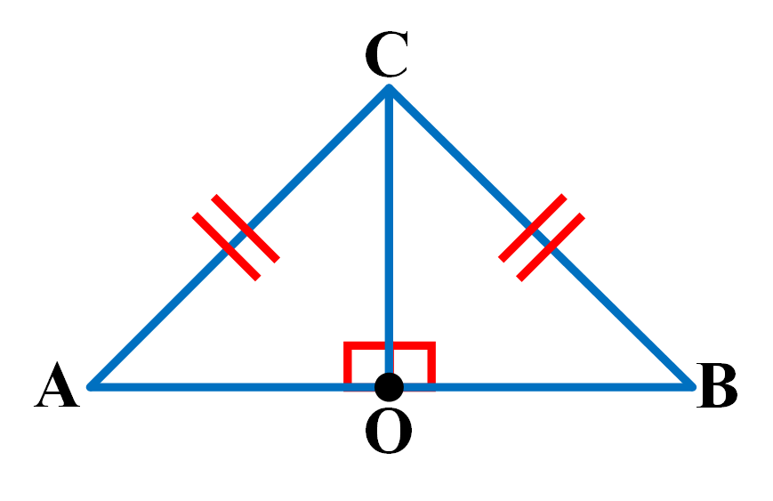

    premise: Collinear(AOB)&Angle(AOC)&Equal(MeasureOfAngle(AOC),90)&Equal(LengthOfLine(CA),LengthOfLine(CB))
    conclusion: IsPerpendicularBisectorOfLine(CO,AB)

**Description**:  
1.垂直平分线判定：垂直平分线上的点到两个端点的距离相等

#### perpendicular_bisector_property_distance_equal(CO,AB)

    

    premise: IsPerpendicularBisectorOfLine(CO,AB)
    conclusion: Equal(LengthOfLine(CA),LengthOfLine(CB))

**Description**:  
1.垂直平分线性质：垂直平分线上的点到两个端点的距离相等

#### perpendicular_bisector_property_bisector(CO,AB)

    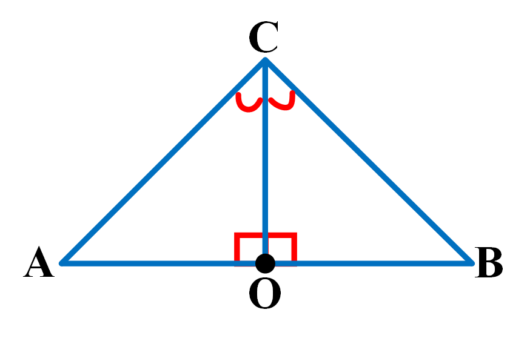

    premise: IsPerpendicularBisectorOfLine(CO,AB)&Angle(BCO)&Angle(OCA)
    conclusion: IsBisectorOfAngle(CO,BCA)

**Description**:  
1.垂直平分线性质：垂直平分线也是角平分线

#### angle_addition(ABC,CBD)

    

    premise: Angle(ABC)&Angle(CBD)&Angle(ABD)
    conclusion: Equal(MeasureOfAngle(ABD),Add(MeasureOfAngle(ABC),MeasureOfAngle(CBD)))

**Description**:  
1.常识：若∠ABC与∠CBD相邻，则∠ABC+∠CBD=∠ABD

#### flat_angle(ABC)

    

    premise: Collinear(ABC)
    conclusion: Equal(MeasureOfAngle(ABC),180)

**Description**:  
1.常识：平角为180°

#### adjacent_complementary_angle(AOB,BOC)

    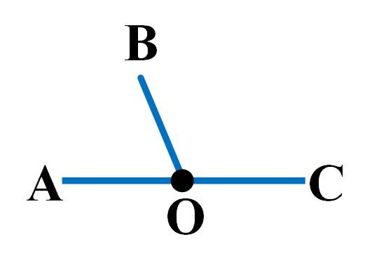

    premise: Collinear(AOC)&Angle(AOB)&Angle(BOC)
    conclusion: Equal(Add(MeasureOfAngle(AOB),MeasureOfAngle(BOC)),180)

**Description**:  
1.邻补角定理：一对邻补角的角度和为180°

#### round_angle(AOB,BOA)

    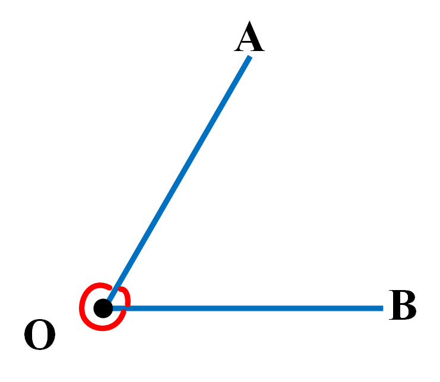

    premise: Angle(AOB)&Angle(BOA)
    conclusion: Equal(Add(MeasureOfAngle(AOB),MeasureOfAngle(BOA)),360)

**Description**:  
1.周角定理：周角为360°

#### vertical_angle(AOC,BOD)

    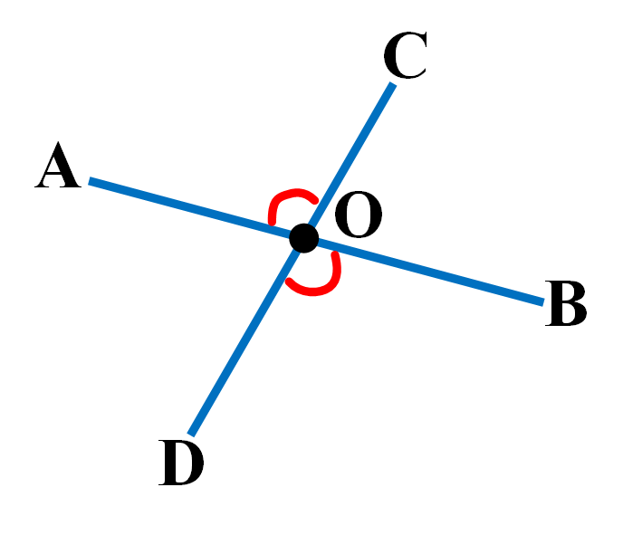

    premise: Collinear(AOB)&Collinear(COD)&Angle(AOC)&Angle(BOD)
    conclusion: Equal(MeasureOfAngle(AOC),MeasureOfAngle(BOD))

**Description**:  
1.对顶角相等：两直线相交，对顶角相等

#### bisector_of_angle_judgment_angle_equal(BD,ABC)

    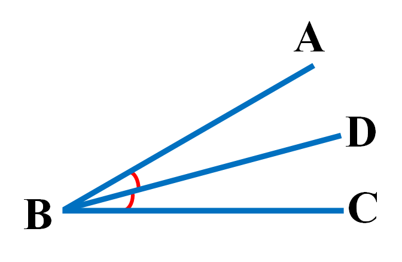

    premise: Angle(ABD)&Angle(DBC)&Equal(MeasureOfAngle(ABD),MeasureOfAngle(DBC))
    conclusion: IsBisectorOfAngle(BD,ABC)

**Description**:  
1.角平分线的判定：平分的两角相等

#### bisector_of_angle_property_distance_equal(BD,ABC)

    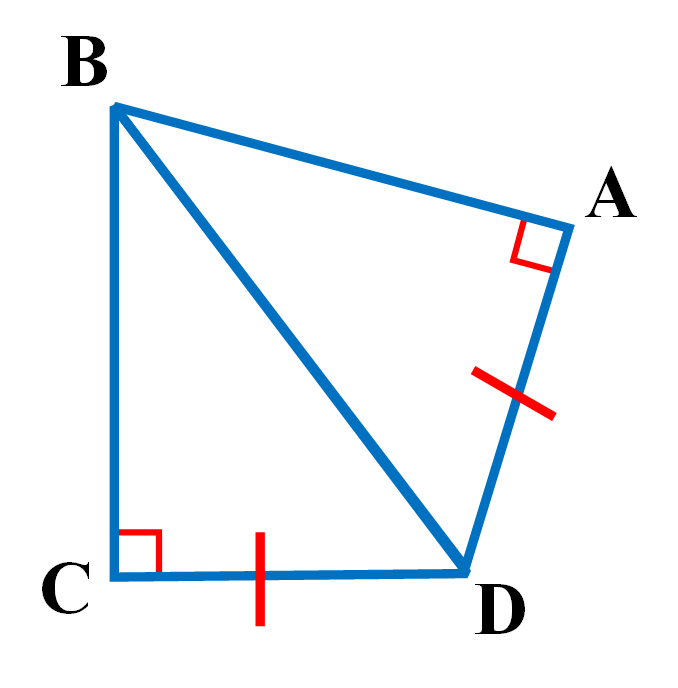

    premise: IsBisectorOfAngle(BD,ABC)&Equal(MeasureOfAngle(BCD),90)&Equal(MeasureOfAngle(DAB),90)
    conclusion: Equal(LengthOfLine(DA),LengthOfLine(DC))

**Description**:  
1.角平分线的判定：角平分线上的点到两端的距离相等

#### bisector_of_angle_property_line_ratio(BD,ABC)

    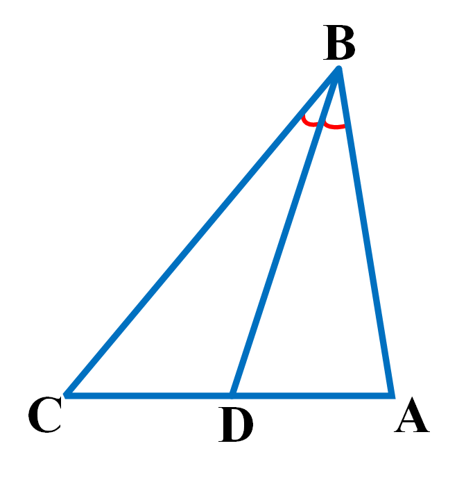

    premise: IsBisectorOfAngle(BD,ABC)&Collinear(CDA)
    conclusion: Equal(Mul(LengthOfLine(CD),LengthOfLine(BA)),Mul(LengthOfLine(DA),LengthOfLine(BC)))

**Description**:  
1.角平分线的性质：边成比例

#### bisector_of_angle_property_length_formula(BD,ABC)

    

    premise: IsBisectorOfAngle(BD,ABC)&Collinear(CDA)
    conclusion: Equal(Mul(LengthOfLine(BD),LengthOfLine(BD)),Sub(Mul(LengthOfLine(BC),LengthOfLine(BA)),Mul(LengthOfLine(DC),LengthOfLine(DA))))

**Description**:  
1.角平分线的性质：长度公式

#### triangle_property_angle_sum(ABC)

    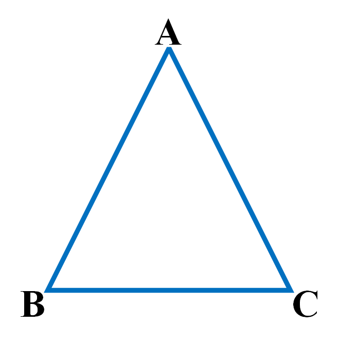

    premise: Polygon(ABC)
    conclusion: Equal(Add(MeasureOfAngle(ABC),MeasureOfAngle(BCA),MeasureOfAngle(CAB)),180)

**Description**:  
1.三角形内角和为180°

#### sine_theorem(ABC)

    

    premise: Polygon(ABC)
    conclusion: Equal(Mul(LengthOfLine(AB),Sin(MeasureOfAngle(ABC))),Mul(LengthOfLine(AC),Sin(MeasureOfAngle(BCA))))

**Description**:  
1.正弦定理  
2.注意标注参数，三角形两腰和和两底角的正弦值成比例

#### cosine_theorem(ABC)

    

    premise: Polygon(ABC)
    conclusion: Equal(Add(Pow(LengthOfLine(BC),2),Mul(2,LengthOfLine(AB),LengthOfLine(AC),Cos(MeasureOfAngle(CAB)))),Add(Pow(LengthOfLine(AB),2),Pow(LengthOfLine(AC),2)))

**Description**:  
1.余弦定理  
2.注意标注参数，角是顶角

#### triangle_perimeter_formula(ABC)

    

    premise: Polygon(ABC)
    conclusion: Equal(PerimeterOfTriangle(ABC),Add(LengthOfLine(AB),LengthOfLine(BC),LengthOfLine(CA)))

**Description**:  
1.三角形周长公式：三边之和

#### triangle_area_formula_common(ABC)

    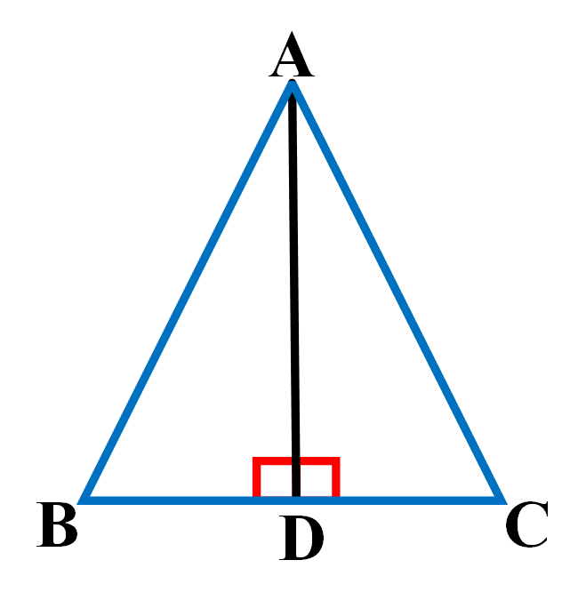

    premise: Polygon(ABC)
    conclusion: Equal(AreaOfTriangle(ABC),Mul(HeightOfTriangle(ABC),LengthOfLine(BC),1/2))

**Description**:  
1.三角形面积公式：底乘高除2  
2.对应的底边是BC

#### triangle_area_formula_sine(ABC)

    

    premise: Polygon(ABC)
    conclusion: Equal(AreaOfTriangle(ABC),Mul(LengthOfLine(AB),LengthOfLine(AC),Sin(MeasureOfAngle(CAB)),1/2))

**Description**:  
1.三角形面积公式：已知一角和两临边即可求面积  
2.角是三角形的顶角，边是三角形的两腰，如triangle_area_formula_sine(ABC)会用∠CAB、边AB和边AC

#### median_of_triangle_judgment(AD,ABC)

    

    premise: Polygon(ABC)&Line(AD)&Collinear(BDC)&Equal(LengthOfLine(BD),LengthOfLine(CD))
    conclusion: IsMedianOfTriangle(AD,ABC)

**Description**:  
1.三角形中线的判定：顶点与底边中点的连线

#### altitude_of_triangle_judgment(AD,ABC)

    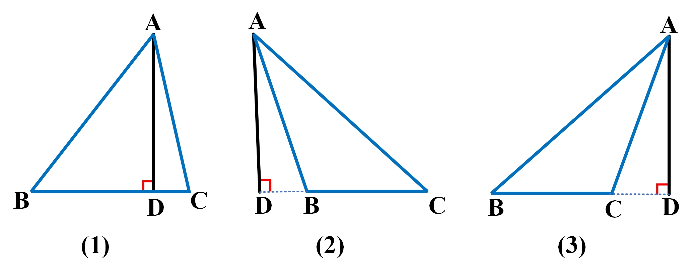

    # branch 1
    premise: Polygon(ABC)&Line(AD)&Collinear(BDC)&Equal(MeasureOfAngle(BDA),90)
    conclusion: IsAltitudeOfTriangle(AD,ABC)
    # branch 2
    premise: Polygon(ABC)&Line(AD)&Collinear(DBC)&Equal(MeasureOfAngle(ADB),90)
    conclusion: IsAltitudeOfTriangle(AD,ABC)
    # branch 3
    premise: Polygon(ABC)&Line(AD)&Collinear(BCD)&Equal(MeasureOfAngle(CDA),90)
    conclusion: IsAltitudeOfTriangle(AD,ABC)

**Description**:  
1.三角形高的判定：垂直于底边

#### midsegment_of_triangle_judgment_midpoint(DE,ABC)

    

    premise: Polygon(ABC)&Collinear(ADB)&Collinear(AEC)&Line(DE)&Equal(LengthOfLine(AD),LengthOfLine(BD))&Equal(LengthOfLine(AE),LengthOfLine(CE))
    conclusion: IsMidsegmentOfTriangle(DE,ABC)

**Description**:  
1.中位线判定：两边中点的连线

#### midsegment_of_triangle_judgment_parallel(DE,ABC)

    

    # branch 1
    premise: Polygon(ABC)&Collinear(ADB)&Collinear(AEC)&Line(DE)&ParallelBetweenLine(DE,BC)&Equal(LengthOfLine(AD),LengthOfLine(BD))
    conclusion: IsMidsegmentOfTriangle(DE,ABC)
    # branch 2
    premise: Polygon(ABC)&Collinear(ADB)&Collinear(AEC)&Line(DE)&ParallelBetweenLine(DE,BC)&Equal(LengthOfLine(AE),LengthOfLine(CE))
    conclusion: IsMidsegmentOfTriangle(DE,ABC)
    # branch 3
    premise: Polygon(ABC)&Collinear(ADB)&Collinear(AEC)&Line(DE)&ParallelBetweenLine(DE,BC)&Equal(LengthOfLine(BC),Mul(LengthOfLine(DE),2))
    conclusion: IsMidsegmentOfTriangle(DE,ABC)

**Description**:  
1.中位线判定：平行且与三角形某腰的交点是该腰的中点

#### midsegment_of_triangle_property_parallel(DE,ABC)

    

    premise: IsMidsegmentOfTriangle(DE,ABC)
    conclusion: ParallelBetweenLine(DE,BC)

**Description**:  
1.中位线性质：平行于底边

#### midsegment_of_triangle_property_length(DE,ABC)

    

    premise: IsMidsegmentOfTriangle(DE,ABC)
    conclusion: Equal(LengthOfLine(DE),Mul(LengthOfLine(BC),1/2))

**Description**:  
1.中位线性质：中位线长度等于底边的一半

#### circumcenter_of_triangle_judgment_intersection(O,ABC,D,E)

    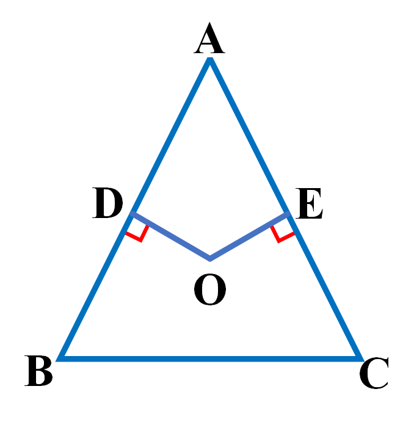

    premise: Polygon(ABC)&Collinear(ADB)&Collinear(CEA)&IsPerpendicularBisectorOfLine(OD,AB)&IsPerpendicularBisectorOfLine(OE,CA)
    conclusion: IsCircumcenterOfTriangle(O,ABC)

**Description**:  
1.三角形外心判定：垂直平分线交点

#### circumcenter_of_triangle_property_intersection(O,ABC,D)

    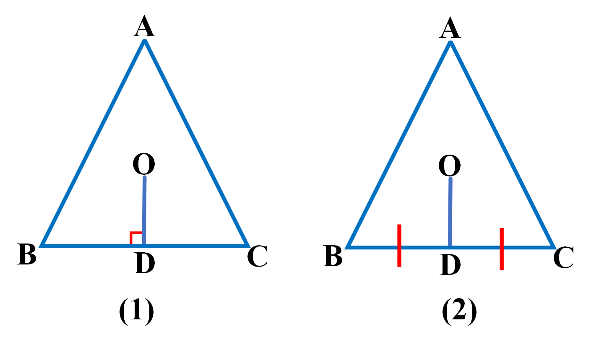

    # branch 1
    premise: IsCircumcenterOfTriangle(O,ABC)&Collinear(BDC)&Line(OD)&Equal(MeasureOfAngle(BDO),90)
    conclusion: IsPerpendicularBisectorOfLine(OD,BC)
    # branch 2
    premise: IsCircumcenterOfTriangle(O,ABC)&Collinear(BDC)&Line(OD)&Equal(LengthOfLine(BD),LengthOfLine(CD))
    conclusion: IsPerpendicularBisectorOfLine(OD,BC)

**Description**:  
1.三角形外心性质：垂直平分线交点

#### incenter_of_triangle_judgment_intersection(O,ABC)

    

    premise: Polygon(ABC)&IsBisectorOfAngle(BO,ABC)&IsBisectorOfAngle(CO,BCA)
    conclusion: IsIncenterOfTriangle(O,ABC)

**Description**:  
1.三角形内心判定：角平分线交点

#### centroid_of_triangle_judgment_intersection(O,ABC,M,N)

    

    premise: IsMedianOfTriangle(CM,CAB)&IsMedianOfTriangle(BN,BCA)&Collinear(COM)&Collinear(BON)
    conclusion: IsCentroidOfTriangle(O,ABC)

**Description**:  
1.三角形重心判定：中线的交点

#### centroid_of_triangle_property_intersection(O,ABC,M)

    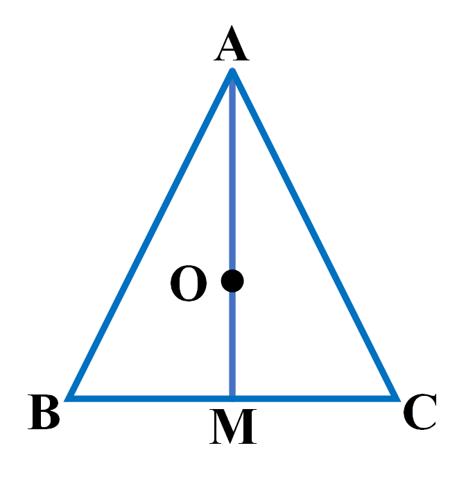

    premise: IsCentroidOfTriangle(O,ABC)&Collinear(AOM)&Collinear(BMC)
    conclusion: IsMedianOfTriangle(AM,ABC)

**Description**:  
1.三角形重心性质：中线交点

#### centroid_of_triangle_property_line_ratio(O,ABC,M)

    

    premise: IsCentroidOfTriangle(O,ABC)&Collinear(AOM)&Collinear(BMC)
    conclusion: Equal(LengthOfLine(OA),Mul(LengthOfLine(OM),2))

**Description**:  
1.三角形重心性质：中线被重心分开的两部分成比例

#### orthocenter_of_triangle_judgment_intersection(O,ABC,D,E)

    

    premise: IsAltitudeOfTriangle(CD,CAB)&IsAltitudeOfTriangle(BE,BCA)&Collinear(COD)&Collinear(BOE)
    conclusion: IsOrthocenterOfTriangle(O,ABC)

**Description**:  
1.三角形垂心判定：高的交点

#### orthocenter_of_triangle_property_intersection(O,ABC,D)

    

    premise: IsOrthocenterOfTriangle(O,ABC)&Collinear(AOD)&Collinear(BDC)
    conclusion: IsAltitudeOfTriangle(AD,ABC)

**Description**:  
1.三角形垂心性质：高的交点

#### orthocenter_of_triangle_property_angle(O,ABC)

    

    premise: IsOrthocenterOfTriangle(O,ABC)&Angle(COB)
    conclusion: Equal(MeasureOfAngle(COB),Add(MeasureOfAngle(ABC),MeasureOfAngle(BCA)))

**Description**:  
1.三角形垂心性质：底边两点与O构成的角的大小等于三角形两底角之和

#### congruent_triangle_judgment_sss(ABC,DEF)

    

    premise: Polygon(ABC)&Polygon(DEF)&Equal(LengthOfLine(AB),LengthOfLine(DE))&Equal(LengthOfLine(BC),LengthOfLine(EF))&Equal(LengthOfLine(CA),LengthOfLine(FD))
    conclusion: CongruentBetweenTriangle(ABC,DEF)

**Description**:  
1.全等三角形判定：SSS

#### congruent_triangle_judgment_sas(ABC,DEF)

    

    premise: Polygon(ABC)&Polygon(DEF)&Equal(LengthOfLine(AB),LengthOfLine(DE))&Equal(MeasureOfAngle(CAB),MeasureOfAngle(FDE))&Equal(LengthOfLine(AC),LengthOfLine(DF))
    conclusion: CongruentBetweenTriangle(ABC,DEF)

**Description**:  
1.全等三角形判定：SAS

#### congruent_triangle_judgment_aas(ABC,DEF)

    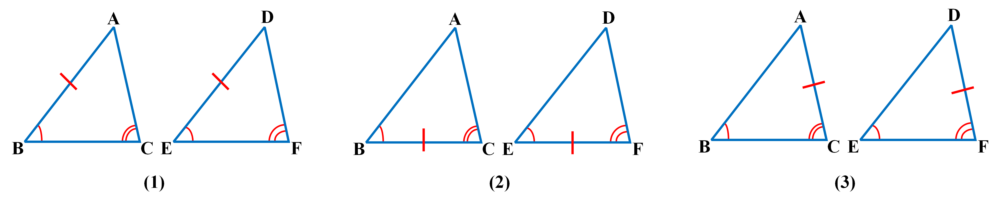

    # branch 1
    premise: Polygon(ABC)&Polygon(DEF)&Equal(MeasureOfAngle(ABC),MeasureOfAngle(DEF))&Equal(MeasureOfAngle(BCA),MeasureOfAngle(EFD))&Equal(LengthOfLine(AB),LengthOfLine(DE))
    conclusion: CongruentBetweenTriangle(ABC,DEF)
    # branch 2
    premise: Polygon(ABC)&Polygon(DEF)&Equal(MeasureOfAngle(ABC),MeasureOfAngle(DEF))&Equal(MeasureOfAngle(BCA),MeasureOfAngle(EFD))&Equal(LengthOfLine(BC),LengthOfLine(EF))
    conclusion: CongruentBetweenTriangle(ABC,DEF)
    # branch 3
    premise: Polygon(ABC)&Polygon(DEF)&Equal(MeasureOfAngle(ABC),MeasureOfAngle(DEF))&Equal(MeasureOfAngle(BCA),MeasureOfAngle(EFD))&Equal(LengthOfLine(AC),LengthOfLine(DF))
    conclusion: CongruentBetweenTriangle(ABC,DEF)

**Description**:  
1.全等三角形判定：AAS

#### congruent_triangle_judgment_hl(ABC,DEF)

    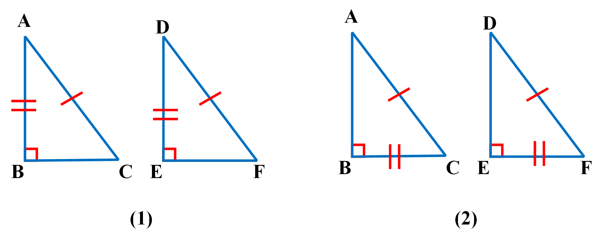

    premise: Polygon(ABC)&Polygon(DEF)&Equal(MeasureOfAngle(ABC),90)&Equal(MeasureOfAngle(DEF),90)&Equal(LengthOfLine(AC),LengthOfLine(DF))&(Equal(LengthOfLine(AB),LengthOfLine(DE))|Equal(LengthOfLine(BC),LengthOfLine(EF)))
    conclusion: CongruentBetweenTriangle(ABC,DEF)

**Description**:  
1.全等三角形判定：HL

#### congruent_triangle_property_line_equal(ABC,DEF)

    

    premise: CongruentBetweenTriangle(ABC,DEF)
    conclusion: Equal(LengthOfLine(BC),LengthOfLine(EF))

**Description**:  
1.全等三角形性质：边相等

#### congruent_triangle_property_angle_equal(ABC,DEF)

    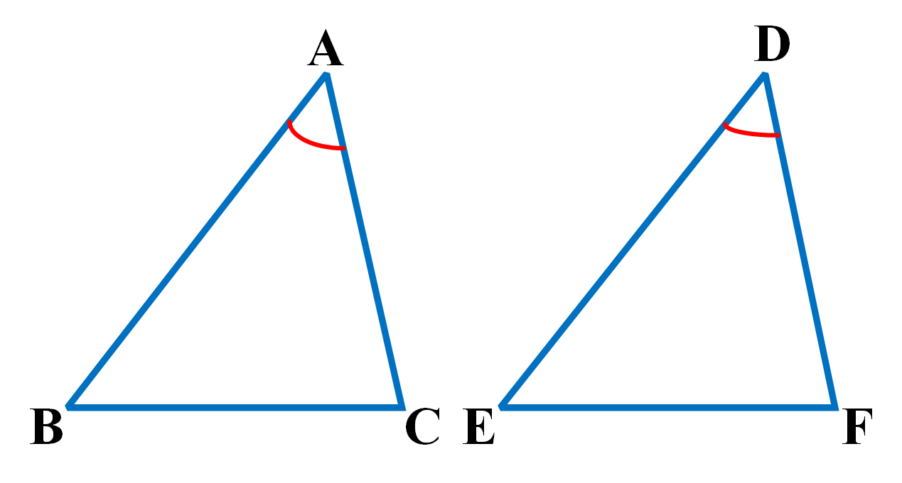

    premise: CongruentBetweenTriangle(ABC,DEF)
    conclusion: Equal(MeasureOfAngle(CAB),MeasureOfAngle(FDE))

**Description**:  
1.全等三角形性质：角相等

#### congruent_triangle_property_perimeter_equal(ABC,DEF)

    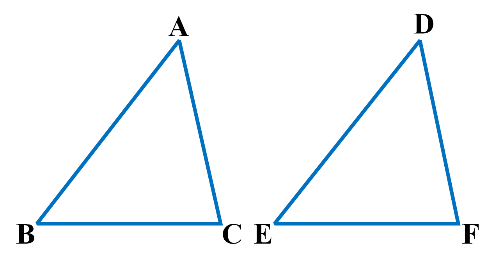

    premise: CongruentBetweenTriangle(ABC,DEF)
    conclusion: Equal(PerimeterOfTriangle(ABC),PerimeterOfTriangle(DEF))

**Description**:  
1.全等三角形性质：周长相等

#### congruent_triangle_property_area_equal(ABC,DEF)

    

    premise: CongruentBetweenTriangle(ABC,DEF)
    conclusion: Equal(AreaOfTriangle(ABC),AreaOfTriangle(DEF))

**Description**:  
1.全等三角形性质：面积相等

#### congruent_triangle_property_exchange(ABC,DEF)

    

    premise: CongruentBetweenTriangle(ABC,DEF)
    conclusion: CongruentBetweenTriangle(DEF,ABC)

**Description**:  
1.全等三角形性质：先后顺序不影响三角形的全等

#### mirror_congruent_triangle_judgment_sss(ABC,DEF)

    

    premise: Polygon(ABC)&Polygon(DEF)&Equal(LengthOfLine(AB),LengthOfLine(FD))&Equal(LengthOfLine(BC),LengthOfLine(EF))&Equal(LengthOfLine(CA),LengthOfLine(DE))
    conclusion: MirrorCongruentBetweenTriangle(ABC,DEF)

**Description**:  
1.镜像全等三角形判定：SSS

#### mirror_congruent_triangle_judgment_sas(ABC,DEF)

    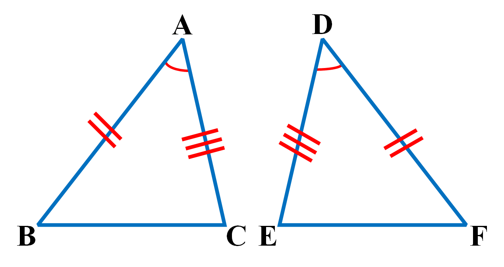

    premise: Polygon(ABC)&Polygon(DEF)&Equal(LengthOfLine(AB),LengthOfLine(DF))&Equal(MeasureOfAngle(CAB),MeasureOfAngle(FDE))&Equal(LengthOfLine(AC),LengthOfLine(DE))
    conclusion: MirrorCongruentBetweenTriangle(ABC,DEF)

**Description**:  
1.镜像全等三角形判定：SAS

#### mirror_congruent_triangle_judgment_aas(ABC,DEF)

    

    # branch 1
    premise: Polygon(ABC)&Polygon(DEF)&Equal(MeasureOfAngle(ABC),MeasureOfAngle(EFD))&Equal(MeasureOfAngle(BCA),MeasureOfAngle(DEF))&Equal(LengthOfLine(AB),LengthOfLine(DF))
    conclusion: MirrorCongruentBetweenTriangle(ABC,DEF)
    # branch 2
    premise: Polygon(ABC)&Polygon(DEF)&Equal(MeasureOfAngle(ABC),MeasureOfAngle(EFD))&Equal(MeasureOfAngle(BCA),MeasureOfAngle(DEF))&Equal(LengthOfLine(BC),LengthOfLine(EF))
    conclusion: MirrorCongruentBetweenTriangle(ABC,DEF)
    # branch 3
    premise: Polygon(ABC)&Polygon(DEF)&Equal(MeasureOfAngle(ABC),MeasureOfAngle(EFD))&Equal(MeasureOfAngle(BCA),MeasureOfAngle(DEF))&Equal(LengthOfLine(CA),LengthOfLine(DE))
    conclusion: MirrorCongruentBetweenTriangle(ABC,DEF)

**Description**:  
1.镜像全等三角形判定：AAS

#### mirror_congruent_triangle_judgment_hl(ABC,DEF)

    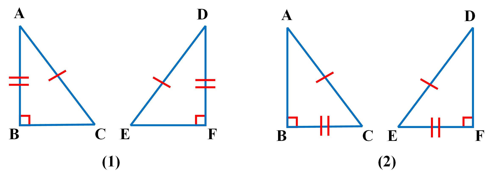

    premise: Polygon(ABC)&Polygon(DEF)&Equal(MeasureOfAngle(ABC),90)&Equal(MeasureOfAngle(EFD),90)&Equal(LengthOfLine(AC),LengthOfLine(DE))&(Equal(LengthOfLine(BC),LengthOfLine(EF))|Equal(LengthOfLine(AB),LengthOfLine(DF)))
    conclusion: MirrorCongruentBetweenTriangle(ABC,DEF)

**Description**:  
1.镜像全等三角形判定：HL

#### mirror_congruent_triangle_property_line_equal(ABC,DEF)

    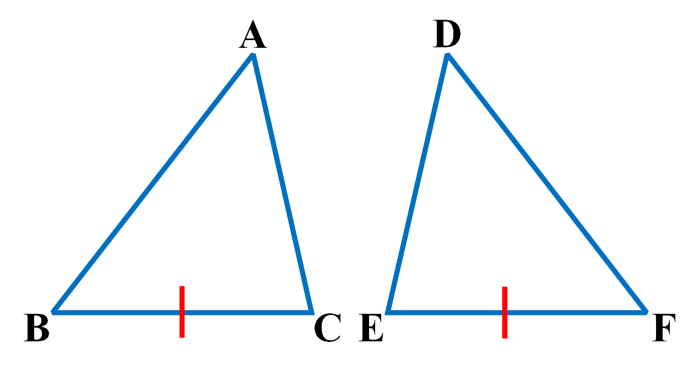

    premise: MirrorCongruentBetweenTriangle(ABC,DEF)
    conclusion: Equal(LengthOfLine(BC),LengthOfLine(EF))

**Description**:  
1.镜像全等三角形性质：边相等

#### mirror_congruent_triangle_property_angle_equal(ABC,DEF)

    

    premise: MirrorCongruentBetweenTriangle(ABC,DEF)
    conclusion: Equal(MeasureOfAngle(CAB),MeasureOfAngle(FDE))

**Description**:  
1.镜像全等三角形性质：角相等

#### mirror_congruent_triangle_property_perimeter_equal(ABC,DEF)

    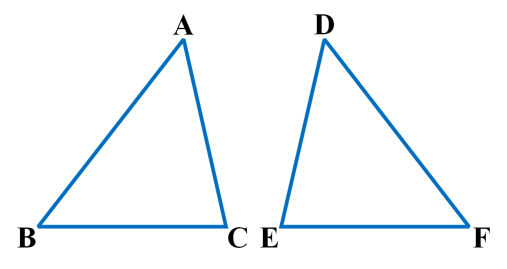

    premise: MirrorCongruentBetweenTriangle(ABC,DEF)
    conclusion: Equal(PerimeterOfTriangle(ABC),PerimeterOfTriangle(DEF))

**Description**:  
1.镜像全等三角形性质：周长相等

#### mirror_congruent_triangle_property_area_equal(ABC,DEF)

    

    premise: MirrorCongruentBetweenTriangle(ABC,DEF)
    conclusion: Equal(AreaOfTriangle(ABC),AreaOfTriangle(DEF))

**Description**:  
1.镜像全等三角形性质：面积相等

#### mirror_congruent_triangle_property_exchange(ABC,DEF)

    

    premise: MirrorCongruentBetweenTriangle(ABC,DEF)
    conclusion: MirrorCongruentBetweenTriangle(DEF,ABC)

**Description**:  
1.镜像全等三角形性质：先后顺序不影响三角形的镜像全等

#### similar_triangle_judgment_sss(ABC,DEF)

    

    premise: Polygon(ABC)&Polygon(DEF)&Equal(Mul(LengthOfLine(AB),LengthOfLine(EF)),Mul(LengthOfLine(DE),LengthOfLine(BC)))&Equal(Mul(LengthOfLine(AB),LengthOfLine(DF)),Mul(LengthOfLine(DE),LengthOfLine(CA)))
    conclusion: SimilarBetweenTriangle(ABC,DEF)

**Description**:  
1.相似三角形判定：SSS

#### similar_triangle_judgment_sas(ABC,DEF)

    

    premise: Polygon(ABC)&Polygon(DEF)&Equal(Mul(LengthOfLine(AB),LengthOfLine(DF)),Mul(LengthOfLine(DE),LengthOfLine(AC)))&Equal(MeasureOfAngle(CAB),MeasureOfAngle(FDE))
    conclusion: SimilarBetweenTriangle(ABC,DEF)

**Description**:  
1.相似三角形判定：SAS

#### similar_triangle_judgment_aa(ABC,DEF)

    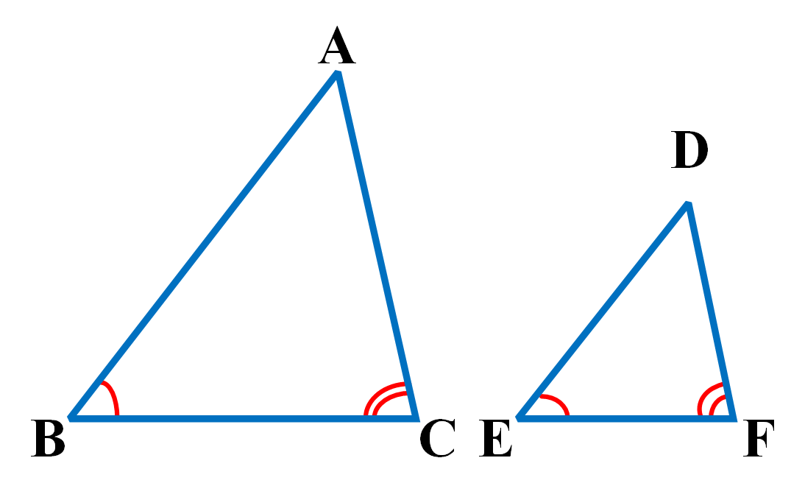

    premise: Polygon(ABC)&Polygon(DEF)&Equal(MeasureOfAngle(ABC),MeasureOfAngle(DEF))&Equal(MeasureOfAngle(BCA),MeasureOfAngle(EFD))
    conclusion: SimilarBetweenTriangle(ABC,DEF)

**Description**:  
1.相似三角形判定：AA

#### similar_triangle_judgment_hl(ABC,DEF)

    

    # branch 1
    premise: Polygon(ABC)&Polygon(DEF)&Equal(MeasureOfAngle(ABC),90)&Equal(MeasureOfAngle(DEF),90)&Equal(Mul(LengthOfLine(AB),LengthOfLine(DF)),Mul(LengthOfLine(AC),LengthOfLine(DE)))
    conclusion: SimilarBetweenTriangle(ABC,DEF)
    # branch 2
    premise: Polygon(ABC)&Polygon(DEF)&PerpendicularBetweenLine(AB,CB)&PerpendicularBetweenLine(DE,FE)&Equal(Mul(LengthOfLine(BC),LengthOfLine(DF)),Mul(LengthOfLine(AC),LengthOfLine(EF)))
    conclusion: SimilarBetweenTriangle(ABC,DEF)

**Description**:  
1.全等三角形判定：HL

#### similar_triangle_property_ratio(ABC,DEF)

    

    premise: SimilarBetweenTriangle(ABC,DEF)
    conclusion: SimilarBetweenTriangle(DEF,ABC)
                Equal(Mul(RatioOfSimilarTriangle(ABC,DEF),RatioOfSimilarTriangle(DEF,ABC)),1)

**Description**:  
1.相似三角形的比值 ABC/DEF * DEF/ABC = 1

#### similar_triangle_property_line_ratio(ABC,DEF)

    

    premise: SimilarBetweenTriangle(ABC,DEF)
    conclusion: Equal(LengthOfLine(BC),Mul(LengthOfLine(EF),RatioOfSimilarTriangle(ABC,DEF)))

**Description**:  
1.相似三角形性质：边成比例  
2.使用一次定理只得到底边成比例

#### similar_triangle_property_angle_equal(ABC,DEF)

    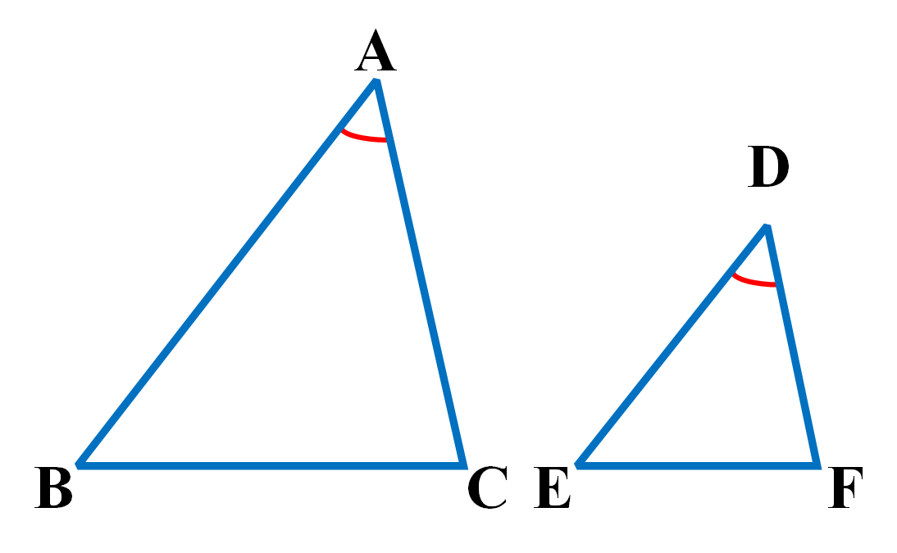

    premise: SimilarBetweenTriangle(ABC,DEF)
    conclusion: Equal(MeasureOfAngle(CAB),MeasureOfAngle(FDE))

**Description**:  
1.相似三角形性质：角相等

#### similar_triangle_property_perimeter_ratio(ABC,DEF)

    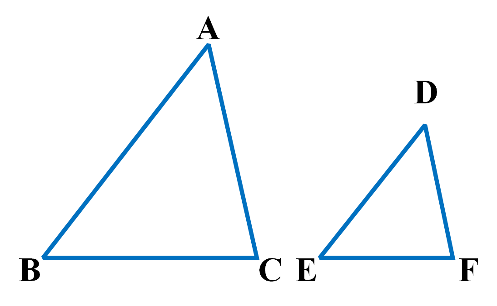

    premise: SimilarBetweenTriangle(ABC,DEF)
    conclusion: Equal(PerimeterOfTriangle(ABC),Mul(PerimeterOfTriangle(DEF),RatioOfSimilarTriangle(ABC,DEF)))

**Description**:  
1.相似三角形性质：周长成比例

#### similar_triangle_property_area_square_ratio(ABC,DEF)

    

    premise: SimilarBetweenTriangle(ABC,DEF)
    conclusion: Equal(AreaOfTriangle(ABC),Mul(AreaOfTriangle(DEF),RatioOfSimilarTriangle(ABC,DEF),RatioOfSimilarTriangle(ABC,DEF)))

**Description**:  
1.相似三角形性质：面积成比例

#### mirror_similar_triangle_judgment_sss(ABC,DEF)

    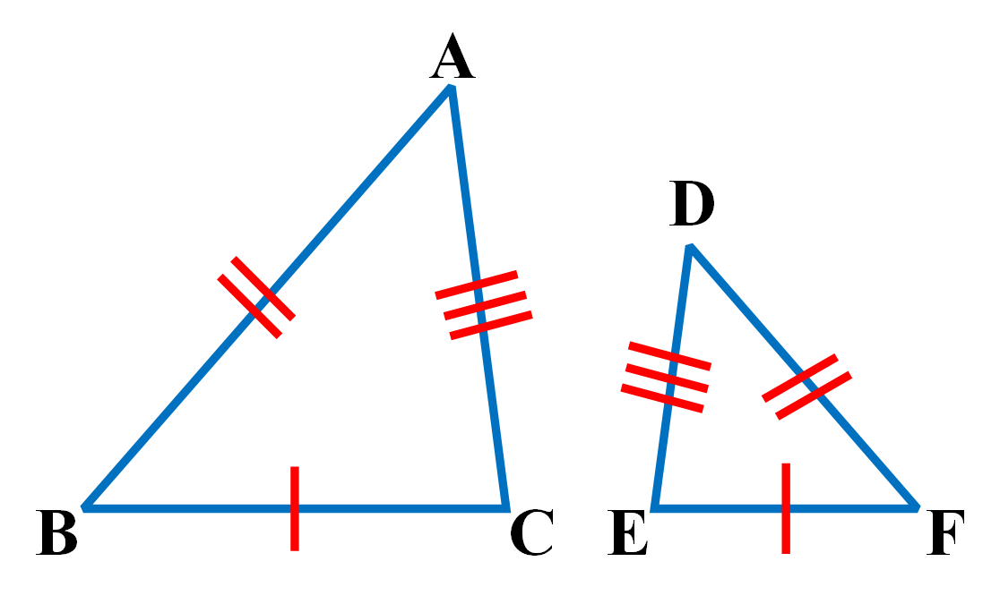

    premise: Polygon(ABC)&Polygon(DEF)&Equal(Mul(LengthOfLine(AB),LengthOfLine(EF)),Mul(LengthOfLine(FD),LengthOfLine(BC)))&Equal(Mul(LengthOfLine(AB),LengthOfLine(DE)),Mul(LengthOfLine(FD),LengthOfLine(CA)))
    conclusion: MirrorSimilarBetweenTriangle(ABC,DEF)

**Description**:  
1.相似三角形判定：SSS

#### mirror_similar_triangle_judgment_sas(ABC,DEF)

    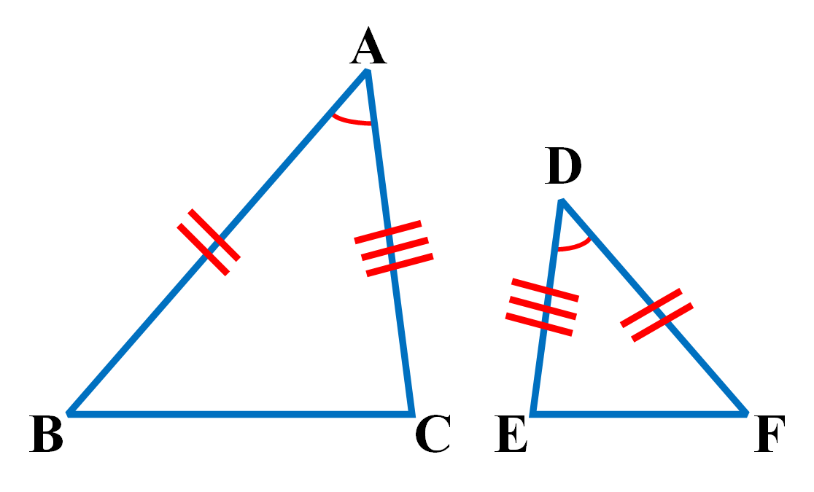

    premise: Polygon(ABC)&Polygon(DEF)&Equal(Mul(LengthOfLine(AB),LengthOfLine(DE)),Mul(LengthOfLine(DF),LengthOfLine(AC)))&Equal(MeasureOfAngle(CAB),MeasureOfAngle(FDE))
    conclusion: MirrorSimilarBetweenTriangle(ABC,DEF)

**Description**:  
1.相似三角形判定：SAS

#### mirror_similar_triangle_judgment_aa(ABC,DEF)

    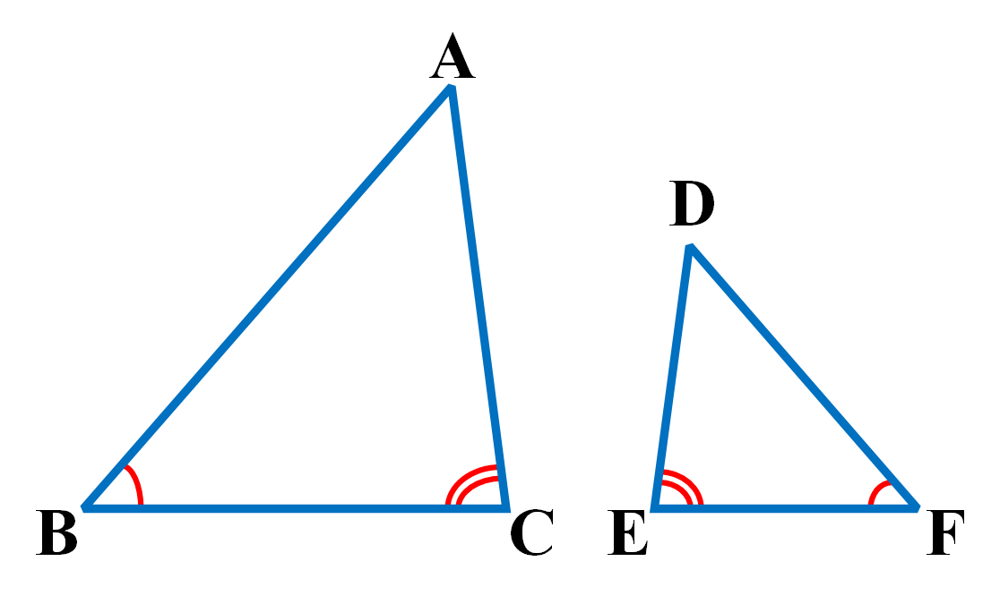

    premise: Polygon(ABC)&Polygon(DEF)&Equal(MeasureOfAngle(ABC),MeasureOfAngle(EFD))&Equal(MeasureOfAngle(BCA),MeasureOfAngle(DEF))
    conclusion: MirrorSimilarBetweenTriangle(ABC,DEF)

**Description**:  
1.相似三角形判定：AA

#### mirror_similar_triangle_judgment_hl(ABC,DEF)

    

    # branch 1
    premise: Polygon(BCA)&Polygon(DEF)&Equal(MeasureOfAngle(ABC),90)&Equal(MeasureOfAngle(DEF),90)&Equal(Mul(LengthOfLine(AB),LengthOfLine(DE)),Mul(LengthOfLine(DF),LengthOfLine(AC)))
    conclusion: MirrorSimilarBetweenTriangle(ABC,DEF)
    # branch 2
    premise: Polygon(BCA)&Polygon(DEF)&Equal(MeasureOfAngle(ABC),90)&Equal(MeasureOfAngle(EFD),90)&Equal(Mul(LengthOfLine(BC),LengthOfLine(DE)),Mul(LengthOfLine(AC),LengthOfLine(EF)))
    conclusion: MirrorSimilarBetweenTriangle(ABC,DEF)

**Description**:  
1.镜像相似三角形判定：HL

#### mirror_similar_triangle_property_ratio(ABC,DEF)

    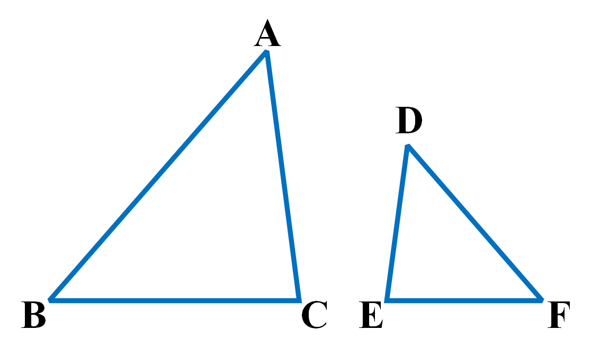

    premise: MirrorSimilarBetweenTriangle(ABC,DEF)
    conclusion: MirrorSimilarBetweenTriangle(DEF,ABC)
                Equal(Mul(RatioOfMirrorSimilarTriangle(ABC,DEF),RatioOfMirrorSimilarTriangle(DEF,ABC)),1)

**Description**:  
1.镜像相似三角形的比值 ABC/DEF * DEF/ABC = 1

#### mirror_similar_triangle_property_line_ratio(ABC,DEF)

    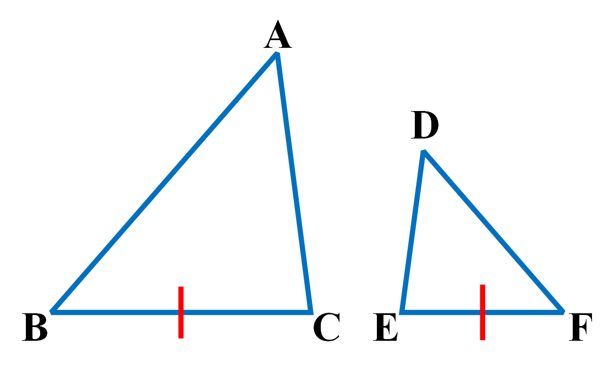

    premise: MirrorSimilarBetweenTriangle(ABC,DEF)
    conclusion: Equal(LengthOfLine(BC),Mul(LengthOfLine(EF),RatioOfMirrorSimilarTriangle(ABC,DEF)))

**Description**:  
1.相似三角形性质：边成比例  
2.使用一次定理只声明底边成比例

#### mirror_similar_triangle_property_angle_equal(ABC,DEF)

    

    premise: MirrorSimilarBetweenTriangle(ABC,DEF)
    conclusion: Equal(MeasureOfAngle(CAB),MeasureOfAngle(FDE))

**Description**:  
1.相似三角形性质：角相等

#### mirror_similar_triangle_property_perimeter_ratio(ABC,DEF)

    

    premise: MirrorSimilarBetweenTriangle(ABC,DEF)
    conclusion: Equal(PerimeterOfTriangle(ABC),Mul(PerimeterOfTriangle(DEF),RatioOfMirrorSimilarTriangle(ABC,DEF)))

**Description**:  
1.相似三角形性质：周长成比例

#### mirror_similar_triangle_property_area_square_ratio(ABC,DEF)

    

    premise: MirrorSimilarBetweenTriangle(ABC,DEF)
    conclusion: Equal(AreaOfTriangle(ABC),Mul(AreaOfTriangle(DEF),RatioOfMirrorSimilarTriangle(ABC,DEF),RatioOfMirrorSimilarTriangle(ABC,DEF)))

**Description**:  
1.相似三角形性质：面积成比例

#### right_triangle_judgment_angle(ABC)

    

    premise: Polygon(ABC)&Equal(MeasureOfAngle(ABC),90)
    conclusion: RightTriangle(ABC)

**Description**:  
1.直角三角形判定：有一个角是直角

#### right_triangle_judgment_pythagorean_inverse(ABC)

    

    premise: Polygon(ABC)&Equal(Add(Pow(LengthOfLine(AB),2),Pow(LengthOfLine(BC),2)),Pow(LengthOfLine(AC),2))
    conclusion: RightTriangle(ABC)

**Description**:  
1.直角三角形判定：勾股定理

#### right_triangle_property_pythagorean(ABC)

    

    premise: RightTriangle(ABC)
    conclusion: Equal(Add(Pow(LengthOfLine(AB),2),Pow(LengthOfLine(BC),2)),Pow(LengthOfLine(AC),2))

**Description**:  
1.直角三角形性质：勾股定理

#### right_triangle_property_length_of_median(ABC,M)

    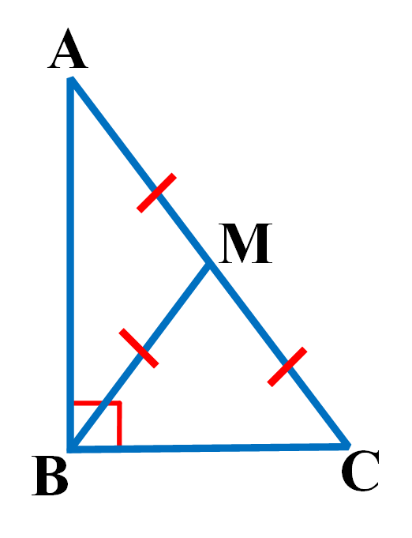

    premise: RightTriangle(ABC)&IsMedianOfTriangle(BM,BCA)
    conclusion: Equal(Mul(LengthOfLine(BM),2),LengthOfLine(CA))

**Description**:  
1.直角三角形性质：斜边的中线等于斜边的一半

#### isosceles_triangle_judgment_line_equal(ABC)

    

    premise: Polygon(ABC)&Equal(LengthOfLine(AB),LengthOfLine(AC))
    conclusion: IsoscelesTriangle(ABC)

**Description**:  
1.等腰三角形判定：两腰相等

#### isosceles_triangle_judgment_angle_equal(ABC)

    

    premise: Polygon(ABC)&Equal(MeasureOfAngle(ABC),MeasureOfAngle(BCA))
    conclusion: IsoscelesTriangle(ABC)

**Description**:  
1.等腰三角形判定：两底角相等

#### isosceles_triangle_property_angle_equal(ABC)

    

    premise: IsoscelesTriangle(ABC)
    conclusion: Equal(MeasureOfAngle(ABC),MeasureOfAngle(BCA))

**Description**:  
1.等腰三角形性质：两底角相等

#### isosceles_triangle_property_line_coincidence(ABC,M)

    

    # branch 1
    premise: IsoscelesTriangle(ABC)&IsAltitudeOfTriangle(AM,ABC)
    conclusion: IsMedianOfTriangle(AM,ABC)
                IsBisectorOfAngle(AM,CAB)
    # branch 2
    premise: IsoscelesTriangle(ABC)&IsMedianOfTriangle(AM,ABC)
    conclusion: IsAltitudeOfTriangle(AM,ABC)
                IsBisectorOfAngle(AM,CAB)
    # branch 3
    premise: IsoscelesTriangle(ABC)&Collinear(BMC)&IsBisectorOfAngle(AM,CAB)
    conclusion: IsAltitudeOfTriangle(AM,ABC)
                IsMedianOfTriangle(AM,ABC)

**Description**:  
1.等腰三角形性质：三线合一

#### isosceles_right_triangle_judgment_isosceles_and_right(ABC)

    

    premise: IsoscelesTriangle(ABC)&RightTriangle(CAB)
    conclusion: IsoscelesRightTriangle(ABC)

**Description**:  
1.等腰直角三角形判定：即是等腰三角形也是直角三角形

#### isosceles_right_triangle_property_angle(ABC)

    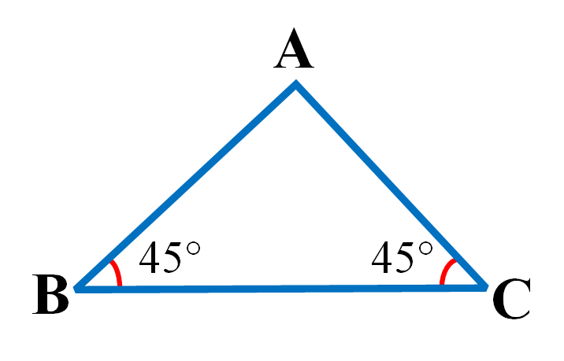

    premise: IsoscelesRightTriangle(ABC)
    conclusion: Equal(MeasureOfAngle(ABC),45)
                Equal(MeasureOfAngle(BCA),45)

**Description**:  
1.等腰直角三角形性质：两直角边为45°

#### equilateral_triangle_judgment_isosceles_and_isosceles(ABC)

    

    premise: IsoscelesTriangle(ABC)&IsoscelesTriangle(BCA)
    conclusion: EquilateralTriangle(ABC)

**Description**:  
1.等边三角形判定：两个等腰三角形

#### equilateral_triangle_property_angle(ABC)

    

    premise: EquilateralTriangle(ABC)
    conclusion: Equal(MeasureOfAngle(CAB),60)

**Description**:  
1.等边三角形性质：内角为60°  
2.内角指的是顶角，应用一次定理只得到一个角的角度

#### quadrilateral_property_angle_sum(ABCD)

    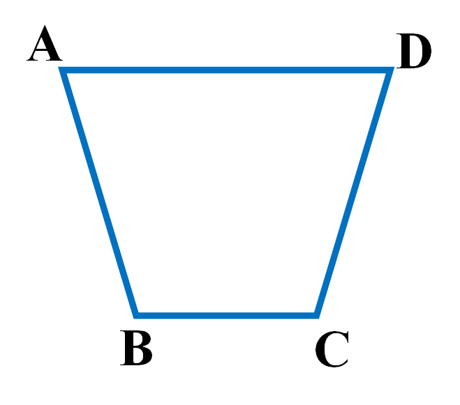

    premise: Polygon(ABCD)
    conclusion: Equal(Add(MeasureOfAngle(ABC),MeasureOfAngle(BCD),MeasureOfAngle(CDA),MeasureOfAngle(DAB)),360)

**Description**:  
1.四边形性质：内角为360°

#### quadrilateral_perimeter_formula(ABCD)

    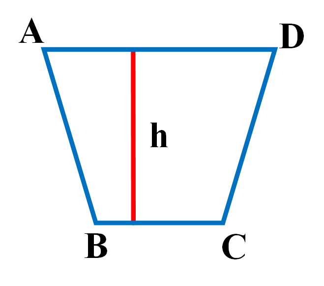

    premise: Polygon(ABCD)
    conclusion: Equal(Add(LengthOfLine(AB),LengthOfLine(BC),LengthOfLine(CD),LengthOfLine(DA)),PerimeterOfQuadrilateral(ABCD))

**Description**:  
1.四边形周长公式

#### altitude_of_quadrilateral_judgment(EF,ABCD)

    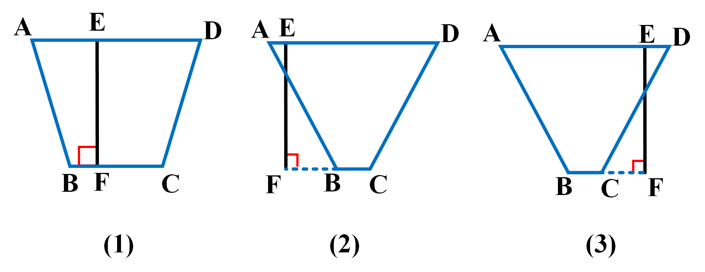

    # branch 1
    premise: (Parallelogram(ABCD)|Trapezoid(ABCD))&Line(EF)&Collinear(AED)&Collinear(BFC)&Equal(MeasureOfAngle(BFE),90)
    conclusion: IsAltitudeOfQuadrilateral(EF,ABCD)
    # branch 2
    premise: (Parallelogram(ABCD)|Trapezoid(ABCD))&Line(EF)&Collinear(AED)&Collinear(FBC)&Equal(MeasureOfAngle(EFB),90)
    conclusion: IsAltitudeOfQuadrilateral(EF,ABCD)
    # branch 3
    premise: (Parallelogram(ABCD)|Trapezoid(ABCD))&Line(EF)&Collinear(AED)&Collinear(BCF)&Equal(MeasureOfAngle(CFE),90)
    conclusion: IsAltitudeOfQuadrilateral(EF,ABCD)

**Description**:  
1.平行四边形/梯形高的判定：垂直于底边

#### altitude_of_quadrilateral_judgment_left_vertex(AF,ABCD)

    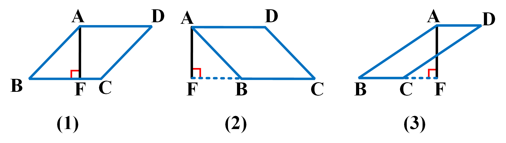

    # branch 1
    premise: (Parallelogram(ABCD)|Trapezoid(ABCD))&Line(AF)&Collinear(BFC)&Equal(MeasureOfAngle(BFA),90)
    conclusion: IsAltitudeOfQuadrilateral(AF,ABCD)
    # branch 2
    premise: (Parallelogram(ABCD)|Trapezoid(ABCD))&Line(AF)&Collinear(FBC)&Equal(MeasureOfAngle(AFB),90)
    conclusion: IsAltitudeOfQuadrilateral(AF,ABCD)
    # branch 3
    premise: (Parallelogram(ABCD)|Trapezoid(ABCD))&Line(AF)&Collinear(BCF)&Equal(MeasureOfAngle(CFA),90)
    conclusion: IsAltitudeOfQuadrilateral(AF,ABCD)

**Description**:  
1.平行四边形/梯形高的判定：垂直于底边

#### altitude_of_quadrilateral_judgment_right_vertex(DF,ABCD)

    

    # branch 1
    premise: (Parallelogram(ABCD)|Trapezoid(ABCD))&Line(DF)&Collinear(BFC)&Equal(MeasureOfAngle(BFD),90)
    conclusion: IsAltitudeOfQuadrilateral(DF,ABCD)
    # branch 2
    premise: (Parallelogram(ABCD)|Trapezoid(ABCD))&Line(DF)&Collinear(FBC)&Equal(MeasureOfAngle(DFB),90)
    conclusion: IsAltitudeOfQuadrilateral(DF,ABCD)
    # branch 3
    premise: (Parallelogram(ABCD)|Trapezoid(ABCD))&Line(DF)&Collinear(BCF)&Equal(MeasureOfAngle(CFD),90)
    conclusion: IsAltitudeOfQuadrilateral(DF,ABCD)

**Description**:  
1.平行四边形/梯形高的判定：垂直于底边

#### altitude_of_quadrilateral_judgment_diagonal(ABCD)

    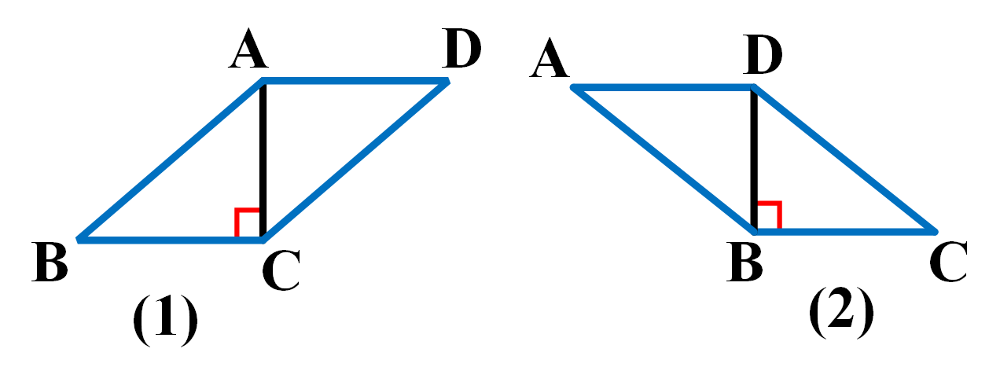

    # branch 1
    premise: (Parallelogram(ABCD)|Trapezoid(ABCD))&Line(AC)&Equal(MeasureOfAngle(BCA),90)
    conclusion: IsAltitudeOfQuadrilateral(AC,ABCD)
    # branch 2
    premise: (Parallelogram(ABCD)|Trapezoid(ABCD))&Line(DB)&Equal(MeasureOfAngle(DBC),90)
    conclusion: IsAltitudeOfQuadrilateral(DB,ABCD)

**Description**:  
1.平行四边形/梯形高的判定：垂直于底边

#### midsegment_of_quadrilateral_judgment_midpoint(EF,ABCD)

    

    premise: Collinear(AEB)&Collinear(DFC)&Line(EF)&Equal(LengthOfLine(AE),LengthOfLine(BE))&Equal(LengthOfLine(DF),LengthOfLine(CF))
    conclusion: IsMidsegmentOfQuadrilateral(EF,ABCD)

**Description**:  
1.四边形中位线判定：两边中点的连线

#### midsegment_of_quadrilateral_judgment_parallel(EF,ABCD)

    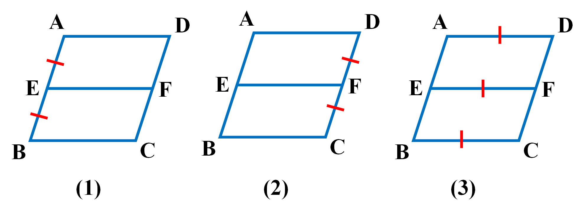

    # branch 1
    premise: Collinear(AEB)&Collinear(DFC)&Line(EF)&(Trapezoid(ABCD)|Parallelogram(ABCD))&ParallelBetweenLine(EF,BC)&Equal(LengthOfLine(AE),LengthOfLine(BE))
    conclusion: IsMidsegmentOfQuadrilateral(EF,ABCD)
    # branch 2
    premise: Collinear(AEB)&Collinear(DFC)&Line(EF)&(Trapezoid(ABCD)|Parallelogram(ABCD))&ParallelBetweenLine(EF,BC)&Equal(LengthOfLine(DF),LengthOfLine(CF))
    conclusion: IsMidsegmentOfQuadrilateral(EF,ABCD)
    # branch 3
    premise: Collinear(AEB)&Collinear(DFC)&Line(EF)&(Trapezoid(ABCD)|Parallelogram(ABCD))&ParallelBetweenLine(EF,BC)&Equal(Add(LengthOfLine(AD),LengthOfLine(BC)),Mul(LengthOfLine(EF),2))
    conclusion: IsMidsegmentOfQuadrilateral(EF,ABCD)

**Description**:  
1.四边形中位线判定：是梯形或平行四边形、平行且某边成比例

#### midsegment_of_quadrilateral_property_length(EF,ABCD)

    

    premise: IsMidsegmentOfQuadrilateral(EF,ABCD)
    conclusion: Equal(Add(LengthOfLine(AD),LengthOfLine(BC)),Mul(LengthOfLine(EF),2))

**Description**:  
1.四边形中位线性质：上底和下底的一半

#### midsegment_of_quadrilateral_property_parallel(EF,ABCD)

    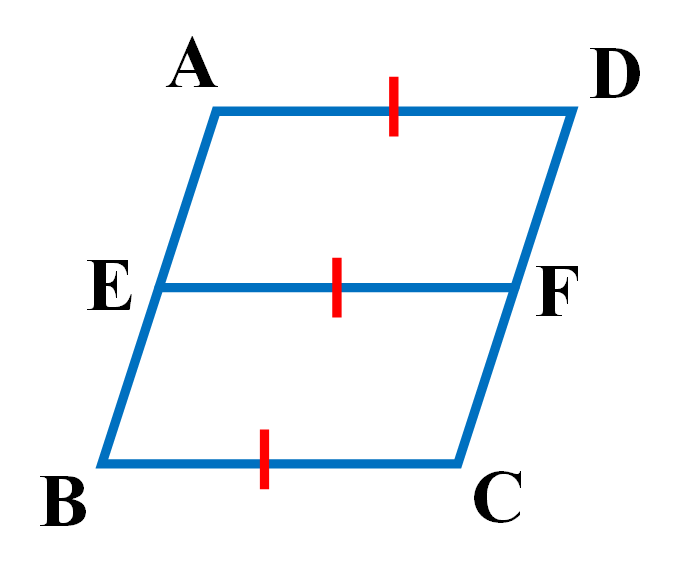

    premise: IsMidsegmentOfQuadrilateral(EF,ABCD)&(Trapezoid(ABCD)|Parallelogram(ABCD))
    conclusion: ParallelBetweenLine(AD,EF)
                ParallelBetweenLine(EF,BC)

**Description**:  
1.四边形中位线性质：梯形、平行四边形的中位线平行于底边

#### circumcenter_of_quadrilateral_property_intersection(O,ABCD,E)

    

    # branch 1
    premise: IsCircumcenterOfQuadrilateral(O,ABCD)&Collinear(BEC)&Equal(MeasureOfAngle(DEO),90)
    conclusion: IsPerpendicularBisectorOfLine(OE,BC)
    # branch 2
    premise: IsCircumcenterOfQuadrilateral(O,ABCD)&Equal(LengthOfLine(BE),LengthOfLine(CE))
    conclusion: IsPerpendicularBisectorOfLine(OE,BC)

**Description**:  
1.四边形外心性质：垂直平分线交点

#### congruent_quadrilateral_property_line_equal(ABCD,EFGH)

    

    premise: CongruentBetweenQuadrilateral(ABCD,EFGH)
    conclusion: Equal(LengthOfLine(AB),LengthOfLine(EF))

**Description**:  
1.全等四边形性质：边相等

#### congruent_quadrilateral_property_angle_equal(ABCD,EFGH)

    

    premise: CongruentBetweenQuadrilateral(ABCD,EFGH)
    conclusion: Equal(MeasureOfAngle(DAB),MeasureOfAngle(HEF))

**Description**:  
1.全等四边形性质：角相等

#### congruent_quadrilateral_property_perimeter_equal(ABCD,EFGH)

    

    premise: CongruentBetweenQuadrilateral(ABCD,EFGH)
    conclusion: Equal(PerimeterOfQuadrilateral(ABC),PerimeterOfQuadrilateral(DEF))

**Description**:  
1.全等四边形性质：周长相等

#### congruent_quadrilateral_property_area_equal(ABCD,EFGH)

    

    premise: CongruentBetweenQuadrilateral(ABCD,EFGH)
    conclusion: Equal(AreaOfQuadrilateral(ABC),AreaOfQuadrilateral(DEF))

**Description**:  
1.全等四边形性质：面积相等

#### congruent_quadrilateral_property_exchange(ABCD,EFGH)

    

    premise: CongruentBetweenQuadrilateral(ABCD,EFGH)
    conclusion: CongruentBetweenQuadrilateral(EFGH,ABCD)

**Description**:  
1.全等四边形性质：先后顺序不影响三角形的全等

#### mirror_congruent_quadrilateral_property_line_equal(ABCD,EFGH)

    

    premise: MirrorCongruentBetweenQuadrilateral(ABCD,EFGH)
    conclusion: Equal(LengthOfLine(AB),LengthOfLine(EH))

**Description**:  
1.全等四边形性质：边相等

#### mirror_congruent_quadrilateral_property_angle_equal(ABCD,EFGH)

    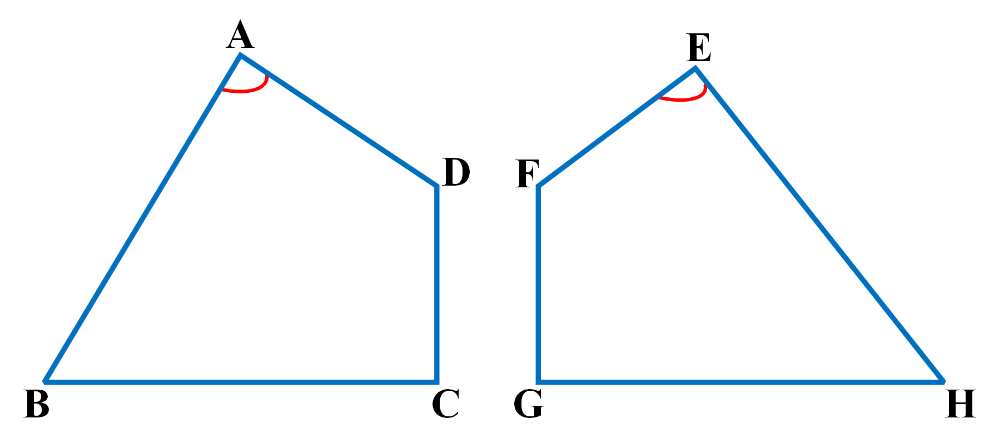

    premise: MirrorCongruentBetweenQuadrilateral(ABCD,EFGH)
    conclusion: Equal(MeasureOfAngle(DAB),MeasureOfAngle(HEF))

**Description**:  
1.全等四边形性质：角相等

#### mirror_congruent_quadrilateral_property_perimeter_equal(ABCD,EFGH)

    

    premise: MirrorCongruentBetweenQuadrilateral(ABCD,EFGH)
    conclusion: Equal(PerimeterOfQuadrilateral(ABCD),PerimeterOfQuadrilateral(EFGH))

**Description**:  
1.全等四边形性质：周长相等

#### mirror_congruent_quadrilateral_property_area_equal(ABCD,EFGH)

    

    premise: MirrorCongruentBetweenQuadrilateral(ABCD,EFGH)
    conclusion: Equal(AreaOfQuadrilateral(ABCD),AreaOfQuadrilateral(EFGH))

**Description**:  
1.全等四边形性质：面积相等

#### mirror_congruent_quadrilateral_property_exchange(ABCD,EFGHF)

    

    premise: MirrorCongruentBetweenQuadrilateral(ABCD,EFGH)
    conclusion: MirrorCongruentBetweenQuadrilateral(EFGH,ABCD)

**Description**:  
1.镜像全等四边形性质：先后顺序不影响四边形的镜像全等

#### similar_quadrilateral_property_ratio(ABCD,EFGH)

    

    premise: SimilarBetweenQuadrilateral(ABCD,EFGH)
    conclusion: SimilarBetweenQuadrilateral(EFGH,ABCD)
                Equal(Mul(RatioOfSimilarQuadrilateral(ABCD,EFGH),RatioOfSimilarQuadrilateral(EFGH,ABCD)),1)

**Description**:  
1.相似四边形的比值

#### similar_quadrilateral_property_line_ratio(ABCD,EFGH)

    

    premise: SimilarBetweenQuadrilateral(ABCD,EFGH)
    conclusion: Equal(LengthOfLine(AB),Mul(LengthOfLine(EF),RatioOfSimilarQuadrilateral(ABCD,EFGH)))

**Description**:  
1.相似四边形性质：边成比例

#### similar_quadrilateral_property_angle_equal(ABCD,EFGH)

    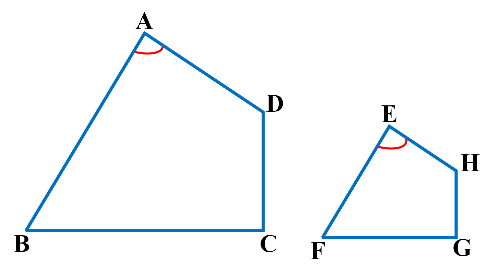

    premise: SimilarBetweenQuadrilateral(ABCD,EFGH)
    conclusion: Equal(MeasureOfAngle(DAB),MeasureOfAngle(HEF))

**Description**:  
1.相似四边形性质：角相等

#### similar_quadrilateral_property_perimeter_ratio(ABCD,EFGH)

    

    premise: SimilarBetweenQuadrilateral(ABCD,EFGH)
    conclusion: Equal(PerimeterOfQuadrilateral(ABCD),Mul(PerimeterOfQuadrilateral(EFGH),RatioOfSimilarQuadrilateral(ABCD,EFGH)))

**Description**:  
1.相似四边形性质：周长成比例

#### similar_quadrilateral_property_area_square_ratio(ABCD,EFGH)

    

    premise: SimilarBetweenQuadrilateral(ABCD,EFGH)
    conclusion: Equal(AreaOfQuadrilateral(ABCD),Mul(AreaOfQuadrilateral(EFGH),RatioOfSimilarQuadrilateral(ABCD,EFGH),RatioOfSimilarQuadrilateral(ABCD,EFGH)))

**Description**:  
1.相似四边形性质：面积成比例

#### mirror_similar_quadrilateral_property_ratio(ABCD,EFGH)

    

    premise: MirrorSimilarBetweenQuadrilateral(ABCD,EFGH)
    conclusion: MirrorSimilarBetweenQuadrilateral(EFGH,ABCD)
                Equal(Mul(RatioOfMirrorSimilarQuadrilateral(ABCD,EFGH),RatioOfMirrorSimilarQuadrilateral(EFGH,ABCD)),1)

**Description**:  
1.镜像相似四边形的比值

#### mirror_similar_quadrilateral_property_line_ratio(ABCD,EFGH)

    

    premise: MirrorSimilarBetweenQuadrilateral(ABCD,EFGH)
    conclusion: Equal(LengthOfLine(AB),Mul(LengthOfLine(EH),RatioOfMirrorSimilarQuadrilateral(ABCD,EFGH)))

**Description**:  
1.相似四边形性质：边成比例

#### mirror_similar_quadrilateral_property_angle_equal(ABCD,EFGH)

    

    premise: MirrorSimilarBetweenQuadrilateral(ABCD,EFGH)
    conclusion: Equal(MeasureOfAngle(DAB),MeasureOfAngle(HEF))

**Description**:  
1.相似四边形性质：角相等

#### mirror_similar_quadrilateral_property_perimeter_ratio(ABCD,EFGH)

    

    premise: MirrorSimilarBetweenQuadrilateral(ABCD,EFGH)
    conclusion: Equal(PerimeterOfQuadrilateral(ABCD),Mul(PerimeterOfQuadrilateral(EFGH),RatioOfMirrorSimilarQuadrilateral(ABCD,EFGH)))

**Description**:  
1.相似四边形性质：周长成比例

#### mirror_similar_quadrilateral_property_area_square_ratio(ABCD,EFGH)

    

    premise: MirrorSimilarBetweenQuadrilateral(ABCD,EFGH)
    conclusion: Equal(AreaOfQuadrilateral(ABCD),Mul(AreaOfQuadrilateral(EFGH),RatioOfMirrorSimilarQuadrilateral(ABCD,EFGH),RatioOfMirrorSimilarQuadrilateral(ABCD,EFGH)))

**Description**:  
1.相似四边形性质：面积成比例

#### parallelogram_judgment_parallel_and_parallel(ABCD)

    

    premise: Polygon(ABCD)&ParallelBetweenLine(AD,BC)&ParallelBetweenLine(BA,CD)
    conclusion: Parallelogram(ABCD)

**Description**:  
1.平行四边形判定：两组对边分别平行

#### parallelogram_judgment_parallel_and_equal(ABCD)

    

    premise: Polygon(ABCD)&ParallelBetweenLine(BA,CD)&Equal(LengthOfLine(BA),LengthOfLine(CD))
    conclusion: Parallelogram(ABCD)

**Description**:  
1.平行四边形判定：一组对边平行且相等

#### parallelogram_judgment_equal_and_equal(ABCD)

    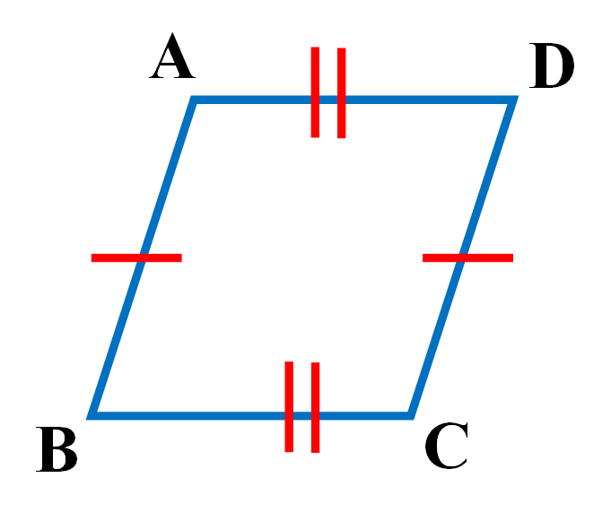

    premise: Polygon(ABCD)&Equal(LengthOfLine(AD),LengthOfLine(BC))&Equal(LengthOfLine(BA),LengthOfLine(CD))
    conclusion: Parallelogram(ABCD)

**Description**:  
1.平行四边形判定：两组对边分别相等

#### parallelogram_judgment_angle_and_angle(ABCD)

    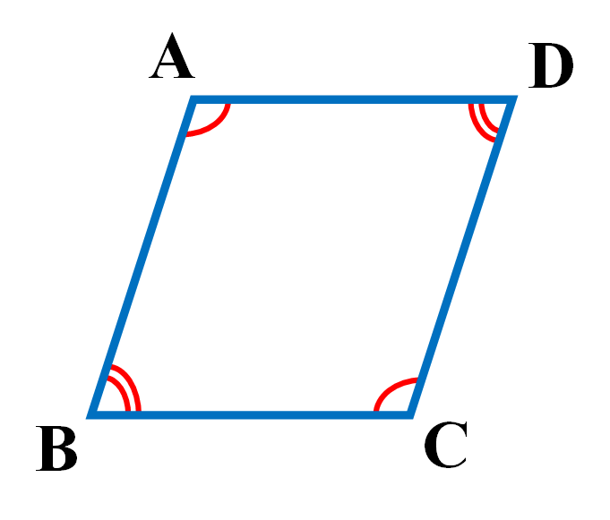

    premise: Polygon(ABCD)&Equal(MeasureOfAngle(DAB),MeasureOfAngle(BCD))&Equal(MeasureOfAngle(ABC),MeasureOfAngle(CDA))
    conclusion: Parallelogram(ABCD)

**Description**:  
1.平行四边形判定：两组对角分别相等

#### parallelogram_judgment_diagonal_bisection(ABCD,O)

    

    premise: Polygon(ABCD)&Collinear(AOC)&Collinear(BOD)&IsMidpointOfLine(O,AC)&IsMidpointOfLine(O,BD)
    conclusion: Parallelogram(ABCD)

**Description**:  
1.平行四边形判定：对角线相互平分

#### parallelogram_property_opposite_line_equal(ABCD)

    

    premise: Parallelogram(ABCD)
    conclusion: Equal(LengthOfLine(BA),LengthOfLine(CD))

**Description**:  
1.平行四边形性质：对边相等

#### parallelogram_property_opposite_angle_equal(ABCD)

    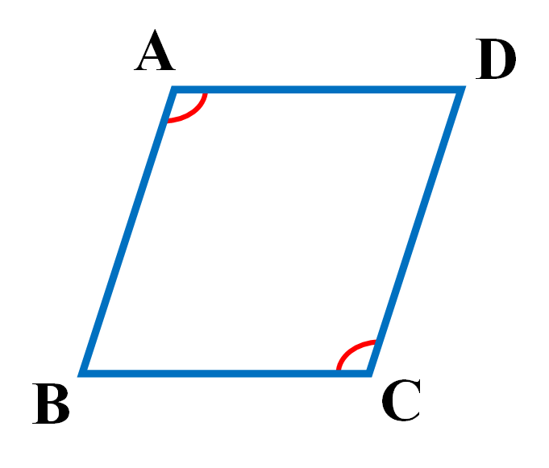

    premise: Parallelogram(ABCD)
    conclusion: Equal(MeasureOfAngle(DAB),MeasureOfAngle(BCD))

**Description**:  
1.平行四边形性质：对角相等

#### parallelogram_property_diagonal_bisection(ABCD,O)

    

    premise: Parallelogram(ABCD)&Collinear(AOC)&Collinear(BOD)
    conclusion: IsMidpointOfLine(O,AC)

**Description**:  
1.平行四边形性质：对角线相互平分

#### parallelogram_area_formula_common(ABCD)

    

    premise: Parallelogram(ABCD)
    conclusion: Equal(AreaOfQuadrilateral(ABCD),Mul(HeightOfQuadrilateral(ABCD),LengthOfLine(BC)))

**Description**:  
1.平行四边形的面积公式：S=底*高  
1.高是底边BC的高

#### parallelogram_area_formula_sine(ABCD)

    

    premise: Parallelogram(ABCD)
    conclusion: Equal(AreaOfQuadrilateral(ABCD),Mul(LengthOfLine(AB),LengthOfLine(BC),Sin(MeasureOfAngle(ABC))))

**Description**:  
1.平行四边形面积公式：S=AB*BC*sinB

#### kite_judgment_equal_and_equal(ABCD)

    

    premise: Polygon(ABCD)&Equal(LengthOfLine(AB),LengthOfLine(AD))&Equal(LengthOfLine(CB),LengthOfLine(CD))
    conclusion: Kite(ABCD)

**Description**:  
1.筝形判定：两组临边分别相等

#### kite_property_diagonal_perpendicular_bisection(ABCD,O)

    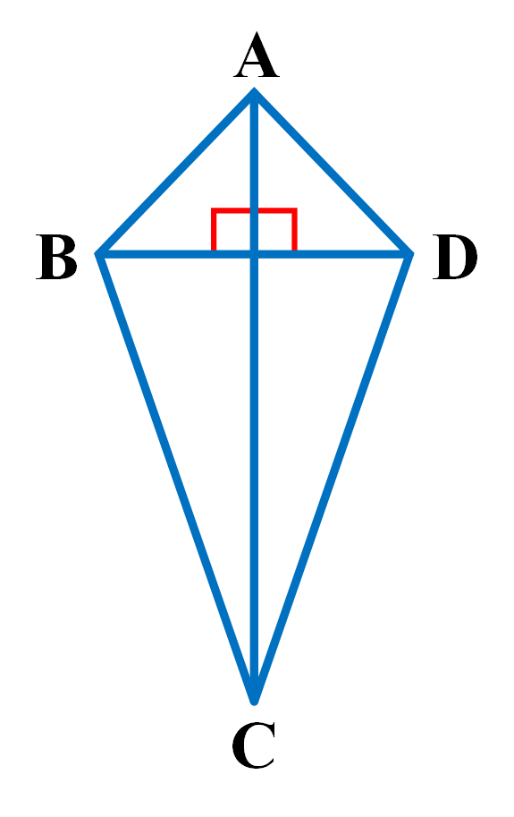

    premise: Kite(ABCD)&Collinear(AOC)&Collinear(BOD)
    conclusion: IsPerpendicularBisectorOfLine(AO,BD)

**Description**:  
1.筝形性质：一个对角线是另一个的垂直平分线

#### kite_property_opposite_angle_equal(ABCD)

    

    premise: Kite(ABCD)
    conclusion: Equal(MeasureOfAngle(ABC),MeasureOfAngle(CDA))

**Description**:  
1.筝形性质：一组对角(等角)相等

#### kite_area_formula_diagonal(ABCD)

    

    premise: Kite(ABCD)&Line(BD)&Line(AC)
    conclusion: Equal(AreaOfQuadrilateral(ABCD),Mul(LengthOfLine(BD),LengthOfLine(AC),1/2))

**Description**:  
1.筝形面积公式：S=m*l /2

#### kite_area_formula_sine(ABCD)

    

    premise: Kite(ABCD)
    conclusion: Equal(AreaOfQuadrilateral(ABCD),Mul(LengthOfLine(AB),LengthOfLine(BC),Sin(MeasureOfAngle(ABC))))

**Description**:  
1.筝形面积公式：S=AB*BC*sinB

#### rectangle_judgment_right_angle(ABCD)

    

    premise: Parallelogram(ABCD)&Equal(MeasureOfAngle(ABC),90)
    conclusion: Rectangle(ABCD)

**Description**:  
1.矩形判定：有一个角是直角的平行四边形

#### rectangle_judgment_diagonal_equal(ABCD)

    

    premise: Parallelogram(ABCD)&Line(AC)&Line(BD)&Equal(LengthOfLine(AC),LengthOfLine(BD))
    conclusion: Rectangle(ABCD)

**Description**:  
1.矩形判定：对角线相等的平行四边形

#### rectangle_property_diagonal_equal(ABCD)

    

    premise: Rectangle(ABCD)&Line(AC)&Line(BD)
    conclusion: Equal(LengthOfLine(AC),LengthOfLine(BD))

**Description**:  
1.矩形性质：对角线相等

#### rhombus_judgment_parallelogram_and_kite(ABCD)

    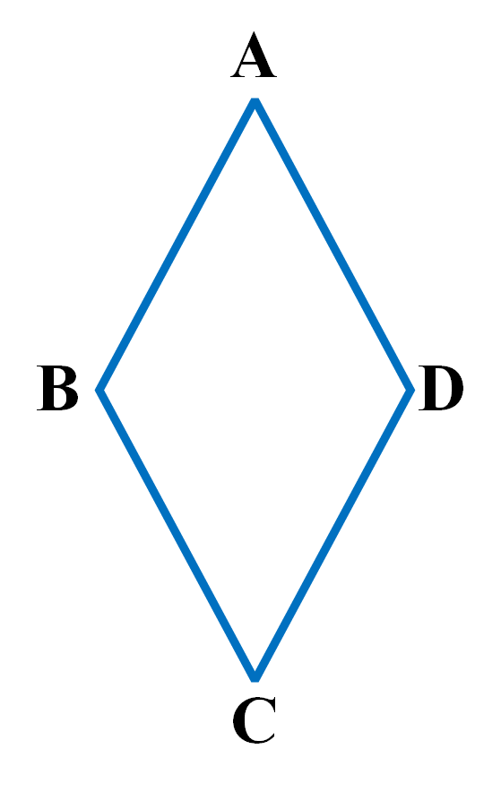

    premise: Parallelogram(ABCD)&Kite(ABCD)
    conclusion: Rhombus(ABCD)

**Description**:  
1.菱形判定：既是平行四边形又是筝形

#### square_judgment_rhombus_and_rectangle(ABCD)

    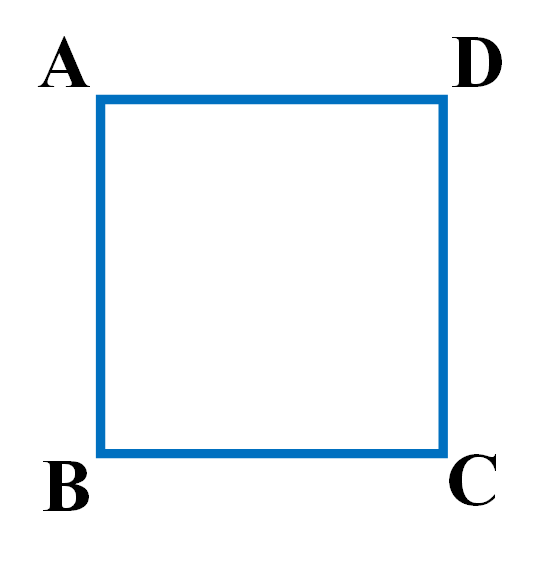

    premise: Rhombus(ABCD)&Rectangle(ABCD)
    conclusion: Square(ABCD)

**Description**:  
1.正方形判定：既是菱形也是矩形

#### trapezoid_judgment_parallel(ABCD)

    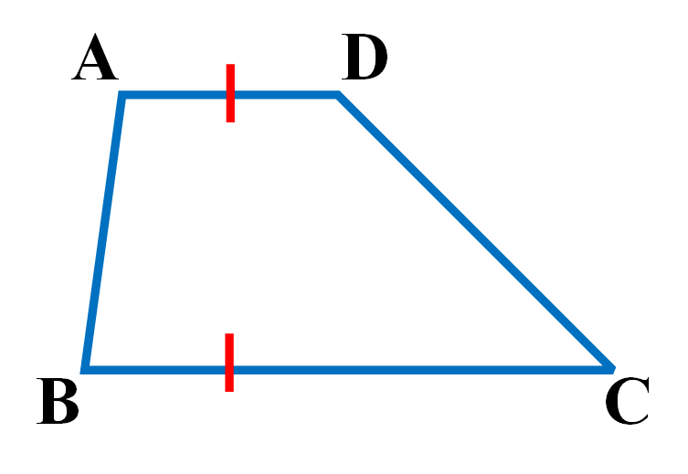

    premise: Polygon(ABCD)&ParallelBetweenLine(AD,BC)&~ParallelBetweenLine(BA,CD)
    conclusion: Trapezoid(ABCD)

**Description**:  
1.梯形判定：两边平行的四边形

#### trapezoid_area_formula(ABCD)

    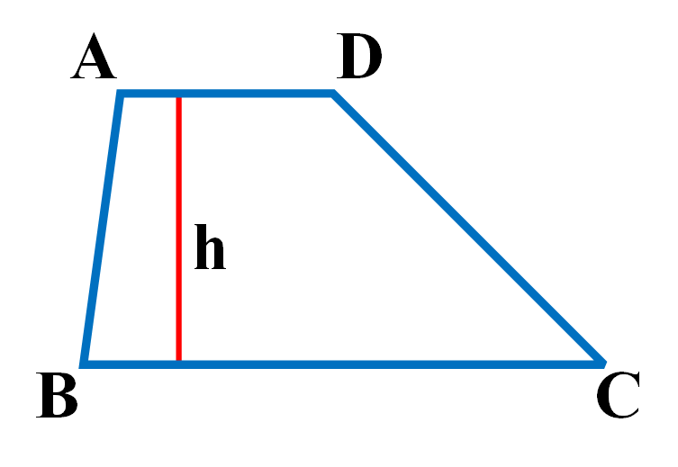

    premise: Trapezoid(ABCD)
    conclusion: Equal(AreaOfQuadrilateral(ABCD),Mul(Add(LengthOfLine(AD),LengthOfLine(BC)),HeightOfQuadrilateral(ABCD),1/2))

**Description**:  
1.梯形的面积公式：S=(上底+下底)*高/2

#### right_trapezoid_judgment_right_angle(ABCD)

    

    premise: Trapezoid(ABCD)&Equal(MeasureOfAngle(ABC),90)
    conclusion: RightTrapezoid(ABCD)

**Description**:  
1.直角梯形的判定：有一侧是直角的梯形

#### right_trapezoid_area_formular(ABCD)

    

    premise: RightTrapezoid(ABCD)
    conclusion: Equal(AreaOfQuadrilateral(ABCD),Mul(Add(LengthOfLine(AD),LengthOfLine(BC)),LengthOfLine(AB),1/2))

**Description**:  
1.直角梯形面积公式：S=(AD+BC)*AB/2

#### isosceles_trapezoid_judgment_line_equal(ABCD)

    

    premise: Trapezoid(ABCD)&Equal(LengthOfLine(AB),LengthOfLine(CD))
    conclusion: IsoscelesTrapezoid(ABCD)

**Description**:  
1.等腰梯形的判定：腰相等的梯形

#### isosceles_trapezoid_judgment_angle_equal(ABCD)

    

    premise: Trapezoid(ABCD)&Equal(MeasureOfAngle(ABC),MeasureOfAngle(BCD))
    conclusion: IsoscelesTrapezoid(ABCD)

**Description**:  
1.等腰梯形的判定：底角相等的梯形

#### isosceles_trapezoid_judgment_diagonal_equal(ABCD)

    

    premise: Trapezoid(ABCD)&Line(AC)&Line(BD)&Equal(LengthOfLine(AC),LengthOfLine(BD))
    conclusion: IsoscelesTrapezoid(ABCD)

**Description**:  
1.等腰梯形的判定：对角线相等的梯形

#### isosceles_trapezoid_property_angle_equal(ABCD)

    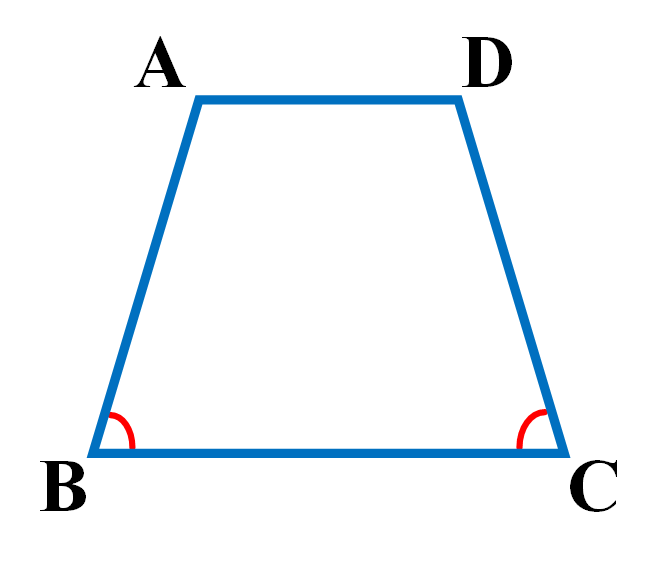

    premise: IsoscelesTrapezoid(ABCD)
    conclusion: Equal(MeasureOfAngle(ABC),MeasureOfAngle(BCD))

**Description**:  
1.等腰梯形的性质：底角相等

#### isosceles_trapezoid_property_diagonal_equal(ABCD)

    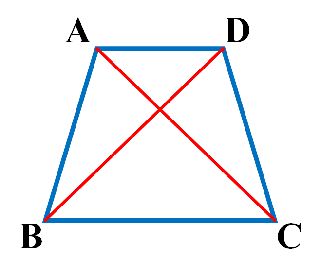

    premise: IsoscelesTrapezoid(ABCD)
    conclusion: Equal(LengthOfLine(AC),LengthOfLine(BD))

**Description**:  
1.等腰梯形的性质：对角线相等

#### round_arc(OAB,OBA)

    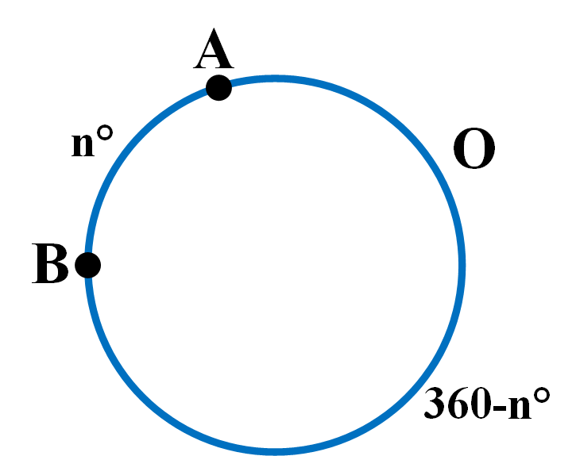

    premise: Arc(OAB)&Arc(OBA)
    conclusion: Equal(Add(MeasureOfArc(OAB),MeasureOfArc(OBA)),360)

**Description**:  
1.常识：一整个圆弧为360°

#### arc_addition_length(OAB,OBC)

    

    premise: Arc(OAB)&Arc(OBC)&Arc(OAC)
    conclusion: Equal(LengthOfArc(OAC),Add(LengthOfArc(OAB),LengthOfArc(OBC)))

**Description**:  
1.常识：临弧弧长相加

#### arc_addition_measure(OAB,OBC)

    

    premise: Arc(OAB)&Arc(OBC)&Arc(OAC)
    conclusion: Equal(MeasureOfArc(OAC),Add(MeasureOfArc(OAB),MeasureOfArc(OBC)))

**Description**:  
1.常识：临弧角度相加

#### arc_property_center_angle(OAB,P)

    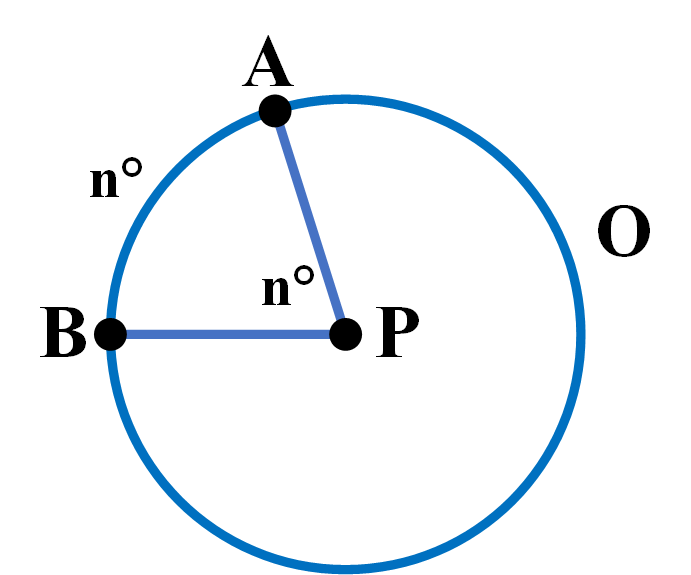

    premise: Arc(OAB)&Angle(BPA)&IsCentreOfCircle(P,O)
    conclusion: Equal(MeasureOfArc(OAB),MeasureOfAngle(BPA))

**Description**:  
1.常识：弧所对的角度等于弧所对圆心角角度

#### arc_property_circumference_angle_external(OAB,C)

    

    premise: Cocircular(O,ABC)&Angle(BCA)
    conclusion: Equal(MeasureOfAngle(BCA),Mul(MeasureOfArc(OAB),1/2))

**Description**:  
1.同弧所对的圆周角等于圆心角的一半

#### arc_property_circumference_angle_internal(OAB,D)

    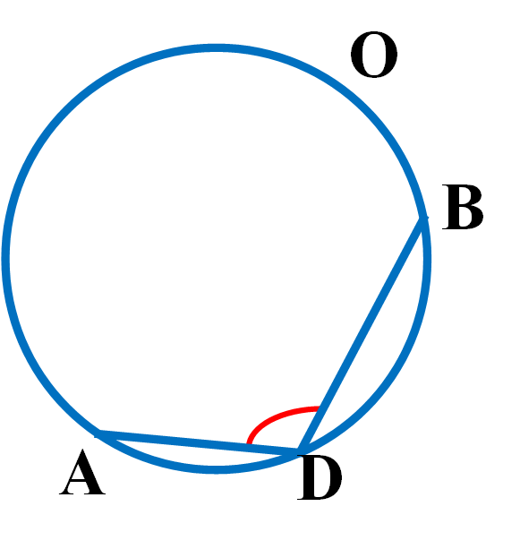

    premise: Cocircular(O,ADB)&Angle(ADB)
    conclusion: Equal(MeasureOfAngle(ADB),Sub(180,Mul(MeasureOfArc(OAB),1/2)))

**Description**:  
1.由圆内接四边形对角互补得此定理

#### arc_length_formula(OAB)

    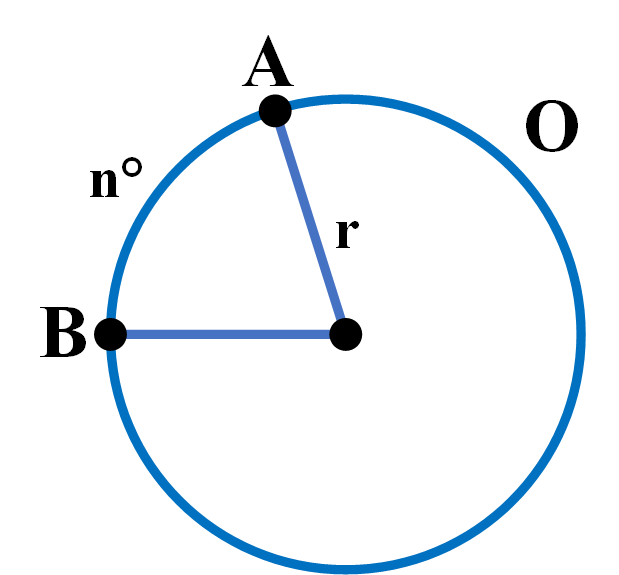

    premise: Arc(OAB)
    conclusion: Equal(LengthOfArc(OAB),Mul(MeasureOfArc(OAB),1/180*pi,RadiusOfCircle(O)))

**Description**:  
1.弧长公式：L=n/180*pi*r

#### congruent_arc_judgment_length_equal(XAB,YCD)

    

    premise: Arc(XAB)&Arc(YCD)&Cocircular(X,CD)&Equal(LengthOfArc(XAB),LengthOfArc(YCD))
    conclusion: CongruentBetweenArc(XAB,YCD)

**Description**:  
1.全等弧判定：同圆且长度相等

#### congruent_arc_judgment_measure_equal(XAB,YCD)

    

    premise: Arc(XAB)&Arc(YCD)&Cocircular(X,CD)&Equal(MeasureOfArc(XAB),MeasureOfArc(YCD))
    conclusion: CongruentBetweenArc(XAB,YCD)

**Description**:  
1.全等弧判定：同圆且所对圆心角相等

#### congruent_arc_judgment_chord_equal(XAB,YCD)

    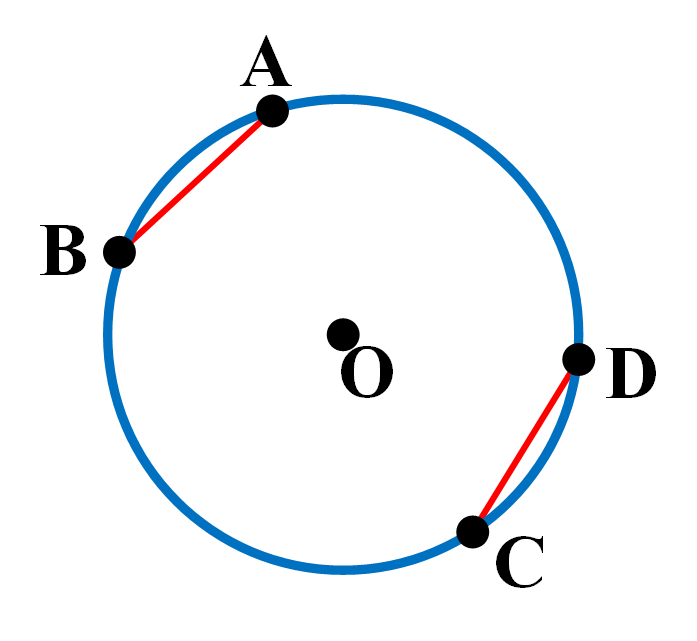

    premise: Arc(XAB)&Arc(YCD)&Cocircular(X,CD)&Line(AB)&Line(CD)&Equal(LengthOfLine(AB),LengthOfLine(CD))
    conclusion: CongruentBetweenArc(XAB,YCD)

**Description**:  
1.全等弧判定：同圆且所对弦长度相等

#### congruent_arc_property_length_equal(XAB,YCD)

    

    premise: CongruentBetweenArc(XAB,YCD)
    conclusion: Equal(LengthOfArc(XAB),LengthOfArc(YCD))

**Description**:  
1.全等弧性质：长度相等

#### congruent_arc_property_measure_equal(XAB,YCD)

    

    premise: CongruentBetweenArc(XAB,YCD)
    conclusion: Equal(MeasureOfArc(XAB),MeasureOfArc(YCD))

**Description**:  
1.全等弧性质：所对圆心角相等

#### congruent_arc_property_chord_equal(XAB,YCD)

    

    premise: CongruentBetweenArc(XAB,YCD)&Line(AB)&Line(CD)
    conclusion: Equal(LengthOfLine(AB),LengthOfLine(CD))

**Description**:  
1.全等弧性质：所对弦长度相等

#### similar_arc_judgment_cocircular(XAB,YCD)

    

    premise: Arc(XAB)&Arc(YCD)&Cocircular(X,CD)
    conclusion: SimilarBetweenArc(XAB,YCD)

**Description**:  
1.相似弧判定：同圆

#### similar_arc_property_ratio(XAB,YCD)

    

    premise: SimilarBetweenArc(XAB,YCD)&SimilarBetweenArc(YCD,XAB)
    conclusion: Equal(Mul(RatioOfSimilarArc(XAB,YCD),RatioOfSimilarArc(YCD,XAB)),1)

**Description**:  
1.相似弧性质：成比例

#### similar_arc_property_length_ratio(XAB,YCD)

    

    premise: SimilarBetweenArc(XAB,YCD)
    conclusion: Equal(LengthOfArc(XAB),Mul(LengthOfArc(YCD),RatioOfSimilarArc(YCD,XAB)))

**Description**:  
1.相似弧性质：长度成比例

#### similar_arc_property_measure_ratio(XAB,YCD)

    

    premise: SimilarBetweenArc(XAB,YCD)
    conclusion: Equal(MeasureOfArc(XAB),Mul(MeasureOfArc(YCD),RatioOfSimilarArc(YCD,XAB)))

**Description**:  
1.相似弧性质：角度成比例

#### similar_arc_property_chord_ratio(XAB,YCD)

    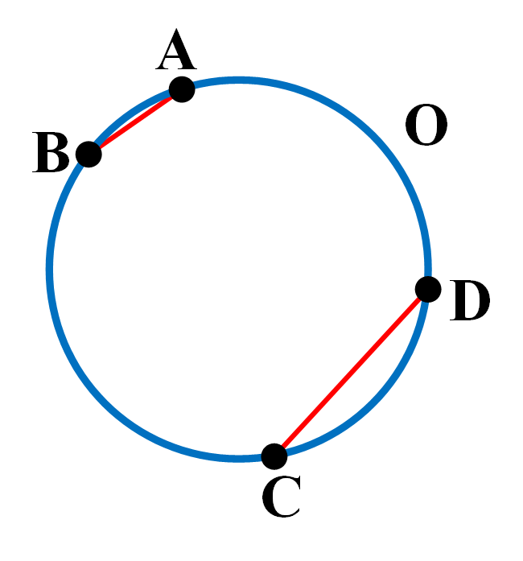

    premise: SimilarBetweenArc(XAB,YCD)&Line(AB)&Line(CD)
    conclusion: Equal(LengthOfLine(AB),Mul(LengthOfLine(CD),RatioOfSimilarArc(YCD,XAB)))

**Description**:  
1.相似弧性质：所对弦长成比例

#### circle_property_length_of_radius_and_diameter(O)

    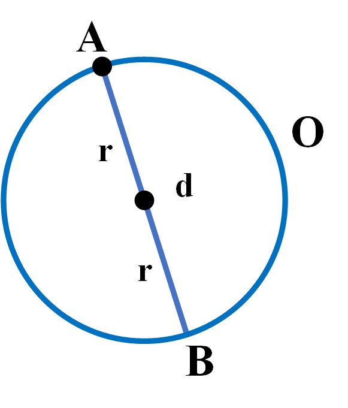

    premise: Circle(O)
    conclusion: Equal(DiameterOfCircle(O),Mul(RadiusOfCircle(O),2))

**Description**:  
1.常识：圆的直径是半径的两倍

#### circle_property_circular_power_chord_and_chord(AEB,CED,O)

    

    premise: Cocircular(O,AB)&Cocircular(O,CD)&Collinear(AEB)&Collinear(CED)
    conclusion: Equal(Mul(LengthOfLine(EC),LengthOfLine(ED)),Mul(LengthOfLine(EA),LengthOfLine(EB)))

**Description**:  
1.圆幂定理之相交弦定理：圆O的两个弦AB和CD交与点E，则EA*EB=EC*ED

#### circle_property_circular_power_tangent_and_segment_line(PA,PCD,O)

    

    premise: IsTangentOfCircle(PA,O)&Cocircular(O,CD)&Collinear(PCD)
    conclusion: Equal(Mul(LengthOfLine(PA),LengthOfLine(PA)),Mul(LengthOfLine(PC),LengthOfLine(PD)))

**Description**:  
1.圆幂定理之切割线定理：P引直线PAB切圆O于A，引割线PCD交圆O于CD，则PA*PA=PC*PD

#### circle_property_circular_power_segment_and_segment_line(PAB,PCD,O)

    

    premise: Cocircular(O,AB)&Cocircular(O,CD)&Collinear(PAB)&Collinear(PCD)
    conclusion: Equal(Mul(LengthOfLine(PA),LengthOfLine(PB)),Mul(LengthOfLine(PC),LengthOfLine(PD)))

**Description**:  
1.圆幂定理之割线定理：园外P引割线PAB切圆O于AB，引割线PCD交圆O于CD，则PA*PB=PC*PD

#### circle_property_circular_power_tangent_and_segment_angle(PA,PCD,O)

    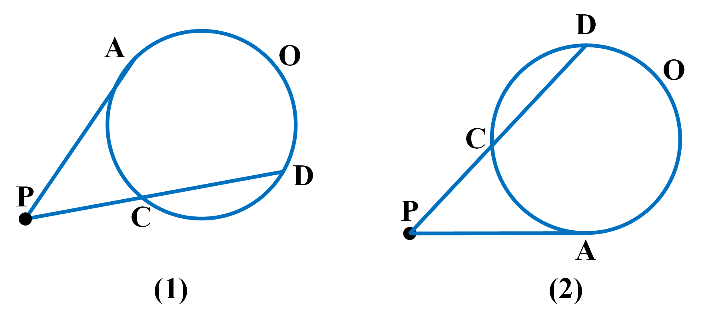

    # branch 1
    premise: Cocircular(O,ACD)&Collinear(PCD)
    conclusion: Equal(Sub(MeasureOfArc(ODA),MeasureOfArc(OAC)),Mul(MeasureOfAngle(APC),2))
    # branch 2
    premise: Cocircular(O,CAD)&Collinear(PCD)
    conclusion: Equal(Sub(MeasureOfArc(OAD),MeasureOfArc(OCA)),Mul(MeasureOfAngle(CPA),2))

**Description**:  
1.圆幂定理之割线角度关系：P引切线PA切圆O于A，引割线PCD交圆O于CD，则两端弧所对圆心角之差等于2倍角P

#### circle_property_circular_power_segment_and_segment_angle(PAB,PCD,O)

    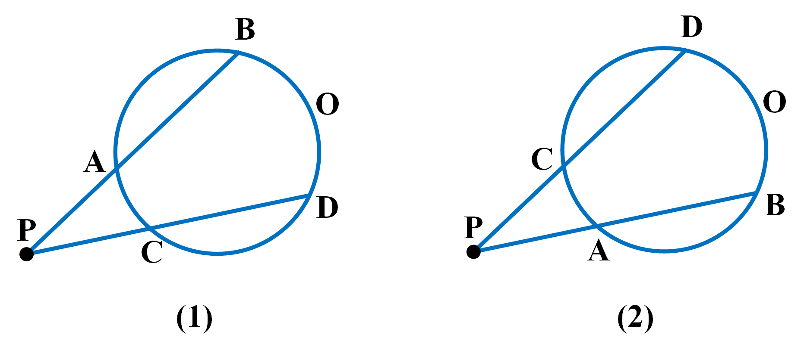

    # branch 1
    premise: Cocircular(O,ACDB)&Collinear(PAB)&Collinear(PCD)
    conclusion: Equal(Sub(MeasureOfArc(ODB),MeasureOfArc(OAC)),Mul(MeasureOfAngle(APC),2))
    # branch 2
    premise: Cocircular(O,CABD)&Collinear(PAB)&Collinear(PCD)
    conclusion: Equal(Sub(MeasureOfArc(OBD),MeasureOfArc(OCA)),Mul(MeasureOfAngle(CPA),2))

**Description**:  
1.圆幂定理之割线角度关系：P引割线PAB切圆O于AB，引割线PCD交圆O于CD，则两端弧所对圆心角之差等于2倍角P

#### circle_property_chord_perpendicular_bisect_chord(O,PM,AB)

    

    # branch 1
    premise: Cocircular(O,AB)&Collinear(AMB)&IsCentreOfCircle(P,O)&Equal(MeasureOfAngle(AMP),90)
    conclusion: IsPerpendicularBisectorOfLine(PM,AB)
    # branch 2
    premise: Cocircular(O,AB)&Collinear(AMB)&IsCentreOfCircle(P,O)&Equal(LengthOfLine(AM),LengthOfLine(MB))
    conclusion: IsPerpendicularBisectorOfLine(PM,AB)

**Description**:  
1.弦中点和圆心的连线是弦的垂直平分线（垂径定理）

#### circle_property_chord_perpendicular_bisect_arc(OAB,PMD)

    

    # branch 1
    premise: Arc(OAB)&Cocircular(O,ADB)&Collinear(AMB)&Collinear(PMD)&IsCentreOfCircle(P,O)&Equal(MeasureOfAngle(AMO),90)
    conclusion: Equal(LengthOfArc(OAD),LengthOfArc(ODB))
    # branch 2
    premise: Arc(OAB)&Cocircular(O,ADB)&Collinear(AMB)&Collinear(PMD)&IsCentreOfCircle(P,O)&Equal(LengthOfLine(AM),LengthOfLine(MB))
    conclusion: Equal(LengthOfArc(OAD),LengthOfArc(ODB))

**Description**:  
1.圆心过弦中点与弦所对的弧的交点平分弧

#### circle_property_angle_of_osculation(OAB,P)

    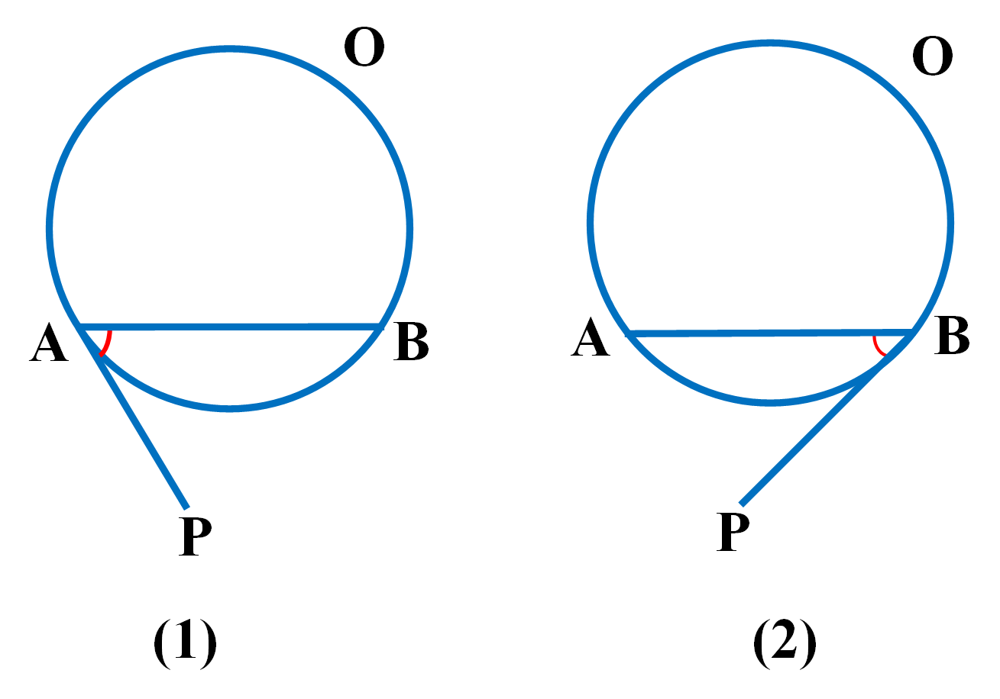

    # branch 1
    premise: Arc(OAB)&Angle(BAP)&IsTangentOfCircle(PA,O)
    conclusion: Equal(MeasureOfAngle(BAP),Mul(MeasureOfArc(OAB),1/2))
    # branch 2
    premise: Arc(OAB)&Angle(PBA)&IsTangentOfCircle(PB,O)
    conclusion: Equal(MeasureOfAngle(PBA),Mul(MeasureOfArc(OAB),1/2))

**Description**:  
1.弦切角定理：弦切角的度数等于它所夹的弧的圆心角度数的一半

#### circle_perimeter_formula(O)

    

    premise: Circle(O)
    conclusion: Equal(PerimeterOfCircle(O),Mul(2*pi,RadiusOfCircle(O)))

**Description**:  
1.圆的周长公式：P=2*pi*r

#### circle_area_formula(O)

    

    premise: Circle(O)
    conclusion: Equal(AreaOfCircle(O),Mul(pi,RadiusOfCircle(O),RadiusOfCircle(O)))

**Description**:  
1.圆的面积公式：S=pi*r*r

#### radius_of_circle_property_length_equal(PA,O)

    

    premise: Cocircular(O,A)&Line(PA)&IsCentreOfCircle(P,O)
    conclusion: Equal(LengthOfLine(PA),RadiusOfCircle(O))

**Description**:  
1.圆的所有半径长度相等

#### diameter_of_circle_judgment_pass_centre(APB,O)

    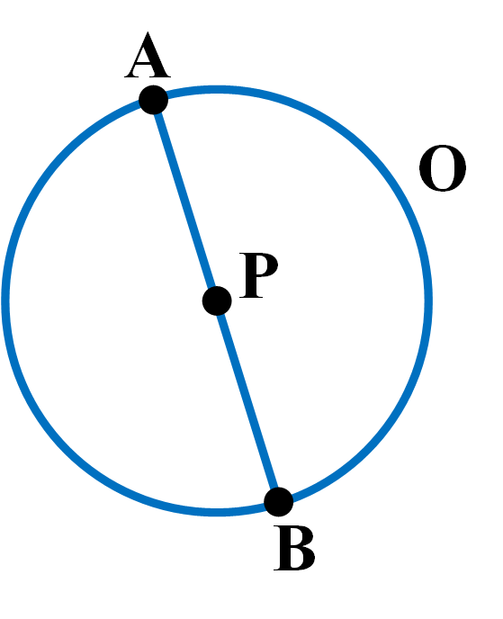

    premise: Cocircular(O,AB)&Collinear(APB)&IsCentreOfCircle(P,O)
    conclusion: IsDiameterOfCircle(AB,O)

**Description**:  
1.圆的直径的判定：过圆心且两端在圆上的直线

#### diameter_of_circle_judgment_length_equal(AB,O)

    

    premise: Cocircular(O,AB)&Equal(DiameterOfCircle(O),LengthOfLine(AB))
    conclusion: IsDiameterOfCircle(AB,O)

**Description**:  
1.圆的直径的判定：两端在圆上且长度与圆直径相等的直线

#### diameter_of_circle_judgment_right_angle(BCA,O)

    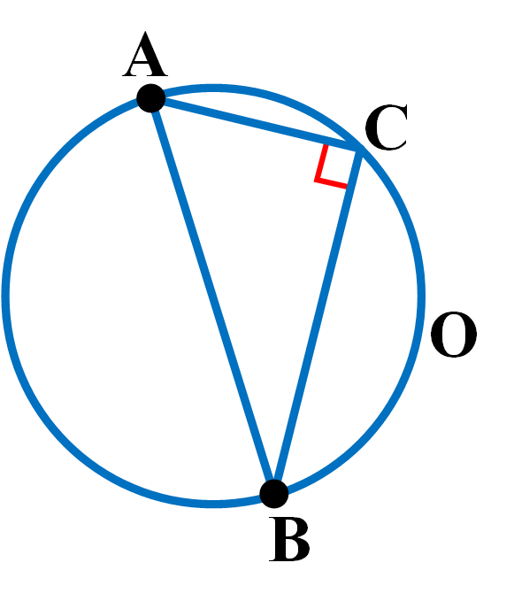

    premise: Cocircular(O,BCA)&Equal(MeasureOfAngle(BCA),90)
    conclusion: IsDiameterOfCircle(AB,O)

**Description**:  
1.圆的直径的判定：两端在圆上且所对圆周角是直角

#### diameter_of_circle_property_length_equal(AB,O)

    

    premise: IsDiameterOfCircle(AB,O)
    conclusion: Equal(LengthOfLine(AB),DiameterOfCircle(O))

**Description**:  
1.圆的所有直径长度相等

#### diameter_of_circle_property_right_angle(BCA,O)

    

    premise: IsDiameterOfCircle(AB,O)&Cocircular(O,BCA)&Angle(BCA)
    conclusion: PerpendicularBetweenLine(BC,AC)

**Description**:  
1.直径所对的圆周角是直角

#### tangent_of_circle_judgment_perpendicular(PA,O,Q)

    

    # branch 1
    premise: Cocircular(O,A)&IsCentreOfCircle(Q,O)&Angle(QAP)&Equal(MeasureOfAngle(QAP),90)
    conclusion: IsTangentOfCircle(PA,O)
    # branch 2
    premise: Cocircular(O,A)&IsCentreOfCircle(Q,O)&Angle(PAQ)&Equal(MeasureOfAngle(PAQ),90)
    conclusion: IsTangentOfCircle(PA,O)

**Description**:  
1.圆切线的判定：垂直

#### tangent_of_circle_property_perpendicular(PA,O,Q)

    

    # branch 1
    premise: IsTangentOfCircle(PA,O)&Angle(QAP)&IsCentreOfCircle(Q,O)
    conclusion: PerpendicularBetweenLine(QA,PA)
    # branch 2
    premise: IsTangentOfCircle(PA,O)&Angle(PAQ)&IsCentreOfCircle(Q,O)
    conclusion: PerpendicularBetweenLine(PA,QA)

**Description**:  
1.圆切线的性质：垂直

#### tangent_of_circle_property_length_equal(PA,PB,O)

    

    premise: IsTangentOfCircle(PA,O)&IsTangentOfCircle(PB,O)
    conclusion: Equal(LengthOfLine(PA),LengthOfLine(PB))

**Description**:  
1.圆切线的性质：圆外一点到圆的两条切线长度相等

#### sector_perimeter_formula(OAB)

    

    premise: Arc(OAB)
    conclusion: Equal(PerimeterOfSector(OAB),Add(RadiusOfCircle(O),RadiusOfCircle(O),LengthOfArc(OAB)))

**Description**:  
1.扇形周长公式：P=2*r+L

#### sector_area_formula(OAB)

    

    premise: Arc(OAB)
    conclusion: Equal(AreaOfSector(OAB),Mul(MeasureOfArc(OAB),1/360*pi,RadiusOfCircle(O),RadiusOfCircle(O)))

**Description**:  
1.扇形面积公式：S=n/360*pi*r*r

#### perpendicular_bisector_judgment_per_and_bisect(AD,BC)

    

    premise: IsBisectorOfAngle(AD,CAB)&Collinear(BDC)&Equal(LengthOfLine(BD),LengthOfLine(DC))
    conclusion: IsPerpendicularBisectorOfLine(AD,BC)

**Description**:  
1.垂直平分线判定：AD是角平分线且BD=DC

