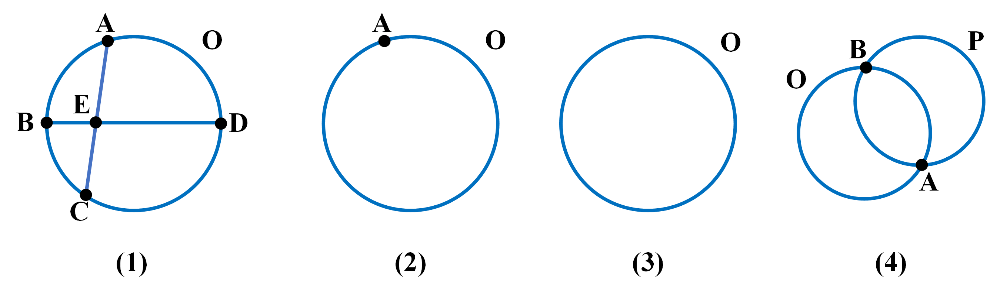
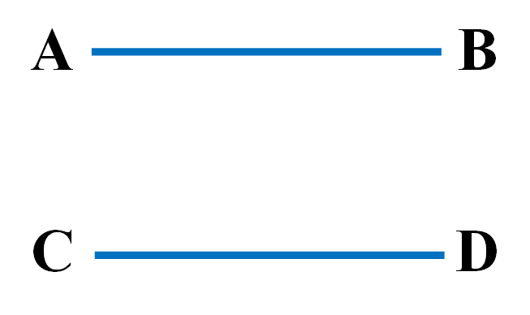
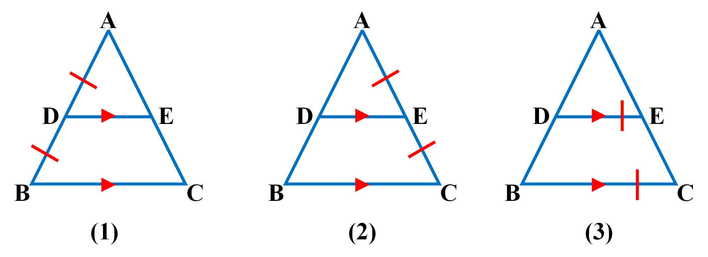
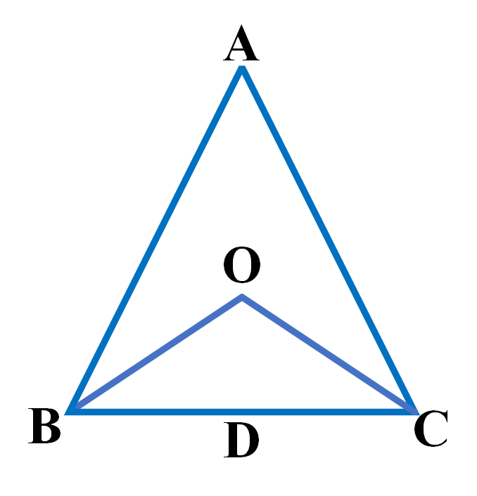
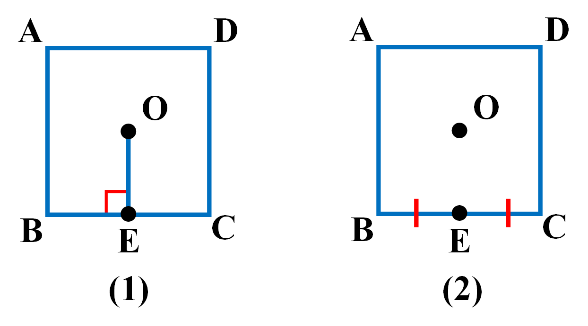

# GFS-Basic

GFS-Basic is a geometry formal system designed based on the
[Geometry Formalization Theory](https://arxiv.org/abs/2310.18021), suitable for the solver
[FormalGeo](https://github.com/FormalGeo/FormalGeo) version 0.0.1. FormalGeo-0.0.1 contains 25 built-in predicates.
On this basis, GFS-Basic has detailed summaries of common nouns and theorems in the field of plane geometry, and has
newly defined 63 predicates and 196 theorems.

## Preset Predicates

3 construction predicates: Shape, Collinear, Cocircular; 6 basic entity predicates: Point, Line, Arc, Angle, Polygon,
Circle; 2 algebraic relation predicates: Equal, Equation; 1 attribute predicate: Free; 10 operation predicates: Add,
Sub, Mul, Div, Pow, Mod, Sqrt, Sin, Cos, Tan; 3 problem target predicates: Value, Equal, Relation.

### Construction Predicates

#### Shape(*)

Shape is the most basic construction predicate. It uses several edges or arcs to declare a closed geometric figure,
which can be an angle or a shape formed by edges and arcs. For closed geometric figures, list the edges of the figure in
a counterclockwise direction. For non-closed geometric figures, first connect the gaps to transform them into closed
geometric figures.

    

**1.Declare a point**  
As shown in Figure 1, P is the center of the circle O. We can declare a point like this：

    Shape(P)

**2.Declare a point**  
As shown in Figure 2, AB are the two points of the line segment. We can declare the line segment like this:

    Shape(AB)

When declaring a line segment using Shape, the segment is assumed to be undirected by default, so declaring it this way
is also valid:

    Shape(BA)

**3.Declare a angle**  
As shown in Figure 3, angle B is formed by two line segments. It is important to note that when declaring an angle, the
line segments are directed, and the order in which the two lines appear follows the counterclockwise direction,
connecting head to tail. Therefore, angle B can be represented as:

    Shape(AB,BC)

**4.Declare a shape**  
If we declare shapes one edge or one angle at a time, it can be quite cumbersome. Instead, we can directly declare a
shape composed of several line segments and arcs. In the construction stage, the reasoner will automatically expand the
angles, lines, and arcs in the shape.

For the quadrilateral in Figure 3, we can declare it like this:

    Shape(AB,BC,CD,DA)
    Shape(BC,CD,DA,AB)
    Shape(CD,DA,AB,BC)
    Shape(DA,AB,BC,CD)

A quadrilateral can be represented in the four ways mentioned above, and we can choose one of them. For more complex
shapes, like the one in Figure 4, it can be declared as:

    Shape(OAB,BE,EA)
    Shape(OBC,CE,EB)
    Shape(EC,OCD,DP,PE)
    Shape(AE,EP,PD,ODA)

It should be noted that although EP and PD are collinear, when declaring a closed figure, we cannot directly declare ED;
we need to declare all the smallest edges. Closed figures can be composed of lines and arcs. Lines have two directions,
but arcs only have one. When declaring lines, they should be arranged in a counterclockwise direction, with the points
connecting end to end; when declaring arcs, it's important to note that there is only one way to represent them. When an
arc appears on its own, there is no need to declare it using Shape, as the appearance of an arc is always accompanied by
the Cocircular predicate. All arcs will be automatically extended by the Cocircular predicate.

#### Collinear(*)

Collinear is used to declare that three or more points are collinear. Since two points are always collinear, there is no
need to declare collinearity for just two points.

    

Declaring collinearity is extremely simple; just list all the points on a line in order. The collinearity in Figure 1
can be declared as:

    Collinear(AMB)

Collinearity does not have a direction, so declaring it from the other direction is also valid:

    Collinear(BMA)

The collinearity in Figure 2 can be declared as:

    Collinear(BCDEF)

The collinearity in Figure 3 can be declared as:

    Collinear(ADB)
    Collinear(AEC)

Collinearity will automatically expand in the reasoner to include all lines and flat angles. For instance,
Collinear(AMB) will expand to include Line(AM), Line(MB), Line(AM), Angle(AMB), and Angle(BMA).

#### Cocircular(O,*)

Cocircular is used to declare several points that are concyclic. Like Collinear, it involves listing several points in
order. However, it differs from Collinear in two ways: first, even if only one point is on the circle, it needs to be
declared, and second, the declaration of concyclic points should follow a counterclockwise direction, and it can start
from any point.

    

In Figure 1, the points that are concyclic can be declared as:

    Cocircular(O,ABCD)
    Cocircular(O,BCDA)
    Cocircular(O,CDAB)
    Cocircular(O,DABC)

The concyclic declaration in Figure 1 can have the above four forms, and any one of them can be chosen. Figures 2 to 4
show several special cases of concyclic declarations. In Figure 2, where there is only one point on the circle, it also
needs to be declared:

    Cocircular(O,A)

In Figure 3, where there are no points on the circle, it also needs to be declared:

    Cocircular(O)

In Figure 4, where two circles have a common point, they need to be declared separately:

    Cocircular(O,AB)
    Cocircular(P,BA)

After declaring cocircular, all arcs and circles will be automatically expanded.

### Basic Entity Predicates

Basic entities are derived from basic constructions and do not change after the construction phase is complete. We do
not need to declare basic entities; the following information is provided to help us understand the internal logic of
the formal system. Basic construction predicates declare the structural information of a shape, which is the relative
positional information of points. Basic entities are essentially the 'unzipped' version of basic constructions, making
them more convenient to use during the reasoning process.

#### Point(A)

It's about points, straightforward and simple.

    

The declaration of points in Figures 1-3:

    Point(A)
    Point(A),Point(B),Point(C)
    Point(A),Point(C),Point(O)

#### Line(AB)

Line declares an undirected line segment.

    

Since it is undirected, the line segment in Figure 1 can be declared in two ways; either one can be chosen:

    Line(AB)
    Line(BA)

The declaration of line in Figures 2 and 3:

    Line(AB),Line(CD)  
    Line(AO),Line(BO) 

#### Arc(OAB)

Arc declares a segment of an arc, consisting of three points. The first point is the center of the circle to which the
arc belongs, and the remaining two points form the arc. They should be listed in counterclockwise order.

    

The declaration of arcs in Figures 1-3:

    Arc(OAB)
    Arc(OAC),Arc(OCA)
    Arc(OAB),Arc(OBC),Arc(OCD),Arc(ODA)

#### Angle(ABC)

An angle is formed by three points. When declaring an angle, the points should be ordered according to the
counterclockwise principle.

    

The declaration of angles in Figures 1-3:

    Angle(AOB)
    Angle(ABC),Angle(BCA),Angle(CAB)
    Angle(AOC),Angle(COB),Angle(BOD),Angle(DOA)

#### Polygon(*)

A polygon is formed by several straight lines, and all points should be listed in counterclockwise order. A polygon with
n sides has n different representations.

    

    Polygon(ABC),Polygon(BCA),Polygon(CAB)
    Polygon(ABCD),Polygon(BCDA),Polygon(CDAB),Polygon(DABC)
    Polygon(ABCDE),Polygon(BCDEA),Polygon(CDEAB),Polygon(DEABC),Polygon(EABCD)

#### Circle(O)

Circle is used to declare a circle, and it's important to distinguish between the circle and its center.

    

The declaration of circles in Figures 1-3:

    Cirlce(O)
    Cirlce(B),Cirlce(A)
    Cirlce(O)

### Algebraic Relation Predicates

Algebraic relations are expressed as algebraic expressions, denoted as "expr." An "expr" is a formula composed of
symbols, operators, and nested attributes. Any expression that conforms to the sympy syntax can be correctly parsed.

#### Equal(expr1,expr2)

Equal accepts two "expr" values, representing an algebraic equivalence relationship.

    Equal(a,5)  
    Equal(MeasureOfAngle(ABC),30)  
    Equal(Add(LengthOfLine(AB),a+5,x),y^2)

#### Equation(expr)

Equation accepts one "expr" value, representing an equation.

    Equation(a-5)  
    Equation(Sub(MeasureOfAngle(ABC),30))  
    Equation(Sub(Add(LengthOfLine(AB),a+5,x),y^2))

### Attribution Predicates

#### Free(y)

Declare a free symbol, which can represent an unknown variable or refer to a geometric property.

### Operation Predicates

|        名称         |         格式         |   表达式符号   | 优先级 |
|:-----------------:|:------------------:|:---------:|:---:|
|        Add        | Add(expr1,expr2,…) |     +     |  1  |
|        Sub        |  Sub(expr1,expr2)  |     -     |  1  |
|        Mul        | Mul(expr1,expr2,…) |     *     |  2  |
|        Div        |  Div(expr1,expr2)  |     /     |  2  |
|        Pow        |  Pow(expr1,expr2)  |    **     |  3  |
|        Mod        |  Mod(expr1,expr2)  |    mod    |  3  |
|       Sqrt        |    Sqrt(expr1)     |   sqrt    |  4  |
|        Sin        |     Sin(expr)      |    sin    |  4  |
|        Cos        |     Cos(expr)      |    cos    |  4  |
|        Tan        |     Tan(expr)      |    tan    |  4  |
|    Real Number    |         R          | 1,2,3,... |  /  |
|  Free Variables   |         f          | a,b,c,... |  /  |
| Left parenthesis  |         /          |     (     |  5  |
| Right parenthesis |         /          |     )     |  0  |  

### Problem Target Predicates

#### Value(expr)

"expr" can be an expression or a geometric entity property, and it can be nested. Algebraic problem-solving goals
involve finding the value of an expression or property.

    Value(LengthOfLine(AB))
    Value(Add(MeasureOfAngle(ABC),MeasureOfAngle(DEF)))
    Value(x+y)

#### Equal(expr1,expr2)

"expr" can indeed be an expression or a geometric entity property, and it can be nested. Algebraic problem-solving goals
can involve proving the equality of two expressions or properties on the left and right sides of an equation.

    Equal(LengthOfLine(AB),x+y)
    Equal(Add(MeasureOfAngle(ABC),MeasureOfAngle(DEF)),Pow(x,2))

#### Relation(*)

In logical problem-solving goals, the aim is to find a specific entity or property. "Relation" represents any entity or
entity relationship.

    Relation(Parallel(AB,CD))
    Relation(RightTriangle(ABC))  

## Custom Predicate
### Entity
#### RightTriangle(ABC)

    

    ee_check: Polygon(ABC)
    multi: 
    extend: PerpendicularBetweenLine(AB,CB)

**Description**:  
A triangle with one right angle is called a right triangle.
In the right triangle ABC, ∠ABC is the right angle, and AB and BC are the two legs.

#### IsoscelesTriangle(ABC)

    

    ee_check: Polygon(ABC)
    multi: 
    extend: Equal(LengthOfLine(AB),LengthOfLine(AC))

**Description**:  
A triangle with two equal legs is called an isosceles triangle. 
AB and AC are the two equal legs of the isosceles triangle ABC.

#### IsoscelesRightTriangle(ABC)

    

    ee_check: Polygon(ABC)
    multi: 
    extend: RightTriangle(CAB)
            IsoscelesTriangle(ABC)

**Description**:  
A triangle that satisfies the conditions of both a right triangle and an isosceles triangle is called an isosceles right triangle.

#### EquilateralTriangle(ABC)

    

    ee_check: Polygon(ABC)
    multi: BCA
           CAB
    extend: IsoscelesTriangle(ABC)
            IsoscelesTriangle(BCA)
            IsoscelesTriangle(CAB)

**Description**:  
A triangle with three equal sides is called an equilateral triangle.

#### Kite(ABCD)

    

    ee_check: Polygon(ABCD)
    multi: CDAB
    extend: Equal(LengthOfLine(AB),LengthOfLine(AD))
            Equal(LengthOfLine(CB),LengthOfLine(CD))

**Description**:  
A quadrilateral with two pairs of adjacent sides equal is called a kite. 
In the kite ABCD, AB and AD are one pair of adjacent sides, and CB and CD are the other pair.

#### Parallelogram(ABCD)

    

    ee_check: Polygon(ABCD)
    multi: BCDA
           CDAB
           DABC
    extend: ParallelBetweenLine(AD,BC)
            ParallelBetweenLine(BA,CD)

**Description**:  
A quadrilateral with both pairs of opposite sides parallel is called a parallelogram. 
In the parallelogram ABCD, AD and BC are one pair of opposite sides, and BA and CD are the other pair.

#### Rhombus(ABCD)

    

    ee_check: Polygon(ABCD)
    multi: BCDA
           CDAB
           DABC
    extend: Parallelogram(ABCD)
            Kite(ABCD)
            Kite(BCDA)

**Description**:  
A quadrilateral with four equal sides is called a rhombus.

#### Rectangle(ABCD)

    

    ee_check: Polygon(ABCD)
    multi: BCDA
           CDAB
           DABC
    extend: Parallelogram(ABCD)
            PerpendicularBetweenLine(AB,CB)
            PerpendicularBetweenLine(BC,DC)
            PerpendicularBetweenLine(CD,AD)
            PerpendicularBetweenLine(DA,BA)

**Description**:  
A quadrilateral with four right angles is called a rectangle.

#### Square(ABCD)

    

    ee_check: Polygon(ABCD)
    multi: BCDA
           CDAB
           DABC
    extend: Rhombus(ABCD)
            Rectangle(ABCD)

**Description**:  
A quadrilateral with four right angles and four equal sides is called a square.

#### Trapezoid(ABCD)

    

    ee_check: Polygon(ABCD)
    multi: CDAB
    extend: ParallelBetweenLine(AD,BC)

**Description**:  
A quadrilateral with one pair of parallel sides and another pair of sides that would intersect if extended is called a trapezoid. 
In the trapezoid ABCD, AD and BC are the parallel sides, and AB and CD are the non-parallel sides.

#### IsoscelesTrapezoid(ABCD)

    

    ee_check: Polygon(ABCD)
    multi: CDAB
    extend: Trapezoid(ABCD)
            Equal(LengthOfLine(AB),LengthOfLine(CD))

**Description**:  
A trapezoid with two equal legs is called an isosceles trapezoid.

#### RightTrapezoid(ABCD)

    

    ee_check: Polygon(ABCD)
    multi: 
    extend: Trapezoid(ABCD)
            PerpendicularBetweenLine(DA,BA)
            PerpendicularBetweenLine(AB,CB)

**Description**:  
A trapezoid with one right angle is called a right-angled trapezoid. 
In the right-angled trapezoid ABCD, ∠A and ∠B are right angles.

### Relation
#### IsMidpointOfLine(M,AB)

    

    ee_check: Point(M)
              Line(AB)
              Collinear(AMB)
    fv_check: M,AB
    multi: M,BA
    extend: Equal(LengthOfLine(AM),LengthOfLine(MB))

**Description**:  
Points on a segment that are equidistant from the two endpoints of the segment are called the midpoint of the segment.

#### IsMidpointOfArc(M,OAB)

    

    ee_check: Point(M)
              Arc(OAB)
              Cocircular(O,AMB)
    fv_check: M,OAB
    multi: 
    extend: Equal(LengthOfArc(OAM),LengthOfArc(OMB))

**Description**:  
Points on a arc that are equidistant from the two endpoints of the arc are called the midpoint of the arc.

#### ParallelBetweenLine(AB,CD)

    

    ee_check: Line(AB)
              Line(CD)
    fv_check: AB,CD
    multi: DC,BA
    extend: 

**Description**:  
Line AB and line CD are parallel to each other. 
AB and CD are collinear segments in the same direction.

#### PerpendicularBetweenLine(AO,CO)

    

    ee_check: Line(AO)
              Line(CO)
    fv_check: AO,CO
    multi: 
    extend: Equal(MeasureOfAngle(AOC),90)

**Description**:  
Line AO and line CO are mutually perpendicular.
∠AOC is a right angle.

#### IsPerpendicularBisectorOfLine(CO,AB)

    

    ee_check: Line(CO)
              Line(AB)
              Collinear(AOB)
    fv_check: CO,AB
    multi: 
    extend: PerpendicularBetweenLine(AO,CO)
            PerpendicularBetweenLine(CO,BO)
            IsMidpointOfLine(O,AB)

**Description**:  
If CO is perpendicular to AB, intersects AB at point O, and O is the midpoint of AB, then line CO is the perpendicular bisector of line AB.

#### IsBisectorOfAngle(BD,ABC)

    

    ee_check: Line(BD)
              Angle(ABC)
    fv_check: BD,ABC
    multi: 
    extend: Equal(MeasureOfAngle(ABD),MeasureOfAngle(DBC))

**Description**:  
If BD is between angles ABC, and after the division, the two resulting angles are equal, then line BD is the angle bisector of angle ABC.

#### IsMedianOfTriangle(AD,ABC)

    

    ee_check: Line(AD)
              Polygon(ABC)
              Collinear(BDC)
    fv_check: AD,ABC
    multi: 
    extend: IsMidpointOfLine(D,BC)

**Description**:  
The line segment connecting vertex A and the midpoint D of the base BC of triangle ABC is called the median of the triangle.

#### IsAltitudeOfTriangle(AD,ABC)

    

    ee_check: Line(AD)
              Polygon(ABC)
    fv_check: AD,ABC
    multi: 
    extend: Equal(LengthOfLine(AD),HeightOfTriangle(ABC))
            PerpendicularBetweenLine(BD,AD)
            PerpendicularBetweenLine(AD,CD)

**Description**:  
A line segment perpendicular to the base is the altitude of a triangle.

#### IsMidsegmentOfTriangle(DE,ABC)

    

    ee_check: Line(DE)
              Polygon(ABC)
              Collinear(ADB)
              Collinear(AEC)
    fv_check: DE,ABC
    multi: 
    extend: IsMidpointOfLine(D,AB)
            IsMidpointOfLine(E,AC)

**Description**:  
The line connecting the midpoints of the two legs of a triangle is called the midsegment of the triangle.

#### IsCircumcenterOfTriangle(O,ABC)

    

    ee_check: Point(O)
              Polygon(ABC)
    fv_check: O,ABC
    multi: O,BCA
           O,CAB
    extend: 

**Description**:  
The point of intersection of the perpendicular bisectors of the three sides of a triangle and the center of the circumcircle is the circumcenter of the triangle

#### IsIncenterOfTriangle(O,ABC)

    

    ee_check: Point(O)
              Polygon(ABC)
    fv_check: O,ABC
    multi: O,BCA
           O,CAB
    extend: IsBisectorOfAngle(AO,CAB)
            IsBisectorOfAngle(BO,ABC)
            IsBisectorOfAngle(CO,BCA)

**Description**:  
The point of intersection of the angle bisectors of the three sides of a triangle and the center of the incircle is the incenter of the triangle.

#### IsCentroidOfTriangle(O,ABC)

    

    ee_check: Point(O)
              Polygon(ABC)
    fv_check: O,ABC
    multi: O,BCA
           O,CAB
    extend: 

**Description**:  
The point of intersection of the medians of the three sides of a triangle is the centroid of the triangle.

#### IsOrthocenterOfTriangle(O,ABC)

    

    ee_check: Point(O)
              Polygon(ABC)
    fv_check: O,ABC
              A,ABC
              B,ABC
              C,ABC
    multi: O,BCA
           O,CAB
    extend: 

**Description**:  
The point of intersection of the altitudes of the three sides of a triangle is the orthocenter of the triangle.

#### CongruentBetweenTriangle(ABC,DEF)

    

    ee_check: Polygon(ABC)
              Polygon(DEF)
    multi: BCA,EFD
           CAB,FDE
    extend: 

**Description**:  
Two triangles that are exactly the same are called congruent triangles.

#### MirrorCongruentBetweenTriangle(ABC,DEF)

    

    ee_check: Polygon(ABC)
              Polygon(DEF)
    multi: BCA,FDE
           CAB,EFD
    extend: 

**Description**:  
Two triangles that are mirror images of each other and exactly the same are called mirror congruent triangles. 
Corresponding points (ABC, DFE), and there is no triangle DFE. Keeping the first point D fixed and reversing the order of the other points, we get (ABC, DEF).

#### SimilarBetweenTriangle(ABC,DEF)

    

    ee_check: Polygon(ABC)
              Polygon(DEF)
    multi: BCA,EFD
           CAB,FDE
    extend: 

**Description**:  
Two triangles that are in proportion to each other are called similar triangles.

#### MirrorSimilarBetweenTriangle(ABC,DEF)

    

    ee_check: Polygon(ABC)
              Polygon(DEF)
    multi: BCA,FDE
           CAB,EFD
    extend: 

**Description**:  
Two triangles that are mirror images of each other and in proportion to each other are called mirror similar triangles.

#### IsAltitudeOfQuadrilateral(EF,ABCD)

    

    ee_check: Line(EF)
              Polygon(ABCD)
    fv_check: EF,ABCD
              AF,ABCD
              DF,ABCD
              AC,ABCD
              DB,ABCD
    multi: 
    extend: Equal(LengthOfLine(EF),HeightOfQuadrilateral(ABCD))
            PerpendicularBetweenLine(BF,EF)
            PerpendicularBetweenLine(EF,CF)
            PerpendicularBetweenLine(DE,FE)
            PerpendicularBetweenLine(FE,AE)

**Description**:  
The line EF, which is perpendicular to the base, is the height of quadrilateral ABCD.

#### IsMidsegmentOfQuadrilateral(EF,ABCD)

    

    ee_check: Line(EF)
              Polygon(ABCD)
              Collinear(AEB)
              Collinear(DFC)
    fv_check: FE,CDAB
    multi: FE,CDAB
    extend: IsMidpointOfLine(E,AB)
            IsMidpointOfLine(F,CD)

**Description**:  
The line connecting the midpoints of the two legs of a quadrilateral is called the midsegment of the quadrilateral.

#### IsCircumcenterOfQuadrilateral(O,ABCD)

    

    ee_check: Point(O)
              Polygon(ABCD)
    fv_check: O,ABCD
    multi: O,BCDA
           O,CDAB
           O,DABC
    extend: 

**Description**:  
The center of the circumcircle of a quadrilateral is called the circumcenter of the quadrilateral.

#### IsIncenterOfQuadrilateral(O,ABCD)

    

    ee_check: Point(O)
              Polygon(ABCD)
    fv_check: O,ABCD
    multi: O,BCDA
           O,CDAB
           O,DABC
    extend: IsBisectorOfAngle(AO,DAB)
            IsBisectorOfAngle(BO,ABC)
            IsBisectorOfAngle(CO,BCD)
            IsBisectorOfAngle(DO,CDA)

**Description**:  
The center of the incircle of a quadrilateral is called the incenter of the quadrilateral.

#### CongruentBetweenQuadrilateral(ABCD,EFGH)

    

    ee_check: Polygon(ABCD)
              Polygon(EFGH)
    multi: BCDA,FGHE
           CDAB,GHEF
           DABC,HEFG
    extend: 

**Description**:  
Two quadrilaterals that are exactly the same are called congruent quadrilaterals.

#### MirrorCongruentBetweenQuadrilateral(ABCD,EFGH)

    

    ee_check: Polygon(ABCD)
              Polygon(EFGH)
    multi: BCDA,HEFG
           CDAB,GHEF
           DABC,FGHE
    extend: 

**Description**:  
Two quadrilaterals that are mirror images of each other and exactly the same are called mirror congruent quadrilaterals.

#### SimilarBetweenQuadrilateral(ABCD,EFGH)

    

    ee_check: Polygon(ABCD)
              Polygon(EFGH)
    multi: BCDA,FGHE
           CDAB,GHEF
           DABC,HEFG
    extend: 

**Description**:  
Two quadrilaterals that are in proportion to each other are called similar quadrilaterals.

#### MirrorSimilarBetweenQuadrilateral(ABCD,EFGH)

    

    ee_check: Polygon(ABCD)
              Polygon(EFGH)
    multi: BCDA,HEFG
           CDAB,GHEF
           DABC,FGHE
    extend: 

**Description**:  
Two quadrilaterals that are mirror images of each other and in proportion to each other are called mirror similar quadrilaterals.

#### CongruentBetweenArc(OAB,OCD)

    

    ee_check: Arc(OAB)
              Arc(OCD)
    multi: 
    extend: 

**Description**:  
Two arcs that are exactly the same are called congruent arcs.

#### SimilarBetweenArc(OAB,OCD)

    

    ee_check: Arc(OAB)
              Arc(OCD)
    multi: 
    extend: 

**Description**:  
Two arcs that are in proportion to each other are called similar arcs.

#### IsDiameterOfCircle(AB,O)

    

    ee_check: Line(AB)
              Cocircular(O,AB)
    fv_check: AB,O
    multi: BA,O
    extend: 

**Description**:  
The diameter of a circle.

#### IsTangentOfCircle(PA,O)

    

    ee_check: Line(PA)
              Cocircular(O,A)
    fv_check: PA,O
    multi: 
    extend: 

**Description**:  
A straight line passing through point P, if it intersects the circle at only one point, is called a tangent to the circle.

#### IsCentreOfCircle(P,O)

    

    ee_check: Point(P)
              Circle(O)
    fv_check: P,O
              O,O
    multi: 
    extend: 

**Description**:  
The center of a circle is called the center or the centre of the circle.

### Attribution
#### LengthOfLine(AB)

    

    ee_check: Line(AB)
    multi: BA
    sym: ll

**Description**:  
The length of the line AB.

#### MeasureOfAngle(ABC)

    

    ee_check: Angle(ABC)
    multi: 
    sym: ma

**Description**:  
The measure of ∠ABC.

#### PerimeterOfTriangle(ABC)

    

    ee_check: Polygon(ABC)
    multi: BCA
           CAB
    sym: pt

**Description**:  
The perimeter of triangle ABC.

#### AreaOfTriangle(ABC)

    

    ee_check: Polygon(ABC)
    multi: BCA
           CAB
    sym: at

**Description**:  
The area of triangle ABC.

#### HeightOfTriangle(ABC)

    

    ee_check: Polygon(ABC)
    multi: 
    sym: ht

**Description**:  
The length of the altitude on the base BC of triangle ABC.

#### RatioOfSimilarTriangle(ABC,DEF)

    

    ee_check: Polygon(ABC)
              Polygon(DEF)
    multi: BCA,EFD
           CAB,FDE
    sym: rst

**Description**:  
The similarity ratio of similar triangles.

#### RatioOfMirrorSimilarTriangle(ABC,DEF)

    

    ee_check: Polygon(ABC)
              Polygon(DEF)
    multi: BCA,FDE
           CAB,EFD
    sym: rmt

**Description**:  
The similarity ratio of mirror similar triangles.

#### PerimeterOfQuadrilateral(ABCD)

    

    ee_check: Polygon(ABCD)
    multi: BCDA
           CDAB
           DABC
    sym: pq

**Description**:  
The perimeter of quadrilateral ABCD.

#### AreaOfQuadrilateral(ABCD)

    

    ee_check: Polygon(ABCD)
    multi: BCDA
           CDAB
           DABC
    sym: aq

**Description**:  
The area of quadrilateral ABCD.

#### HeightOfQuadrilateral(ABCD)

    

    ee_check: Polygon(ABCD)
    multi: 
    sym: hq

**Description**:  
The length of the altitude on the base BC of quadrilateral ABCD.

#### RatioOfSimilarQuadrilateral(ABCD,EFGH)

    

    ee_check: Polygon(ABCD)
              Polygon(EFGH)
    multi: BCDA,FGHE
           CDAB,GHEF
           DABC,HEFG
    sym: rsq

**Description**:  
The similarity ratio of similar quadrilaterals.

#### RatioOfMirrorSimilarQuadrilateral(ABCD,EFGH)

    

    ee_check: Polygon(ABCD)
              Polygon(EFGH)
    multi: BCDA,HEFG
           CDAB,GHEF
           DABC,FGHE
    sym: rmq

**Description**:  
The similarity ratio of mirror similar quadrilaterals.

#### LengthOfArc(OAB)

    

    ee_check: Arc(OAB)
    multi: 
    sym: la

**Description**:  
The length of arc OAB.

#### MeasureOfArc(OAB)

    

    ee_check: Arc(OAB)
    multi: 
    sym: mar

**Description**:  
The measure of arc OAB. 
It is equal to the measure of the central angle of the circle.

#### RatioOfSimilarArc(OAB,OCD)

    

    ee_check: Arc(OAB)
              Arc(OCD)
    multi: 
    sym: rsa

**Description**:  
The similarity ratio of similar arcs.

#### RadiusOfCircle(O)

    

    ee_check: Circle(O)
    multi: 
    sym: rc

**Description**:  
The length of the radius of the circle.

#### DiameterOfCircle(O)

    

    ee_check: Circle(O)
    multi: 
    sym: dc

**Description**:  
The length of the diameter of the circle.

#### PerimeterOfCircle(O)

    

    ee_check: Circle(O)
    multi: 
    sym: pc

**Description**:  

#### AreaOfCircle(O)

    

    ee_check: Circle(O)
    multi: 
    sym: ac

**Description**:  

#### PerimeterOfSector(OAB)

    

    ee_check: Arc(OAB)
    multi: 
    sym: ps

**Description**:  

#### AreaOfSector(OAB)

    

    ee_check: Arc(OAB)
    multi: 
    sym: as

**Description**:  

## Custom Theorem
#### line_addition(AB,BC)

    

    premise: Collinear(ABC)
    conclusion: Equal(LengthOfLine(AC),Add(LengthOfLine(AB),LengthOfLine(BC)))

**Description**:  

#### midpoint_of_line_judgment(M,AB)

    

    premise: Collinear(AMB)&Equal(LengthOfLine(AM),LengthOfLine(MB))
    conclusion: IsMidpointOfLine(M,AB)

**Description**:  

#### parallel_judgment_corresponding_angle(AB,CD,E)

    

    # branch 1
    premise: Angle(EAB)&Angle(ACD)&Collinear(EAC)&Equal(MeasureOfAngle(EAB),MeasureOfAngle(ACD))
    conclusion: ParallelBetweenLine(AB,CD)
    # branch 2
    premise: Angle(BAC)&Angle(DCE)&Collinear(ACE)&Equal(MeasureOfAngle(BAC),MeasureOfAngle(DCE))
    conclusion: ParallelBetweenLine(AB,CD)

**Description**:  

#### parallel_judgment_alternate_interior_angle(AB,CD)

    

    # branch 1
    premise: Angle(BAD)&Angle(CDA)&Equal(MeasureOfAngle(BAD),MeasureOfAngle(CDA))
    conclusion: ParallelBetweenLine(AB,CD)
    # branch 2
    premise: Angle(CBA)&Angle(BCD)&Equal(MeasureOfAngle(CBA),MeasureOfAngle(BCD))
    conclusion: ParallelBetweenLine(AB,CD)

**Description**:  

#### parallel_judgment_ipsilateral_internal_angle(AB,CD)

    

    premise: Angle(BAC)&Angle(ACD)&Equal(Add(MeasureOfAngle(BAC),MeasureOfAngle(ACD)),180)
    conclusion: ParallelBetweenLine(AB,CD)

**Description**:  

#### parallel_judgment_par_par(AB,CD,EF)

    

    premise: ParallelBetweenLine(AB,CD)&ParallelBetweenLine(CD,EF)
    conclusion: ParallelBetweenLine(AB,EF)

**Description**:  

#### parallel_judgment_per_per(AB,CD)

    

    # branch 1
    premise: PerpendicularBetweenLine(BA,CA)&PerpendicularBetweenLine(AC,DC)
    conclusion: ParallelBetweenLine(AB,CD)
    # branch 2
    premise: PerpendicularBetweenLine(CD,AD)&PerpendicularBetweenLine(BA,DA)
    conclusion: ParallelBetweenLine(AB,CD)

**Description**:  

#### parallel_property_collinear_extend(AB,CD,M)

    

    # branch 1
    premise: ParallelBetweenLine(AB,CD)&Collinear(MAB)
    conclusion: ParallelBetweenLine(MA,CD)
                ParallelBetweenLine(MB,CD)
    # branch 2
    premise: ParallelBetweenLine(AB,CD)&Collinear(ABM)
    conclusion: ParallelBetweenLine(AM,CD)
                ParallelBetweenLine(BM,CD)
    # branch 3
    premise: ParallelBetweenLine(AB,CD)&Collinear(AMB)
    conclusion: ParallelBetweenLine(AM,CD)
                ParallelBetweenLine(MB,CD)

**Description**:  

#### parallel_property_corresponding_angle(AB,CD,E)

    

    # branch 1
    premise: ParallelBetweenLine(AB,CD)&Collinear(EAC)
    conclusion: Equal(MeasureOfAngle(EAB),MeasureOfAngle(ACD))
    # branch 2
    premise: ParallelBetweenLine(AB,CD)&Collinear(ACE)
    conclusion: Equal(MeasureOfAngle(BAC),MeasureOfAngle(DCE))

**Description**:  

#### parallel_property_alternate_interior_angle(AB,CD)

    

    # branch 1
    premise: ParallelBetweenLine(AB,CD)&Line(AD)
    conclusion: Equal(MeasureOfAngle(BAD),MeasureOfAngle(CDA))
    # branch 2
    premise: ParallelBetweenLine(AB,CD)&Line(BC)
    conclusion: Equal(MeasureOfAngle(CBA),MeasureOfAngle(BCD))

**Description**:  

#### parallel_property_ipsilateral_internal_angle(AB,CD)

    

    premise: ParallelBetweenLine(AB,CD)&Line(AC)
    conclusion: Equal(Add(MeasureOfAngle(BAC),MeasureOfAngle(ACD)),180)

**Description**:  

#### parallel_property_par_per(AB,CD)

    

    # branch 1
    premise: ParallelBetweenLine(AB,CD)&PerpendicularBetweenLine(AC,DC)
    conclusion: PerpendicularBetweenLine(BA,CA)
    # branch 2
    premise: ParallelBetweenLine(AB,CD)&PerpendicularBetweenLine(BA,CA)
    conclusion: PerpendicularBetweenLine(AC,DC)

**Description**:  

#### perpendicular_judgment_angle(AO,CO)

    

    premise: Angle(AOC)&Equal(MeasureOfAngle(AOC),90)
    conclusion: PerpendicularBetweenLine(AO,CO)

**Description**:  

#### perpendicular_bisector_judgment_per_and_mid(CO,AB)

    

    premise: Collinear(AOB)&Angle(AOC)&Equal(MeasureOfAngle(AOC),90)&Equal(LengthOfLine(AO),LengthOfLine(BO))
    conclusion: IsPerpendicularBisectorOfLine(CO,AB)

**Description**:  

#### perpendicular_bisector_judgment_distance_equal(CO,AB)

    

    premise: Collinear(AOB)&Angle(AOC)&Equal(MeasureOfAngle(AOC),90)&Equal(LengthOfLine(CA),LengthOfLine(CB))
    conclusion: IsPerpendicularBisectorOfLine(CO,AB)

**Description**:  

#### perpendicular_bisector_property_distance_equal(CO,AB)

    

    premise: IsPerpendicularBisectorOfLine(CO,AB)
    conclusion: Equal(LengthOfLine(CA),LengthOfLine(CB))

**Description**:  

#### perpendicular_bisector_property_bisector(CO,AB)

    

    premise: IsPerpendicularBisectorOfLine(CO,AB)&Angle(BCO)&Angle(OCA)
    conclusion: IsBisectorOfAngle(CO,BCA)

**Description**:  

#### angle_addition(ABC,CBD)

    

    premise: Angle(ABC)&Angle(CBD)&Angle(ABD)
    conclusion: Equal(MeasureOfAngle(ABD),Add(MeasureOfAngle(ABC),MeasureOfAngle(CBD)))

**Description**:  

#### flat_angle(ABC)

    

    premise: Collinear(ABC)
    conclusion: Equal(MeasureOfAngle(ABC),180)

**Description**:  

#### adjacent_complementary_angle(AOB,BOC)

    

    premise: Collinear(AOC)&Angle(AOB)&Angle(BOC)
    conclusion: Equal(Add(MeasureOfAngle(AOB),MeasureOfAngle(BOC)),180)

**Description**:  

#### round_angle(AOB,BOA)

    

    premise: Angle(AOB)&Angle(BOA)
    conclusion: Equal(Add(MeasureOfAngle(AOB),MeasureOfAngle(BOA)),360)

**Description**:  

#### vertical_angle(AOC,BOD)

    

    premise: Collinear(AOB)&Collinear(COD)&Angle(AOC)&Angle(BOD)
    conclusion: Equal(MeasureOfAngle(AOC),MeasureOfAngle(BOD))

**Description**:  

#### bisector_of_angle_judgment_angle_equal(BD,ABC)

    

    premise: Angle(ABD)&Angle(DBC)&Equal(MeasureOfAngle(ABD),MeasureOfAngle(DBC))
    conclusion: IsBisectorOfAngle(BD,ABC)

**Description**:  

#### bisector_of_angle_property_distance_equal(BD,ABC)

    

    premise: IsBisectorOfAngle(BD,ABC)&Equal(MeasureOfAngle(BCD),90)&Equal(MeasureOfAngle(DAB),90)
    conclusion: Equal(LengthOfLine(DA),LengthOfLine(DC))

**Description**:  

#### bisector_of_angle_property_line_ratio(BD,ABC)

    

    premise: IsBisectorOfAngle(BD,ABC)&Collinear(CDA)
    conclusion: Equal(Mul(LengthOfLine(CD),LengthOfLine(BA)),Mul(LengthOfLine(DA),LengthOfLine(BC)))

**Description**:  

#### bisector_of_angle_property_length_formula(BD,ABC)

    

    premise: IsBisectorOfAngle(BD,ABC)&Collinear(CDA)
    conclusion: Equal(Mul(LengthOfLine(BD),LengthOfLine(BD)),Sub(Mul(LengthOfLine(BC),LengthOfLine(BA)),Mul(LengthOfLine(DC),LengthOfLine(DA))))

**Description**:  

#### triangle_property_angle_sum(ABC)

    

    premise: Polygon(ABC)
    conclusion: Equal(Add(MeasureOfAngle(ABC),MeasureOfAngle(BCA),MeasureOfAngle(CAB)),180)

**Description**:  

#### sine_theorem(ABC)

    

    premise: Polygon(ABC)
    conclusion: Equal(Mul(LengthOfLine(AB),Sin(MeasureOfAngle(ABC))),Mul(LengthOfLine(AC),Sin(MeasureOfAngle(BCA))))

**Description**:  

#### cosine_theorem(ABC)

    

    premise: Polygon(ABC)
    conclusion: Equal(Add(Pow(LengthOfLine(BC),2),Mul(2,LengthOfLine(AB),LengthOfLine(AC),Cos(MeasureOfAngle(CAB)))),Add(Pow(LengthOfLine(AB),2),Pow(LengthOfLine(AC),2)))

**Description**:  

#### triangle_perimeter_formula(ABC)

    

    premise: Polygon(ABC)
    conclusion: Equal(PerimeterOfTriangle(ABC),Add(LengthOfLine(AB),LengthOfLine(BC),LengthOfLine(CA)))

**Description**:  

#### triangle_area_formula_common(ABC)

    

    premise: Polygon(ABC)
    conclusion: Equal(AreaOfTriangle(ABC),Mul(HeightOfTriangle(ABC),LengthOfLine(BC),1/2))

**Description**:  

#### triangle_area_formula_sine(ABC)

    

    premise: Polygon(ABC)
    conclusion: Equal(AreaOfTriangle(ABC),Mul(LengthOfLine(AB),LengthOfLine(AC),Sin(MeasureOfAngle(CAB)),1/2))

**Description**:  

#### median_of_triangle_judgment(AD,ABC)

    

    premise: Polygon(ABC)&Line(AD)&Collinear(BDC)&Equal(LengthOfLine(BD),LengthOfLine(CD))
    conclusion: IsMedianOfTriangle(AD,ABC)

**Description**:  

#### altitude_of_triangle_judgment(AD,ABC)

    

    # branch 1
    premise: Polygon(ABC)&Line(AD)&Collinear(BDC)&Equal(MeasureOfAngle(BDA),90)
    conclusion: IsAltitudeOfTriangle(AD,ABC)
    # branch 2
    premise: Polygon(ABC)&Line(AD)&Collinear(DBC)&Equal(MeasureOfAngle(ADB),90)
    conclusion: IsAltitudeOfTriangle(AD,ABC)
    # branch 3
    premise: Polygon(ABC)&Line(AD)&Collinear(BCD)&Equal(MeasureOfAngle(CDA),90)
    conclusion: IsAltitudeOfTriangle(AD,ABC)

**Description**:  

#### midsegment_of_triangle_judgment_midpoint(DE,ABC)

    

    premise: Polygon(ABC)&Collinear(ADB)&Collinear(AEC)&Line(DE)&Equal(LengthOfLine(AD),LengthOfLine(BD))&Equal(LengthOfLine(AE),LengthOfLine(CE))
    conclusion: IsMidsegmentOfTriangle(DE,ABC)

**Description**:  

#### midsegment_of_triangle_judgment_parallel(DE,ABC)

    

    # branch 1
    premise: Polygon(ABC)&Collinear(ADB)&Collinear(AEC)&Line(DE)&ParallelBetweenLine(DE,BC)&Equal(LengthOfLine(AD),LengthOfLine(BD))
    conclusion: IsMidsegmentOfTriangle(DE,ABC)
    # branch 2
    premise: Polygon(ABC)&Collinear(ADB)&Collinear(AEC)&Line(DE)&ParallelBetweenLine(DE,BC)&Equal(LengthOfLine(AE),LengthOfLine(CE))
    conclusion: IsMidsegmentOfTriangle(DE,ABC)
    # branch 3
    premise: Polygon(ABC)&Collinear(ADB)&Collinear(AEC)&Line(DE)&ParallelBetweenLine(DE,BC)&Equal(LengthOfLine(BC),Mul(LengthOfLine(DE),2))
    conclusion: IsMidsegmentOfTriangle(DE,ABC)

**Description**:  

#### midsegment_of_triangle_property_parallel(DE,ABC)

    

    premise: IsMidsegmentOfTriangle(DE,ABC)
    conclusion: ParallelBetweenLine(DE,BC)

**Description**:  

#### midsegment_of_triangle_property_length(DE,ABC)

    

    premise: IsMidsegmentOfTriangle(DE,ABC)
    conclusion: Equal(LengthOfLine(DE),Mul(LengthOfLine(BC),1/2))

**Description**:  

#### circumcenter_of_triangle_judgment_intersection(O,ABC,D,E)

    

    premise: Polygon(ABC)&Collinear(ADB)&Collinear(CEA)&IsPerpendicularBisectorOfLine(OD,AB)&IsPerpendicularBisectorOfLine(OE,CA)
    conclusion: IsCircumcenterOfTriangle(O,ABC)

**Description**:  

#### circumcenter_of_triangle_property_intersection(O,ABC,D)

    

    # branch 1
    premise: IsCircumcenterOfTriangle(O,ABC)&Collinear(BDC)&Line(OD)&Equal(MeasureOfAngle(BDO),90)
    conclusion: IsPerpendicularBisectorOfLine(OD,BC)
    # branch 2
    premise: IsCircumcenterOfTriangle(O,ABC)&Collinear(BDC)&Line(OD)&Equal(LengthOfLine(BD),LengthOfLine(CD))
    conclusion: IsPerpendicularBisectorOfLine(OD,BC)

**Description**:  

#### incenter_of_triangle_judgment_intersection(O,ABC)

    

    premise: Polygon(ABC)&IsBisectorOfAngle(BO,ABC)&IsBisectorOfAngle(CO,BCA)
    conclusion: IsIncenterOfTriangle(O,ABC)

**Description**:  

#### centroid_of_triangle_judgment_intersection(O,ABC,M,N)

    

    premise: IsMedianOfTriangle(CM,CAB)&IsMedianOfTriangle(BN,BCA)&Collinear(COM)&Collinear(BON)
    conclusion: IsCentroidOfTriangle(O,ABC)

**Description**:  

#### centroid_of_triangle_property_intersection(O,ABC,M)

    

    premise: IsCentroidOfTriangle(O,ABC)&Collinear(AOM)&Collinear(BMC)
    conclusion: IsMedianOfTriangle(AM,ABC)

**Description**:  

#### centroid_of_triangle_property_line_ratio(O,ABC,M)

    

    premise: IsCentroidOfTriangle(O,ABC)&Collinear(AOM)&Collinear(BMC)
    conclusion: Equal(LengthOfLine(OA),Mul(LengthOfLine(OM),2))

**Description**:  

#### orthocenter_of_triangle_judgment_intersection(O,ABC,D,E)

    

    premise: IsAltitudeOfTriangle(CD,CAB)&IsAltitudeOfTriangle(BE,BCA)&Collinear(COD)&Collinear(BOE)
    conclusion: IsOrthocenterOfTriangle(O,ABC)

**Description**:  

#### orthocenter_of_triangle_property_intersection(O,ABC,D)

    

    premise: IsOrthocenterOfTriangle(O,ABC)&Collinear(AOD)&Collinear(BDC)
    conclusion: IsAltitudeOfTriangle(AD,ABC)

**Description**:  

#### orthocenter_of_triangle_property_angle(O,ABC)

    

    premise: IsOrthocenterOfTriangle(O,ABC)&Angle(COB)
    conclusion: Equal(MeasureOfAngle(COB),Add(MeasureOfAngle(ABC),MeasureOfAngle(BCA)))

**Description**:  

#### congruent_triangle_judgment_sss(ABC,DEF)

    

    premise: Polygon(ABC)&Polygon(DEF)&Equal(LengthOfLine(AB),LengthOfLine(DE))&Equal(LengthOfLine(BC),LengthOfLine(EF))&Equal(LengthOfLine(CA),LengthOfLine(FD))
    conclusion: CongruentBetweenTriangle(ABC,DEF)

**Description**:  

#### congruent_triangle_judgment_sas(ABC,DEF)

    

    premise: Polygon(ABC)&Polygon(DEF)&Equal(LengthOfLine(AB),LengthOfLine(DE))&Equal(MeasureOfAngle(CAB),MeasureOfAngle(FDE))&Equal(LengthOfLine(AC),LengthOfLine(DF))
    conclusion: CongruentBetweenTriangle(ABC,DEF)

**Description**:  

#### congruent_triangle_judgment_aas(ABC,DEF)

    

    # branch 1
    premise: Polygon(ABC)&Polygon(DEF)&Equal(MeasureOfAngle(ABC),MeasureOfAngle(DEF))&Equal(MeasureOfAngle(BCA),MeasureOfAngle(EFD))&Equal(LengthOfLine(AB),LengthOfLine(DE))
    conclusion: CongruentBetweenTriangle(ABC,DEF)
    # branch 2
    premise: Polygon(ABC)&Polygon(DEF)&Equal(MeasureOfAngle(ABC),MeasureOfAngle(DEF))&Equal(MeasureOfAngle(BCA),MeasureOfAngle(EFD))&Equal(LengthOfLine(BC),LengthOfLine(EF))
    conclusion: CongruentBetweenTriangle(ABC,DEF)
    # branch 3
    premise: Polygon(ABC)&Polygon(DEF)&Equal(MeasureOfAngle(ABC),MeasureOfAngle(DEF))&Equal(MeasureOfAngle(BCA),MeasureOfAngle(EFD))&Equal(LengthOfLine(AC),LengthOfLine(DF))
    conclusion: CongruentBetweenTriangle(ABC,DEF)

**Description**:  

#### congruent_triangle_judgment_hl(ABC,DEF)

    

    premise: Polygon(ABC)&Polygon(DEF)&Equal(MeasureOfAngle(ABC),90)&Equal(MeasureOfAngle(DEF),90)&Equal(LengthOfLine(AC),LengthOfLine(DF))&(Equal(LengthOfLine(AB),LengthOfLine(DE))|Equal(LengthOfLine(BC),LengthOfLine(EF)))
    conclusion: CongruentBetweenTriangle(ABC,DEF)

**Description**:  

#### congruent_triangle_property_line_equal(ABC,DEF)

    

    premise: CongruentBetweenTriangle(ABC,DEF)
    conclusion: Equal(LengthOfLine(BC),LengthOfLine(EF))

**Description**:  

#### congruent_triangle_property_angle_equal(ABC,DEF)

    

    premise: CongruentBetweenTriangle(ABC,DEF)
    conclusion: Equal(MeasureOfAngle(CAB),MeasureOfAngle(FDE))

**Description**:  

#### congruent_triangle_property_perimeter_equal(ABC,DEF)

    

    premise: CongruentBetweenTriangle(ABC,DEF)
    conclusion: Equal(PerimeterOfTriangle(ABC),PerimeterOfTriangle(DEF))

**Description**:  

#### congruent_triangle_property_area_equal(ABC,DEF)

    

    premise: CongruentBetweenTriangle(ABC,DEF)
    conclusion: Equal(AreaOfTriangle(ABC),AreaOfTriangle(DEF))

**Description**:  

#### congruent_triangle_property_exchange(ABC,DEF)

    

    premise: CongruentBetweenTriangle(ABC,DEF)
    conclusion: CongruentBetweenTriangle(DEF,ABC)

**Description**:  

#### mirror_congruent_triangle_judgment_sss(ABC,DEF)

    

    premise: Polygon(ABC)&Polygon(DEF)&Equal(LengthOfLine(AB),LengthOfLine(FD))&Equal(LengthOfLine(BC),LengthOfLine(EF))&Equal(LengthOfLine(CA),LengthOfLine(DE))
    conclusion: MirrorCongruentBetweenTriangle(ABC,DEF)

**Description**:  

#### mirror_congruent_triangle_judgment_sas(ABC,DEF)

    

    premise: Polygon(ABC)&Polygon(DEF)&Equal(LengthOfLine(AB),LengthOfLine(DF))&Equal(MeasureOfAngle(CAB),MeasureOfAngle(FDE))&Equal(LengthOfLine(AC),LengthOfLine(DE))
    conclusion: MirrorCongruentBetweenTriangle(ABC,DEF)

**Description**:  

#### mirror_congruent_triangle_judgment_aas(ABC,DEF)

    

    # branch 1
    premise: Polygon(ABC)&Polygon(DEF)&Equal(MeasureOfAngle(ABC),MeasureOfAngle(EFD))&Equal(MeasureOfAngle(BCA),MeasureOfAngle(DEF))&Equal(LengthOfLine(AB),LengthOfLine(DF))
    conclusion: MirrorCongruentBetweenTriangle(ABC,DEF)
    # branch 2
    premise: Polygon(ABC)&Polygon(DEF)&Equal(MeasureOfAngle(ABC),MeasureOfAngle(EFD))&Equal(MeasureOfAngle(BCA),MeasureOfAngle(DEF))&Equal(LengthOfLine(BC),LengthOfLine(EF))
    conclusion: MirrorCongruentBetweenTriangle(ABC,DEF)
    # branch 3
    premise: Polygon(ABC)&Polygon(DEF)&Equal(MeasureOfAngle(ABC),MeasureOfAngle(EFD))&Equal(MeasureOfAngle(BCA),MeasureOfAngle(DEF))&Equal(LengthOfLine(CA),LengthOfLine(DE))
    conclusion: MirrorCongruentBetweenTriangle(ABC,DEF)

**Description**:  

#### mirror_congruent_triangle_judgment_hl(ABC,DEF)

    

    premise: Polygon(ABC)&Polygon(DEF)&Equal(MeasureOfAngle(ABC),90)&Equal(MeasureOfAngle(EFD),90)&Equal(LengthOfLine(AC),LengthOfLine(DE))&(Equal(LengthOfLine(BC),LengthOfLine(EF))|Equal(LengthOfLine(AB),LengthOfLine(DF)))
    conclusion: MirrorCongruentBetweenTriangle(ABC,DEF)

**Description**:  

#### mirror_congruent_triangle_property_line_equal(ABC,DEF)

    

    premise: MirrorCongruentBetweenTriangle(ABC,DEF)
    conclusion: Equal(LengthOfLine(BC),LengthOfLine(EF))

**Description**:  

#### mirror_congruent_triangle_property_angle_equal(ABC,DEF)

    

    premise: MirrorCongruentBetweenTriangle(ABC,DEF)
    conclusion: Equal(MeasureOfAngle(CAB),MeasureOfAngle(FDE))

**Description**:  

#### mirror_congruent_triangle_property_perimeter_equal(ABC,DEF)

    

    premise: MirrorCongruentBetweenTriangle(ABC,DEF)
    conclusion: Equal(PerimeterOfTriangle(ABC),PerimeterOfTriangle(DEF))

**Description**:  

#### mirror_congruent_triangle_property_area_equal(ABC,DEF)

    

    premise: MirrorCongruentBetweenTriangle(ABC,DEF)
    conclusion: Equal(AreaOfTriangle(ABC),AreaOfTriangle(DEF))

**Description**:  

#### mirror_congruent_triangle_property_exchange(ABC,DEF)

    

    premise: MirrorCongruentBetweenTriangle(ABC,DEF)
    conclusion: MirrorCongruentBetweenTriangle(DEF,ABC)

**Description**:  

#### similar_triangle_judgment_sss(ABC,DEF)

    

    premise: Polygon(ABC)&Polygon(DEF)&Equal(Mul(LengthOfLine(AB),LengthOfLine(EF)),Mul(LengthOfLine(DE),LengthOfLine(BC)))&Equal(Mul(LengthOfLine(AB),LengthOfLine(DF)),Mul(LengthOfLine(DE),LengthOfLine(CA)))
    conclusion: SimilarBetweenTriangle(ABC,DEF)

**Description**:  

#### similar_triangle_judgment_sas(ABC,DEF)

    

    premise: Polygon(ABC)&Polygon(DEF)&Equal(Mul(LengthOfLine(AB),LengthOfLine(DF)),Mul(LengthOfLine(DE),LengthOfLine(AC)))&Equal(MeasureOfAngle(CAB),MeasureOfAngle(FDE))
    conclusion: SimilarBetweenTriangle(ABC,DEF)

**Description**:  

#### similar_triangle_judgment_aa(ABC,DEF)

    

    premise: Polygon(ABC)&Polygon(DEF)&Equal(MeasureOfAngle(ABC),MeasureOfAngle(DEF))&Equal(MeasureOfAngle(BCA),MeasureOfAngle(EFD))
    conclusion: SimilarBetweenTriangle(ABC,DEF)

**Description**:  

#### similar_triangle_judgment_hl(ABC,DEF)

    

    # branch 1
    premise: Polygon(ABC)&Polygon(DEF)&Equal(MeasureOfAngle(ABC),90)&Equal(MeasureOfAngle(DEF),90)&Equal(Mul(LengthOfLine(AB),LengthOfLine(DF)),Mul(LengthOfLine(AC),LengthOfLine(DE)))
    conclusion: SimilarBetweenTriangle(ABC,DEF)
    # branch 2
    premise: Polygon(ABC)&Polygon(DEF)&PerpendicularBetweenLine(AB,CB)&PerpendicularBetweenLine(DE,FE)&Equal(Mul(LengthOfLine(BC),LengthOfLine(DF)),Mul(LengthOfLine(AC),LengthOfLine(EF)))
    conclusion: SimilarBetweenTriangle(ABC,DEF)

**Description**:  

#### similar_triangle_property_ratio(ABC,DEF)

    

    premise: SimilarBetweenTriangle(ABC,DEF)
    conclusion: SimilarBetweenTriangle(DEF,ABC)
                Equal(Mul(RatioOfSimilarTriangle(ABC,DEF),RatioOfSimilarTriangle(DEF,ABC)),1)

**Description**:  

#### similar_triangle_property_line_ratio(ABC,DEF)

    

    premise: SimilarBetweenTriangle(ABC,DEF)
    conclusion: Equal(LengthOfLine(BC),Mul(LengthOfLine(EF),RatioOfSimilarTriangle(ABC,DEF)))

**Description**:  

#### similar_triangle_property_angle_equal(ABC,DEF)

    

    premise: SimilarBetweenTriangle(ABC,DEF)
    conclusion: Equal(MeasureOfAngle(CAB),MeasureOfAngle(FDE))

**Description**:  

#### similar_triangle_property_perimeter_ratio(ABC,DEF)

    

    premise: SimilarBetweenTriangle(ABC,DEF)
    conclusion: Equal(PerimeterOfTriangle(ABC),Mul(PerimeterOfTriangle(DEF),RatioOfSimilarTriangle(ABC,DEF)))

**Description**:  

#### similar_triangle_property_area_square_ratio(ABC,DEF)

    

    premise: SimilarBetweenTriangle(ABC,DEF)
    conclusion: Equal(AreaOfTriangle(ABC),Mul(AreaOfTriangle(DEF),RatioOfSimilarTriangle(ABC,DEF),RatioOfSimilarTriangle(ABC,DEF)))

**Description**:  

#### mirror_similar_triangle_judgment_sss(ABC,DEF)

    

    premise: Polygon(ABC)&Polygon(DEF)&Equal(Mul(LengthOfLine(AB),LengthOfLine(EF)),Mul(LengthOfLine(FD),LengthOfLine(BC)))&Equal(Mul(LengthOfLine(AB),LengthOfLine(DE)),Mul(LengthOfLine(FD),LengthOfLine(CA)))
    conclusion: MirrorSimilarBetweenTriangle(ABC,DEF)

**Description**:  

#### mirror_similar_triangle_judgment_sas(ABC,DEF)

    

    premise: Polygon(ABC)&Polygon(DEF)&Equal(Mul(LengthOfLine(AB),LengthOfLine(DE)),Mul(LengthOfLine(DF),LengthOfLine(AC)))&Equal(MeasureOfAngle(CAB),MeasureOfAngle(FDE))
    conclusion: MirrorSimilarBetweenTriangle(ABC,DEF)

**Description**:  

#### mirror_similar_triangle_judgment_aa(ABC,DEF)

    

    premise: Polygon(ABC)&Polygon(DEF)&Equal(MeasureOfAngle(ABC),MeasureOfAngle(EFD))&Equal(MeasureOfAngle(BCA),MeasureOfAngle(DEF))
    conclusion: MirrorSimilarBetweenTriangle(ABC,DEF)

**Description**:  

#### mirror_similar_triangle_judgment_hl(ABC,DEF)

    

    # branch 1
    premise: Polygon(BCA)&Polygon(DEF)&Equal(MeasureOfAngle(ABC),90)&Equal(MeasureOfAngle(DEF),90)&Equal(Mul(LengthOfLine(AB),LengthOfLine(DE)),Mul(LengthOfLine(DF),LengthOfLine(AC)))
    conclusion: MirrorSimilarBetweenTriangle(ABC,DEF)
    # branch 2
    premise: Polygon(BCA)&Polygon(DEF)&Equal(MeasureOfAngle(ABC),90)&Equal(MeasureOfAngle(EFD),90)&Equal(Mul(LengthOfLine(BC),LengthOfLine(DE)),Mul(LengthOfLine(AC),LengthOfLine(EF)))
    conclusion: MirrorSimilarBetweenTriangle(ABC,DEF)

**Description**:  

#### mirror_similar_triangle_property_ratio(ABC,DEF)

    

    premise: MirrorSimilarBetweenTriangle(ABC,DEF)
    conclusion: MirrorSimilarBetweenTriangle(DEF,ABC)
                Equal(Mul(RatioOfMirrorSimilarTriangle(ABC,DEF),RatioOfMirrorSimilarTriangle(DEF,ABC)),1)

**Description**:  

#### mirror_similar_triangle_property_line_ratio(ABC,DEF)

    

    premise: MirrorSimilarBetweenTriangle(ABC,DEF)
    conclusion: Equal(LengthOfLine(BC),Mul(LengthOfLine(EF),RatioOfMirrorSimilarTriangle(ABC,DEF)))

**Description**:  

#### mirror_similar_triangle_property_angle_equal(ABC,DEF)

    

    premise: MirrorSimilarBetweenTriangle(ABC,DEF)
    conclusion: Equal(MeasureOfAngle(CAB),MeasureOfAngle(FDE))

**Description**:  

#### mirror_similar_triangle_property_perimeter_ratio(ABC,DEF)

    

    premise: MirrorSimilarBetweenTriangle(ABC,DEF)
    conclusion: Equal(PerimeterOfTriangle(ABC),Mul(PerimeterOfTriangle(DEF),RatioOfMirrorSimilarTriangle(ABC,DEF)))

**Description**:  

#### mirror_similar_triangle_property_area_square_ratio(ABC,DEF)

    

    premise: MirrorSimilarBetweenTriangle(ABC,DEF)
    conclusion: Equal(AreaOfTriangle(ABC),Mul(AreaOfTriangle(DEF),RatioOfMirrorSimilarTriangle(ABC,DEF),RatioOfMirrorSimilarTriangle(ABC,DEF)))

**Description**:  

#### right_triangle_judgment_angle(ABC)

    

    premise: Polygon(ABC)&Equal(MeasureOfAngle(ABC),90)
    conclusion: RightTriangle(ABC)

**Description**:  

#### right_triangle_judgment_pythagorean_inverse(ABC)

    

    premise: Polygon(ABC)&Equal(Add(Pow(LengthOfLine(AB),2),Pow(LengthOfLine(BC),2)),Pow(LengthOfLine(AC),2))
    conclusion: RightTriangle(ABC)

**Description**:  

#### right_triangle_property_pythagorean(ABC)

    

    premise: RightTriangle(ABC)
    conclusion: Equal(Add(Pow(LengthOfLine(AB),2),Pow(LengthOfLine(BC),2)),Pow(LengthOfLine(AC),2))

**Description**:  

#### right_triangle_property_length_of_median(ABC,M)

    

    premise: RightTriangle(ABC)&IsMedianOfTriangle(BM,BCA)
    conclusion: Equal(Mul(LengthOfLine(BM),2),LengthOfLine(CA))

**Description**:  

#### isosceles_triangle_judgment_line_equal(ABC)

    

    premise: Polygon(ABC)&Equal(LengthOfLine(AB),LengthOfLine(AC))
    conclusion: IsoscelesTriangle(ABC)

**Description**:  

#### isosceles_triangle_judgment_angle_equal(ABC)

    

    premise: Polygon(ABC)&Equal(MeasureOfAngle(ABC),MeasureOfAngle(BCA))
    conclusion: IsoscelesTriangle(ABC)

**Description**:  

#### isosceles_triangle_property_angle_equal(ABC)

    

    premise: IsoscelesTriangle(ABC)
    conclusion: Equal(MeasureOfAngle(ABC),MeasureOfAngle(BCA))

**Description**:  

#### isosceles_triangle_property_line_coincidence(ABC,M)

    

    # branch 1
    premise: IsoscelesTriangle(ABC)&IsAltitudeOfTriangle(AM,ABC)
    conclusion: IsMedianOfTriangle(AM,ABC)
                IsBisectorOfAngle(AM,CAB)
    # branch 2
    premise: IsoscelesTriangle(ABC)&IsMedianOfTriangle(AM,ABC)
    conclusion: IsAltitudeOfTriangle(AM,ABC)
                IsBisectorOfAngle(AM,CAB)
    # branch 3
    premise: IsoscelesTriangle(ABC)&Collinear(BMC)&IsBisectorOfAngle(AM,CAB)
    conclusion: IsAltitudeOfTriangle(AM,ABC)
                IsMedianOfTriangle(AM,ABC)

**Description**:  

#### isosceles_right_triangle_judgment_isosceles_and_right(ABC)

    

    premise: IsoscelesTriangle(ABC)&RightTriangle(CAB)
    conclusion: IsoscelesRightTriangle(ABC)

**Description**:  

#### isosceles_right_triangle_property_angle(ABC)

    

    premise: IsoscelesRightTriangle(ABC)
    conclusion: Equal(MeasureOfAngle(ABC),45)
                Equal(MeasureOfAngle(BCA),45)

**Description**:  

#### equilateral_triangle_judgment_isosceles_and_isosceles(ABC)

    

    premise: IsoscelesTriangle(ABC)&IsoscelesTriangle(BCA)
    conclusion: EquilateralTriangle(ABC)

**Description**:  

#### equilateral_triangle_property_angle(ABC)

    

    premise: EquilateralTriangle(ABC)
    conclusion: Equal(MeasureOfAngle(CAB),60)

**Description**:  

#### quadrilateral_property_angle_sum(ABCD)

    

    premise: Polygon(ABCD)
    conclusion: Equal(Add(MeasureOfAngle(ABC),MeasureOfAngle(BCD),MeasureOfAngle(CDA),MeasureOfAngle(DAB)),360)

**Description**:  

#### quadrilateral_perimeter_formula(ABCD)

    

    premise: Polygon(ABCD)
    conclusion: Equal(Add(LengthOfLine(AB),LengthOfLine(BC),LengthOfLine(CD),LengthOfLine(DA)),PerimeterOfQuadrilateral(ABCD))

**Description**:  

#### altitude_of_quadrilateral_judgment(EF,ABCD)

    

    # branch 1
    premise: (Parallelogram(ABCD)|Trapezoid(ABCD))&Line(EF)&Collinear(AED)&Collinear(BFC)&Equal(MeasureOfAngle(BFE),90)
    conclusion: IsAltitudeOfQuadrilateral(EF,ABCD)
    # branch 2
    premise: (Parallelogram(ABCD)|Trapezoid(ABCD))&Line(EF)&Collinear(AED)&Collinear(FBC)&Equal(MeasureOfAngle(EFB),90)
    conclusion: IsAltitudeOfQuadrilateral(EF,ABCD)
    # branch 3
    premise: (Parallelogram(ABCD)|Trapezoid(ABCD))&Line(EF)&Collinear(AED)&Collinear(BCF)&Equal(MeasureOfAngle(CFE),90)
    conclusion: IsAltitudeOfQuadrilateral(EF,ABCD)

**Description**:  

#### altitude_of_quadrilateral_judgment_left_vertex(AF,ABCD)

    

    # branch 1
    premise: (Parallelogram(ABCD)|Trapezoid(ABCD))&Line(AF)&Collinear(BFC)&Equal(MeasureOfAngle(BFA),90)
    conclusion: IsAltitudeOfQuadrilateral(AF,ABCD)
    # branch 2
    premise: (Parallelogram(ABCD)|Trapezoid(ABCD))&Line(AF)&Collinear(FBC)&Equal(MeasureOfAngle(AFB),90)
    conclusion: IsAltitudeOfQuadrilateral(AF,ABCD)
    # branch 3
    premise: (Parallelogram(ABCD)|Trapezoid(ABCD))&Line(AF)&Collinear(BCF)&Equal(MeasureOfAngle(CFA),90)
    conclusion: IsAltitudeOfQuadrilateral(AF,ABCD)

**Description**:  

#### altitude_of_quadrilateral_judgment_right_vertex(DF,ABCD)

    

    # branch 1
    premise: (Parallelogram(ABCD)|Trapezoid(ABCD))&Line(DF)&Collinear(BFC)&Equal(MeasureOfAngle(BFD),90)
    conclusion: IsAltitudeOfQuadrilateral(DF,ABCD)
    # branch 2
    premise: (Parallelogram(ABCD)|Trapezoid(ABCD))&Line(DF)&Collinear(FBC)&Equal(MeasureOfAngle(DFB),90)
    conclusion: IsAltitudeOfQuadrilateral(DF,ABCD)
    # branch 3
    premise: (Parallelogram(ABCD)|Trapezoid(ABCD))&Line(DF)&Collinear(BCF)&Equal(MeasureOfAngle(CFD),90)
    conclusion: IsAltitudeOfQuadrilateral(DF,ABCD)

**Description**:  

#### altitude_of_quadrilateral_judgment_diagonal(ABCD)

    

    # branch 1
    premise: (Parallelogram(ABCD)|Trapezoid(ABCD))&Line(AC)&Equal(MeasureOfAngle(BCA),90)
    conclusion: IsAltitudeOfQuadrilateral(AC,ABCD)
    # branch 2
    premise: (Parallelogram(ABCD)|Trapezoid(ABCD))&Line(DB)&Equal(MeasureOfAngle(DBC),90)
    conclusion: IsAltitudeOfQuadrilateral(DB,ABCD)

**Description**:  

#### midsegment_of_quadrilateral_judgment_midpoint(EF,ABCD)

    

    premise: Collinear(AEB)&Collinear(DFC)&Line(EF)&Equal(LengthOfLine(AE),LengthOfLine(BE))&Equal(LengthOfLine(DF),LengthOfLine(CF))
    conclusion: IsMidsegmentOfQuadrilateral(EF,ABCD)

**Description**:  

#### midsegment_of_quadrilateral_judgment_parallel(EF,ABCD)

    

    # branch 1
    premise: Collinear(AEB)&Collinear(DFC)&Line(EF)&(Trapezoid(ABCD)|Parallelogram(ABCD))&ParallelBetweenLine(EF,BC)&Equal(LengthOfLine(AE),LengthOfLine(BE))
    conclusion: IsMidsegmentOfQuadrilateral(EF,ABCD)
    # branch 2
    premise: Collinear(AEB)&Collinear(DFC)&Line(EF)&(Trapezoid(ABCD)|Parallelogram(ABCD))&ParallelBetweenLine(EF,BC)&Equal(LengthOfLine(DF),LengthOfLine(CF))
    conclusion: IsMidsegmentOfQuadrilateral(EF,ABCD)
    # branch 3
    premise: Collinear(AEB)&Collinear(DFC)&Line(EF)&(Trapezoid(ABCD)|Parallelogram(ABCD))&ParallelBetweenLine(EF,BC)&Equal(Add(LengthOfLine(AD),LengthOfLine(BC)),Mul(LengthOfLine(EF),2))
    conclusion: IsMidsegmentOfQuadrilateral(EF,ABCD)

**Description**:  

#### midsegment_of_quadrilateral_property_length(EF,ABCD)

    

    premise: IsMidsegmentOfQuadrilateral(EF,ABCD)
    conclusion: Equal(Add(LengthOfLine(AD),LengthOfLine(BC)),Mul(LengthOfLine(EF),2))

**Description**:  

#### midsegment_of_quadrilateral_property_parallel(EF,ABCD)

    

    premise: IsMidsegmentOfQuadrilateral(EF,ABCD)&(Trapezoid(ABCD)|Parallelogram(ABCD))
    conclusion: ParallelBetweenLine(AD,EF)
                ParallelBetweenLine(EF,BC)

**Description**:  

#### circumcenter_of_quadrilateral_property_intersection(O,ABCD,E)

    

    # branch 1
    premise: IsCircumcenterOfQuadrilateral(O,ABCD)&Collinear(BEC)&Equal(MeasureOfAngle(DEO),90)
    conclusion: IsPerpendicularBisectorOfLine(OE,BC)
    # branch 2
    premise: IsCircumcenterOfQuadrilateral(O,ABCD)&Equal(LengthOfLine(BE),LengthOfLine(CE))
    conclusion: IsPerpendicularBisectorOfLine(OE,BC)

**Description**:  

#### congruent_quadrilateral_property_line_equal(ABCD,EFGH)

    

    premise: CongruentBetweenQuadrilateral(ABCD,EFGH)
    conclusion: Equal(LengthOfLine(AB),LengthOfLine(EF))

**Description**:  

#### congruent_quadrilateral_property_angle_equal(ABCD,EFGH)

    

    premise: CongruentBetweenQuadrilateral(ABCD,EFGH)
    conclusion: Equal(MeasureOfAngle(DAB),MeasureOfAngle(HEF))

**Description**:  

#### congruent_quadrilateral_property_perimeter_equal(ABCD,EFGH)

    

    premise: CongruentBetweenQuadrilateral(ABCD,EFGH)
    conclusion: Equal(PerimeterOfQuadrilateral(ABC),PerimeterOfQuadrilateral(DEF))

**Description**:  

#### congruent_quadrilateral_property_area_equal(ABCD,EFGH)

    

    premise: CongruentBetweenQuadrilateral(ABCD,EFGH)
    conclusion: Equal(AreaOfQuadrilateral(ABC),AreaOfQuadrilateral(DEF))

**Description**:  

#### congruent_quadrilateral_property_exchange(ABCD,EFGH)

    

    premise: CongruentBetweenQuadrilateral(ABCD,EFGH)
    conclusion: CongruentBetweenQuadrilateral(EFGH,ABCD)

**Description**:  

#### mirror_congruent_quadrilateral_property_line_equal(ABCD,EFGH)

    

    premise: MirrorCongruentBetweenQuadrilateral(ABCD,EFGH)
    conclusion: Equal(LengthOfLine(AB),LengthOfLine(EH))

**Description**:  

#### mirror_congruent_quadrilateral_property_angle_equal(ABCD,EFGH)

    

    premise: MirrorCongruentBetweenQuadrilateral(ABCD,EFGH)
    conclusion: Equal(MeasureOfAngle(DAB),MeasureOfAngle(HEF))

**Description**:  

#### mirror_congruent_quadrilateral_property_perimeter_equal(ABCD,EFGH)

    

    premise: MirrorCongruentBetweenQuadrilateral(ABCD,EFGH)
    conclusion: Equal(PerimeterOfQuadrilateral(ABCD),PerimeterOfQuadrilateral(EFGH))

**Description**:  

#### mirror_congruent_quadrilateral_property_area_equal(ABCD,EFGH)

    

    premise: MirrorCongruentBetweenQuadrilateral(ABCD,EFGH)
    conclusion: Equal(AreaOfQuadrilateral(ABCD),AreaOfQuadrilateral(EFGH))

**Description**:  

#### mirror_congruent_quadrilateral_property_exchange(ABCD,EFGHF)

    

    premise: MirrorCongruentBetweenQuadrilateral(ABCD,EFGH)
    conclusion: MirrorCongruentBetweenQuadrilateral(EFGH,ABCD)

**Description**:  

#### similar_quadrilateral_property_ratio(ABCD,EFGH)

    

    premise: SimilarBetweenQuadrilateral(ABCD,EFGH)
    conclusion: SimilarBetweenQuadrilateral(EFGH,ABCD)
                Equal(Mul(RatioOfSimilarQuadrilateral(ABCD,EFGH),RatioOfSimilarQuadrilateral(EFGH,ABCD)),1)

**Description**:  

#### similar_quadrilateral_property_line_ratio(ABCD,EFGH)

    

    premise: SimilarBetweenQuadrilateral(ABCD,EFGH)
    conclusion: Equal(LengthOfLine(AB),Mul(LengthOfLine(EF),RatioOfSimilarQuadrilateral(ABCD,EFGH)))

**Description**:  

#### similar_quadrilateral_property_angle_equal(ABCD,EFGH)

    

    premise: SimilarBetweenQuadrilateral(ABCD,EFGH)
    conclusion: Equal(MeasureOfAngle(DAB),MeasureOfAngle(HEF))

**Description**:  

#### similar_quadrilateral_property_perimeter_ratio(ABCD,EFGH)

    

    premise: SimilarBetweenQuadrilateral(ABCD,EFGH)
    conclusion: Equal(PerimeterOfQuadrilateral(ABCD),Mul(PerimeterOfQuadrilateral(EFGH),RatioOfSimilarQuadrilateral(ABCD,EFGH)))

**Description**:  

#### similar_quadrilateral_property_area_square_ratio(ABCD,EFGH)

    

    premise: SimilarBetweenQuadrilateral(ABCD,EFGH)
    conclusion: Equal(AreaOfQuadrilateral(ABCD),Mul(AreaOfQuadrilateral(EFGH),RatioOfSimilarQuadrilateral(ABCD,EFGH),RatioOfSimilarQuadrilateral(ABCD,EFGH)))

**Description**:  

#### mirror_similar_quadrilateral_property_ratio(ABCD,EFGH)

    

    premise: MirrorSimilarBetweenQuadrilateral(ABCD,EFGH)
    conclusion: MirrorSimilarBetweenQuadrilateral(EFGH,ABCD)
                Equal(Mul(RatioOfMirrorSimilarQuadrilateral(ABCD,EFGH),RatioOfMirrorSimilarQuadrilateral(EFGH,ABCD)),1)

**Description**:  

#### mirror_similar_quadrilateral_property_line_ratio(ABCD,EFGH)

    

    premise: MirrorSimilarBetweenQuadrilateral(ABCD,EFGH)
    conclusion: Equal(LengthOfLine(AB),Mul(LengthOfLine(EH),RatioOfMirrorSimilarQuadrilateral(ABCD,EFGH)))

**Description**:  

#### mirror_similar_quadrilateral_property_angle_equal(ABCD,EFGH)

    

    premise: MirrorSimilarBetweenQuadrilateral(ABCD,EFGH)
    conclusion: Equal(MeasureOfAngle(DAB),MeasureOfAngle(HEF))

**Description**:  

#### mirror_similar_quadrilateral_property_perimeter_ratio(ABCD,EFGH)

    

    premise: MirrorSimilarBetweenQuadrilateral(ABCD,EFGH)
    conclusion: Equal(PerimeterOfQuadrilateral(ABCD),Mul(PerimeterOfQuadrilateral(EFGH),RatioOfMirrorSimilarQuadrilateral(ABCD,EFGH)))

**Description**:  

#### mirror_similar_quadrilateral_property_area_square_ratio(ABCD,EFGH)

    

    premise: MirrorSimilarBetweenQuadrilateral(ABCD,EFGH)
    conclusion: Equal(AreaOfQuadrilateral(ABCD),Mul(AreaOfQuadrilateral(EFGH),RatioOfMirrorSimilarQuadrilateral(ABCD,EFGH),RatioOfMirrorSimilarQuadrilateral(ABCD,EFGH)))

**Description**:  

#### parallelogram_judgment_parallel_and_parallel(ABCD)

    

    premise: Polygon(ABCD)&ParallelBetweenLine(AD,BC)&ParallelBetweenLine(BA,CD)
    conclusion: Parallelogram(ABCD)

**Description**:  

#### parallelogram_judgment_parallel_and_equal(ABCD)

    

    premise: Polygon(ABCD)&ParallelBetweenLine(BA,CD)&Equal(LengthOfLine(BA),LengthOfLine(CD))
    conclusion: Parallelogram(ABCD)

**Description**:  

#### parallelogram_judgment_equal_and_equal(ABCD)

    

    premise: Polygon(ABCD)&Equal(LengthOfLine(AD),LengthOfLine(BC))&Equal(LengthOfLine(BA),LengthOfLine(CD))
    conclusion: Parallelogram(ABCD)

**Description**:  

#### parallelogram_judgment_angle_and_angle(ABCD)

    

    premise: Polygon(ABCD)&Equal(MeasureOfAngle(DAB),MeasureOfAngle(BCD))&Equal(MeasureOfAngle(ABC),MeasureOfAngle(CDA))
    conclusion: Parallelogram(ABCD)

**Description**:  

#### parallelogram_judgment_diagonal_bisection(ABCD,O)

    

    premise: Polygon(ABCD)&Collinear(AOC)&Collinear(BOD)&IsMidpointOfLine(O,AC)&IsMidpointOfLine(O,BD)
    conclusion: Parallelogram(ABCD)

**Description**:  

#### parallelogram_property_opposite_line_equal(ABCD)

    

    premise: Parallelogram(ABCD)
    conclusion: Equal(LengthOfLine(BA),LengthOfLine(CD))

**Description**:  

#### parallelogram_property_opposite_angle_equal(ABCD)

    

    premise: Parallelogram(ABCD)
    conclusion: Equal(MeasureOfAngle(DAB),MeasureOfAngle(BCD))

**Description**:  

#### parallelogram_property_diagonal_bisection(ABCD,O)

    

    premise: Parallelogram(ABCD)&Collinear(AOC)&Collinear(BOD)
    conclusion: IsMidpointOfLine(O,AC)

**Description**:  

#### parallelogram_area_formula_common(ABCD)

    

    premise: Parallelogram(ABCD)
    conclusion: Equal(AreaOfQuadrilateral(ABCD),Mul(HeightOfQuadrilateral(ABCD),LengthOfLine(BC)))

**Description**:  

#### parallelogram_area_formula_sine(ABCD)

    

    premise: Parallelogram(ABCD)
    conclusion: Equal(AreaOfQuadrilateral(ABCD),Mul(LengthOfLine(AB),LengthOfLine(BC),Sin(MeasureOfAngle(ABC))))

**Description**:  

#### kite_judgment_equal_and_equal(ABCD)

    

    premise: Polygon(ABCD)&Equal(LengthOfLine(AB),LengthOfLine(AD))&Equal(LengthOfLine(CB),LengthOfLine(CD))
    conclusion: Kite(ABCD)

**Description**:  

#### kite_property_diagonal_perpendicular_bisection(ABCD,O)

    

    premise: Kite(ABCD)&Collinear(AOC)&Collinear(BOD)
    conclusion: IsPerpendicularBisectorOfLine(AO,BD)

**Description**:  

#### kite_property_opposite_angle_equal(ABCD)

    

    premise: Kite(ABCD)
    conclusion: Equal(MeasureOfAngle(ABC),MeasureOfAngle(CDA))

**Description**:  

#### kite_area_formula_diagonal(ABCD)

    

    premise: Kite(ABCD)&Line(BD)&Line(AC)
    conclusion: Equal(AreaOfQuadrilateral(ABCD),Mul(LengthOfLine(BD),LengthOfLine(AC),1/2))

**Description**:  

#### kite_area_formula_sine(ABCD)

    

    premise: Kite(ABCD)
    conclusion: Equal(AreaOfQuadrilateral(ABCD),Mul(LengthOfLine(AB),LengthOfLine(BC),Sin(MeasureOfAngle(ABC))))

**Description**:  

#### rectangle_judgment_right_angle(ABCD)

    

    premise: Parallelogram(ABCD)&Equal(MeasureOfAngle(ABC),90)
    conclusion: Rectangle(ABCD)

**Description**:  

#### rectangle_judgment_diagonal_equal(ABCD)

    

    premise: Parallelogram(ABCD)&Line(AC)&Line(BD)&Equal(LengthOfLine(AC),LengthOfLine(BD))
    conclusion: Rectangle(ABCD)

**Description**:  

#### rectangle_property_diagonal_equal(ABCD)

    

    premise: Rectangle(ABCD)&Line(AC)&Line(BD)
    conclusion: Equal(LengthOfLine(AC),LengthOfLine(BD))

**Description**:  

#### rhombus_judgment_parallelogram_and_kite(ABCD)

    

    premise: Parallelogram(ABCD)&Kite(ABCD)
    conclusion: Rhombus(ABCD)

**Description**:  

#### square_judgment_rhombus_and_rectangle(ABCD)

    

    premise: Rhombus(ABCD)&Rectangle(ABCD)
    conclusion: Square(ABCD)

**Description**:  

#### trapezoid_judgment_parallel(ABCD)

    

    premise: Polygon(ABCD)&ParallelBetweenLine(AD,BC)&~ParallelBetweenLine(BA,CD)
    conclusion: Trapezoid(ABCD)

**Description**:  

#### trapezoid_area_formula(ABCD)

    

    premise: Trapezoid(ABCD)
    conclusion: Equal(AreaOfQuadrilateral(ABCD),Mul(Add(LengthOfLine(AD),LengthOfLine(BC)),HeightOfQuadrilateral(ABCD),1/2))

**Description**:  

#### right_trapezoid_judgment_right_angle(ABCD)

    

    premise: Trapezoid(ABCD)&Equal(MeasureOfAngle(ABC),90)
    conclusion: RightTrapezoid(ABCD)

**Description**:  

#### right_trapezoid_area_formular(ABCD)

    

    premise: RightTrapezoid(ABCD)
    conclusion: Equal(AreaOfQuadrilateral(ABCD),Mul(Add(LengthOfLine(AD),LengthOfLine(BC)),LengthOfLine(AB),1/2))

**Description**:  

#### isosceles_trapezoid_judgment_line_equal(ABCD)

    

    premise: Trapezoid(ABCD)&Equal(LengthOfLine(AB),LengthOfLine(CD))
    conclusion: IsoscelesTrapezoid(ABCD)

**Description**:  

#### isosceles_trapezoid_judgment_angle_equal(ABCD)

    

    premise: Trapezoid(ABCD)&Equal(MeasureOfAngle(ABC),MeasureOfAngle(BCD))
    conclusion: IsoscelesTrapezoid(ABCD)

**Description**:  

#### isosceles_trapezoid_judgment_diagonal_equal(ABCD)

    

    premise: Trapezoid(ABCD)&Line(AC)&Line(BD)&Equal(LengthOfLine(AC),LengthOfLine(BD))
    conclusion: IsoscelesTrapezoid(ABCD)

**Description**:  

#### isosceles_trapezoid_property_angle_equal(ABCD)

    

    premise: IsoscelesTrapezoid(ABCD)
    conclusion: Equal(MeasureOfAngle(ABC),MeasureOfAngle(BCD))

**Description**:  

#### isosceles_trapezoid_property_diagonal_equal(ABCD)

    

    premise: IsoscelesTrapezoid(ABCD)
    conclusion: Equal(LengthOfLine(AC),LengthOfLine(BD))

**Description**:  

#### round_arc(OAB,OBA)

    

    premise: Arc(OAB)&Arc(OBA)
    conclusion: Equal(Add(MeasureOfArc(OAB),MeasureOfArc(OBA)),360)

**Description**:  

#### arc_addition_length(OAB,OBC)

    

    premise: Arc(OAB)&Arc(OBC)&Arc(OAC)
    conclusion: Equal(LengthOfArc(OAC),Add(LengthOfArc(OAB),LengthOfArc(OBC)))

**Description**:  

#### arc_addition_measure(OAB,OBC)

    

    premise: Arc(OAB)&Arc(OBC)&Arc(OAC)
    conclusion: Equal(MeasureOfArc(OAC),Add(MeasureOfArc(OAB),MeasureOfArc(OBC)))

**Description**:  

#### arc_property_center_angle(OAB,P)

    

    premise: Arc(OAB)&Angle(BPA)&IsCentreOfCircle(P,O)
    conclusion: Equal(MeasureOfArc(OAB),MeasureOfAngle(BPA))

**Description**:  

#### arc_property_circumference_angle_external(OAB,C)

    

    premise: Cocircular(O,ABC)&Angle(BCA)
    conclusion: Equal(MeasureOfAngle(BCA),Mul(MeasureOfArc(OAB),1/2))

**Description**:  

#### arc_property_circumference_angle_internal(OAB,D)

    

    premise: Cocircular(O,ADB)&Angle(ADB)
    conclusion: Equal(MeasureOfAngle(ADB),Sub(180,Mul(MeasureOfArc(OAB),1/2)))

**Description**:  

#### arc_length_formula(OAB)

    

    premise: Arc(OAB)
    conclusion: Equal(LengthOfArc(OAB),Mul(MeasureOfArc(OAB),1/180*pi,RadiusOfCircle(O)))

**Description**:  

#### congruent_arc_judgment_length_equal(XAB,YCD)

    

    premise: Arc(XAB)&Arc(YCD)&Cocircular(X,CD)&Equal(LengthOfArc(XAB),LengthOfArc(YCD))
    conclusion: CongruentBetweenArc(XAB,YCD)

**Description**:  

#### congruent_arc_judgment_measure_equal(XAB,YCD)

    

    premise: Arc(XAB)&Arc(YCD)&Cocircular(X,CD)&Equal(MeasureOfArc(XAB),MeasureOfArc(YCD))
    conclusion: CongruentBetweenArc(XAB,YCD)

**Description**:  

#### congruent_arc_judgment_chord_equal(XAB,YCD)

    

    premise: Arc(XAB)&Arc(YCD)&Cocircular(X,CD)&Line(AB)&Line(CD)&Equal(LengthOfLine(AB),LengthOfLine(CD))
    conclusion: CongruentBetweenArc(XAB,YCD)

**Description**:  

#### congruent_arc_property_length_equal(XAB,YCD)

    

    premise: CongruentBetweenArc(XAB,YCD)
    conclusion: Equal(LengthOfArc(XAB),LengthOfArc(YCD))

**Description**:  

#### congruent_arc_property_measure_equal(XAB,YCD)

    

    premise: CongruentBetweenArc(XAB,YCD)
    conclusion: Equal(MeasureOfArc(XAB),MeasureOfArc(YCD))

**Description**:  

#### congruent_arc_property_chord_equal(XAB,YCD)

    

    premise: CongruentBetweenArc(XAB,YCD)&Line(AB)&Line(CD)
    conclusion: Equal(LengthOfLine(AB),LengthOfLine(CD))

**Description**:  

#### similar_arc_judgment_cocircular(XAB,YCD)

    

    premise: Arc(XAB)&Arc(YCD)&Cocircular(X,CD)
    conclusion: SimilarBetweenArc(XAB,YCD)

**Description**:  

#### similar_arc_property_ratio(XAB,YCD)

    

    premise: SimilarBetweenArc(XAB,YCD)&SimilarBetweenArc(YCD,XAB)
    conclusion: Equal(Mul(RatioOfSimilarArc(XAB,YCD),RatioOfSimilarArc(YCD,XAB)),1)

**Description**:  

#### similar_arc_property_length_ratio(XAB,YCD)

    

    premise: SimilarBetweenArc(XAB,YCD)
    conclusion: Equal(LengthOfArc(XAB),Mul(LengthOfArc(YCD),RatioOfSimilarArc(YCD,XAB)))

**Description**:  

#### similar_arc_property_measure_ratio(XAB,YCD)

    

    premise: SimilarBetweenArc(XAB,YCD)
    conclusion: Equal(MeasureOfArc(XAB),Mul(MeasureOfArc(YCD),RatioOfSimilarArc(YCD,XAB)))

**Description**:  

#### similar_arc_property_chord_ratio(XAB,YCD)

    

    premise: SimilarBetweenArc(XAB,YCD)&Line(AB)&Line(CD)
    conclusion: Equal(LengthOfLine(AB),Mul(LengthOfLine(CD),RatioOfSimilarArc(YCD,XAB)))

**Description**:  

#### circle_property_length_of_radius_and_diameter(O)

    

    premise: Circle(O)
    conclusion: Equal(DiameterOfCircle(O),Mul(RadiusOfCircle(O),2))

**Description**:  

#### circle_property_circular_power_chord_and_chord(AEB,CED,O)

    

    premise: Cocircular(O,AB)&Cocircular(O,CD)&Collinear(AEB)&Collinear(CED)
    conclusion: Equal(Mul(LengthOfLine(EC),LengthOfLine(ED)),Mul(LengthOfLine(EA),LengthOfLine(EB)))

**Description**:  

#### circle_property_circular_power_tangent_and_segment_line(PA,PCD,O)

    

    premise: IsTangentOfCircle(PA,O)&Cocircular(O,CD)&Collinear(PCD)
    conclusion: Equal(Mul(LengthOfLine(PA),LengthOfLine(PA)),Mul(LengthOfLine(PC),LengthOfLine(PD)))

**Description**:  

#### circle_property_circular_power_segment_and_segment_line(PAB,PCD,O)

    

    premise: Cocircular(O,AB)&Cocircular(O,CD)&Collinear(PAB)&Collinear(PCD)
    conclusion: Equal(Mul(LengthOfLine(PA),LengthOfLine(PB)),Mul(LengthOfLine(PC),LengthOfLine(PD)))

**Description**:  

#### circle_property_circular_power_tangent_and_segment_angle(PA,PCD,O)

    

    # branch 1
    premise: Cocircular(O,ACD)&Collinear(PCD)
    conclusion: Equal(Sub(MeasureOfArc(ODA),MeasureOfArc(OAC)),Mul(MeasureOfAngle(APC),2))
    # branch 2
    premise: Cocircular(O,CAD)&Collinear(PCD)
    conclusion: Equal(Sub(MeasureOfArc(OAD),MeasureOfArc(OCA)),Mul(MeasureOfAngle(CPA),2))

**Description**:  

#### circle_property_circular_power_segment_and_segment_angle(PAB,PCD,O)

    

    # branch 1
    premise: Cocircular(O,ACDB)&Collinear(PAB)&Collinear(PCD)
    conclusion: Equal(Sub(MeasureOfArc(ODB),MeasureOfArc(OAC)),Mul(MeasureOfAngle(APC),2))
    # branch 2
    premise: Cocircular(O,CABD)&Collinear(PAB)&Collinear(PCD)
    conclusion: Equal(Sub(MeasureOfArc(OBD),MeasureOfArc(OCA)),Mul(MeasureOfAngle(CPA),2))

**Description**:  

#### circle_property_chord_perpendicular_bisect_chord(O,PM,AB)

    

    # branch 1
    premise: Cocircular(O,AB)&Collinear(AMB)&IsCentreOfCircle(P,O)&Equal(MeasureOfAngle(AMP),90)
    conclusion: IsPerpendicularBisectorOfLine(PM,AB)
    # branch 2
    premise: Cocircular(O,AB)&Collinear(AMB)&IsCentreOfCircle(P,O)&Equal(LengthOfLine(AM),LengthOfLine(MB))
    conclusion: IsPerpendicularBisectorOfLine(PM,AB)

**Description**:  

#### circle_property_chord_perpendicular_bisect_arc(OAB,PMD)

    

    # branch 1
    premise: Arc(OAB)&Cocircular(O,ADB)&Collinear(AMB)&Collinear(PMD)&IsCentreOfCircle(P,O)&Equal(MeasureOfAngle(AMO),90)
    conclusion: Equal(LengthOfArc(OAD),LengthOfArc(ODB))
    # branch 2
    premise: Arc(OAB)&Cocircular(O,ADB)&Collinear(AMB)&Collinear(PMD)&IsCentreOfCircle(P,O)&Equal(LengthOfLine(AM),LengthOfLine(MB))
    conclusion: Equal(LengthOfArc(OAD),LengthOfArc(ODB))

**Description**:  

#### circle_property_angle_of_osculation(OAB,P)

    

    # branch 1
    premise: Arc(OAB)&Angle(BAP)&IsTangentOfCircle(PA,O)
    conclusion: Equal(MeasureOfAngle(BAP),Mul(MeasureOfArc(OAB),1/2))
    # branch 2
    premise: Arc(OAB)&Angle(PBA)&IsTangentOfCircle(PB,O)
    conclusion: Equal(MeasureOfAngle(PBA),Mul(MeasureOfArc(OAB),1/2))

**Description**:  

#### circle_perimeter_formula(O)

    

    premise: Circle(O)
    conclusion: Equal(PerimeterOfCircle(O),Mul(2*pi,RadiusOfCircle(O)))

**Description**:  

#### circle_area_formula(O)

    

    premise: Circle(O)
    conclusion: Equal(AreaOfCircle(O),Mul(pi,RadiusOfCircle(O),RadiusOfCircle(O)))

**Description**:  

#### radius_of_circle_property_length_equal(PA,O)

    

    premise: Cocircular(O,A)&Line(PA)&IsCentreOfCircle(P,O)
    conclusion: Equal(LengthOfLine(PA),RadiusOfCircle(O))

**Description**:  

#### diameter_of_circle_judgment_pass_centre(APB,O)

    

    premise: Cocircular(O,AB)&Collinear(APB)&IsCentreOfCircle(P,O)
    conclusion: IsDiameterOfCircle(AB,O)

**Description**:  

#### diameter_of_circle_judgment_length_equal(AB,O)

    

    premise: Cocircular(O,AB)&Equal(DiameterOfCircle(O),LengthOfLine(AB))
    conclusion: IsDiameterOfCircle(AB,O)

**Description**:  

#### diameter_of_circle_judgment_right_angle(BCA,O)

    

    premise: Cocircular(O,BCA)&Equal(MeasureOfAngle(BCA),90)
    conclusion: IsDiameterOfCircle(AB,O)

**Description**:  

#### diameter_of_circle_property_length_equal(AB,O)

    

    premise: IsDiameterOfCircle(AB,O)
    conclusion: Equal(LengthOfLine(AB),DiameterOfCircle(O))

**Description**:  

#### diameter_of_circle_property_right_angle(BCA,O)

    

    premise: IsDiameterOfCircle(AB,O)&Cocircular(O,BCA)&Angle(BCA)
    conclusion: PerpendicularBetweenLine(BC,AC)

**Description**:  

#### tangent_of_circle_judgment_perpendicular(PA,O,Q)

    

    # branch 1
    premise: Cocircular(O,A)&IsCentreOfCircle(Q,O)&Angle(QAP)&Equal(MeasureOfAngle(QAP),90)
    conclusion: IsTangentOfCircle(PA,O)
    # branch 2
    premise: Cocircular(O,A)&IsCentreOfCircle(Q,O)&Angle(PAQ)&Equal(MeasureOfAngle(PAQ),90)
    conclusion: IsTangentOfCircle(PA,O)

**Description**:  

#### tangent_of_circle_property_perpendicular(PA,O,Q)

    

    # branch 1
    premise: IsTangentOfCircle(PA,O)&Angle(QAP)&IsCentreOfCircle(Q,O)
    conclusion: PerpendicularBetweenLine(QA,PA)
    # branch 2
    premise: IsTangentOfCircle(PA,O)&Angle(PAQ)&IsCentreOfCircle(Q,O)
    conclusion: PerpendicularBetweenLine(PA,QA)

**Description**:  

#### tangent_of_circle_property_length_equal(PA,PB,O)

    

    premise: IsTangentOfCircle(PA,O)&IsTangentOfCircle(PB,O)
    conclusion: Equal(LengthOfLine(PA),LengthOfLine(PB))

**Description**:  

#### sector_perimeter_formula(OAB)

    

    premise: Arc(OAB)
    conclusion: Equal(PerimeterOfSector(OAB),Add(RadiusOfCircle(O),RadiusOfCircle(O),LengthOfArc(OAB)))

**Description**:  

#### sector_area_formula(OAB)

    

    premise: Arc(OAB)
    conclusion: Equal(AreaOfSector(OAB),Mul(MeasureOfArc(OAB),1/360*pi,RadiusOfCircle(O),RadiusOfCircle(O)))

**Description**:  

#### perpendicular_bisector_judgment_per_and_bisect(AD,BC)

    

    premise: IsBisectorOfAngle(AD,CAB)&Collinear(BDC)&Equal(LengthOfLine(BD),LengthOfLine(DC))
    conclusion: IsPerpendicularBisectorOfLine(AD,BC)

**Description**:  

